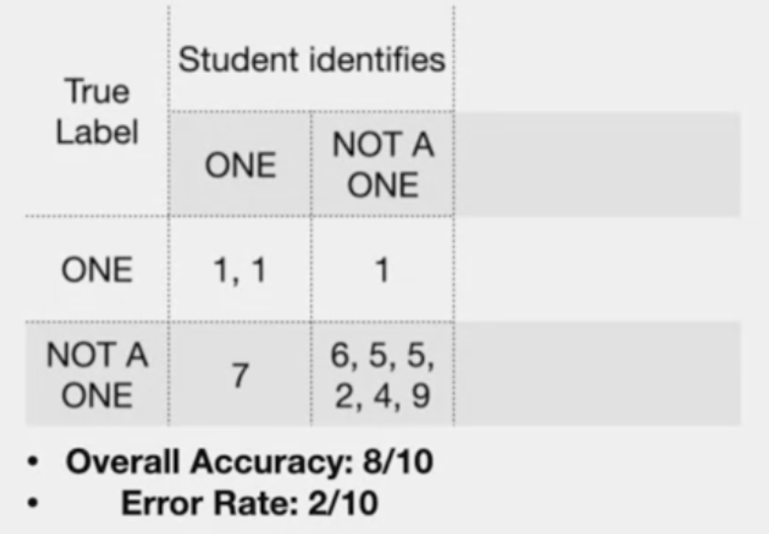
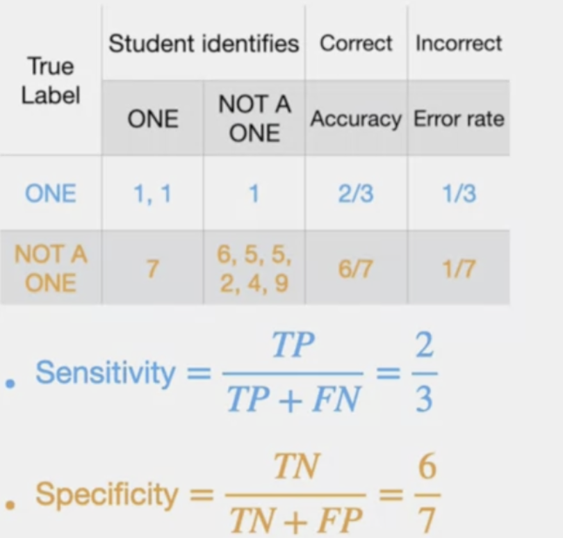

# Topics
> - Classification
> - Regresssion
> - Validation and general concepts Intro

# general

# Numpy

- homogenous data type
- Fixed size at creation (python list can grow dynamically)
> Powerful features (make it fast)
> - Vectorization
> - Broadcasting
> 

# Classification

- Example: simply teaching kids to identify alphabets

# Evaluation
> **Accuracy** : index of goodness
> **Error rate** : Index of badness

# Confusion
1 => positive
0 => Negatuve

| Metrics    | Definition |
| -------- | ------- |
| True Positive  | 1 Classified  as 1 |
| True negative | 0 Classified  as 0 |
| False positive | 0 Classified  as 1 |
| False negative | 1 Classified  as 0 |

> **Note**: In below chart,Accuracy and Error chart is for entire table

> **Note:** Sensitivity and Specificity are for specific **row/True Label > Positive**

# Multi-Class Classifier

> Note : Diagonal value should be large than other cells. If so, the model prediction is good.