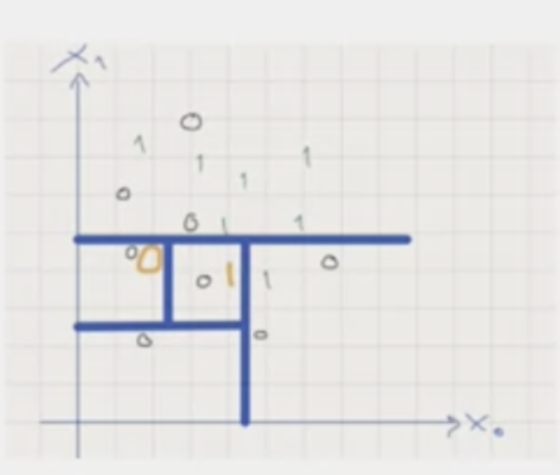
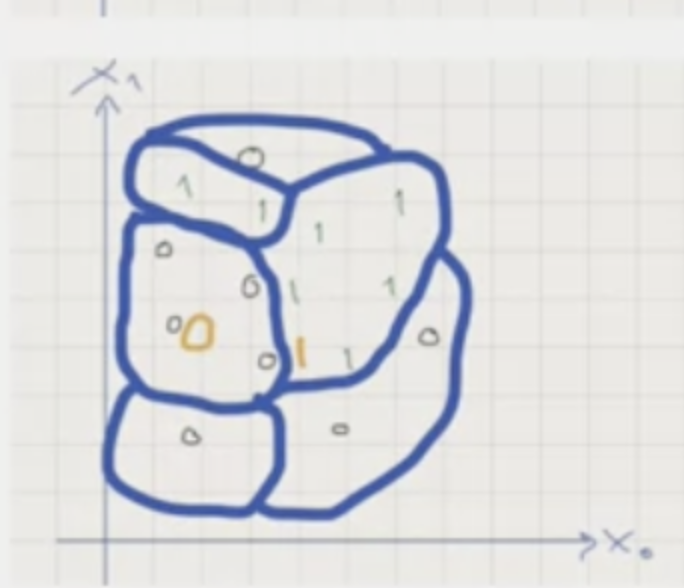
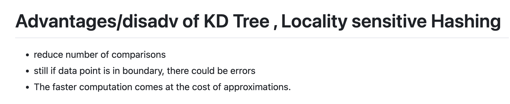

# Nearest Neighbour

> Key feature
- Not much used 
- Instance based learning (use specific instance to make predictions rather than building model)
- High Storage
- associated with promixity
- lazy computing (only during run time )

# General idea
- choose a label from k closet nearest neighbors
- classifies new point with the class that has the highest number of votes

# Adavantages and disadvantages
> - CONS: need large data set for classifier to be effective

# Some approaches to speed up nearest neighbour
> - KD tree
> - locally sensitive hashing

## KD tree
- splits the space

## ocally sensitive hashing
- place data points into buckets and with high probability
- 

# pros and cons of KD tree and hashing
