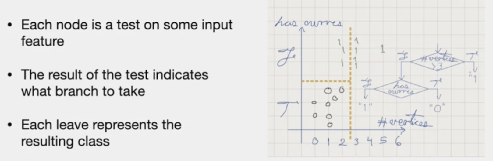
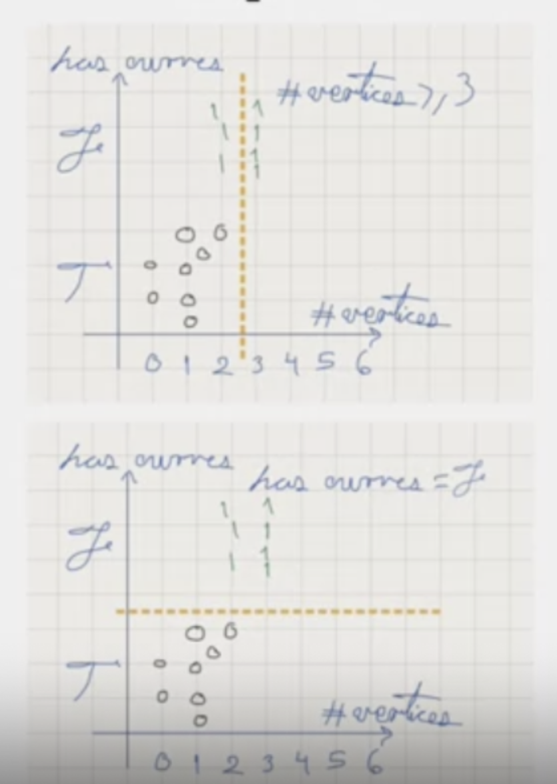
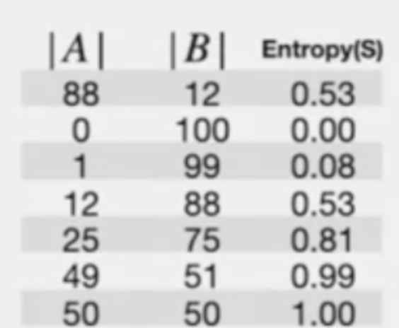
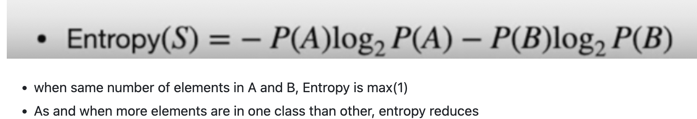
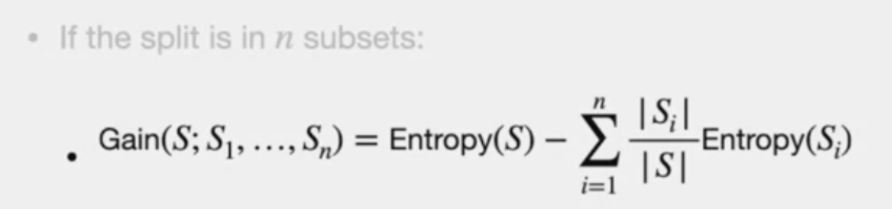
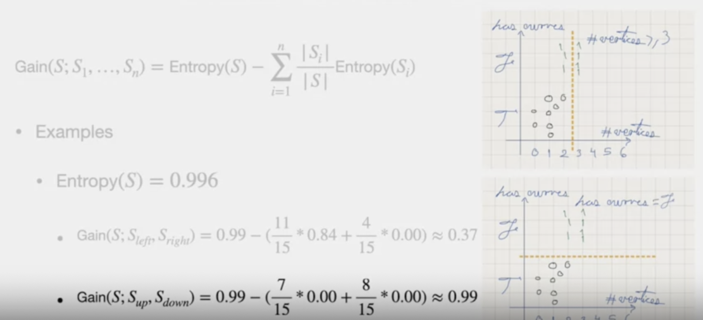
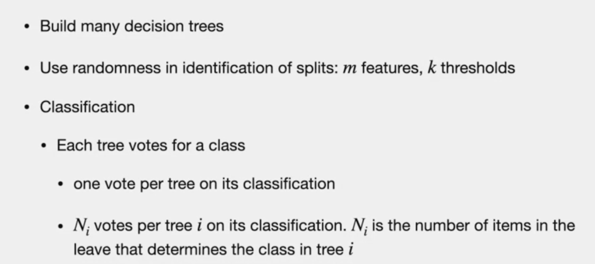
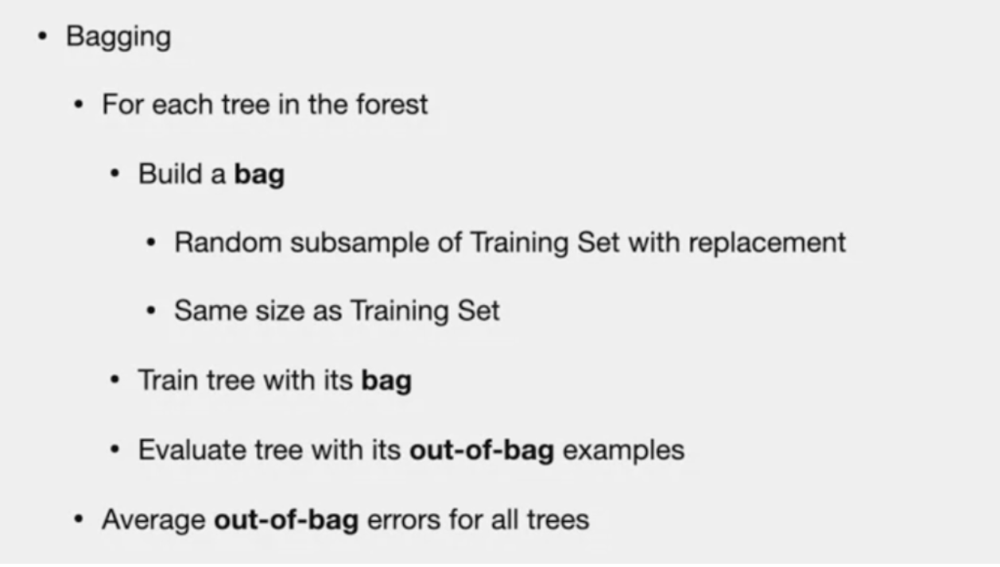

# Decision tress

# Concept

> - It is a "If-then" process
> - It is recursive.
> - Once algorithm moved forward, it doesnt back track to re-consider the earlier choices
> 

# Determine Best Split
## Logic
> - more than one way to split 
> - based on feature. find subset that has more information gain

> **Information Gain**
- Information gain is **higher** when classes have memebers from one class and less when it is diverse
- Preferred - **more** Information gain

> - bottom has higher Information gain

> **Entropy**
- Entropy is low, Informaion gain is high
- **Sample**: 100 elements

## Entropy Math

## Math - Information Gain 

# Splits
- if features can eb sorted, we can use sorted splits, like binary sort. But, it is tough for sorting by more than one features
- Threshold can be used to split

# Pros and Cons of Decsion trees
**Pros**

**Cons**

---

# Random Foreest
## Concept

## Strategies
1. **Simple**: using random splits, train and test data split
2. **Bagging**

> When item is missing a feature: Use Mode or Median to associate value of that feature from other examples