# SVM

# Concept
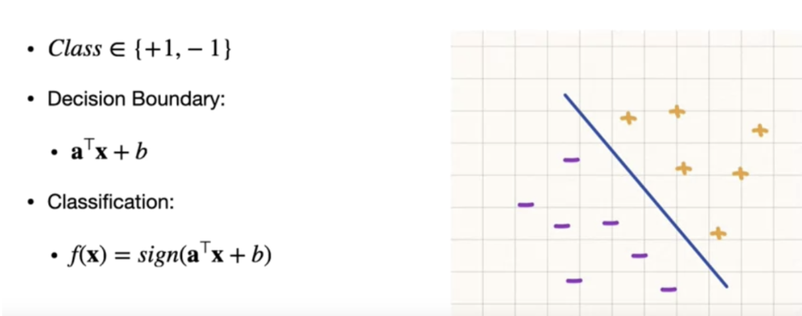

# Components
> - margin is broader (more robust)
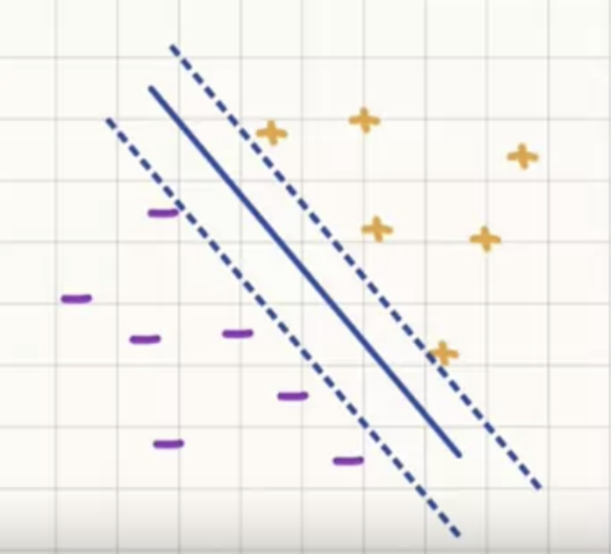
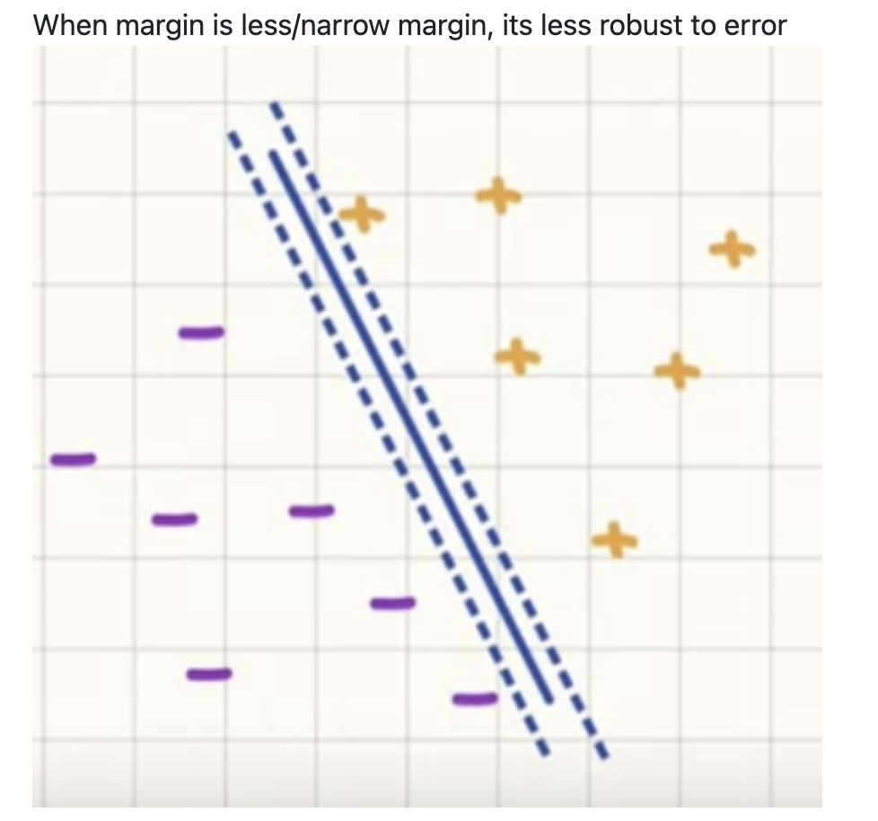

# Math
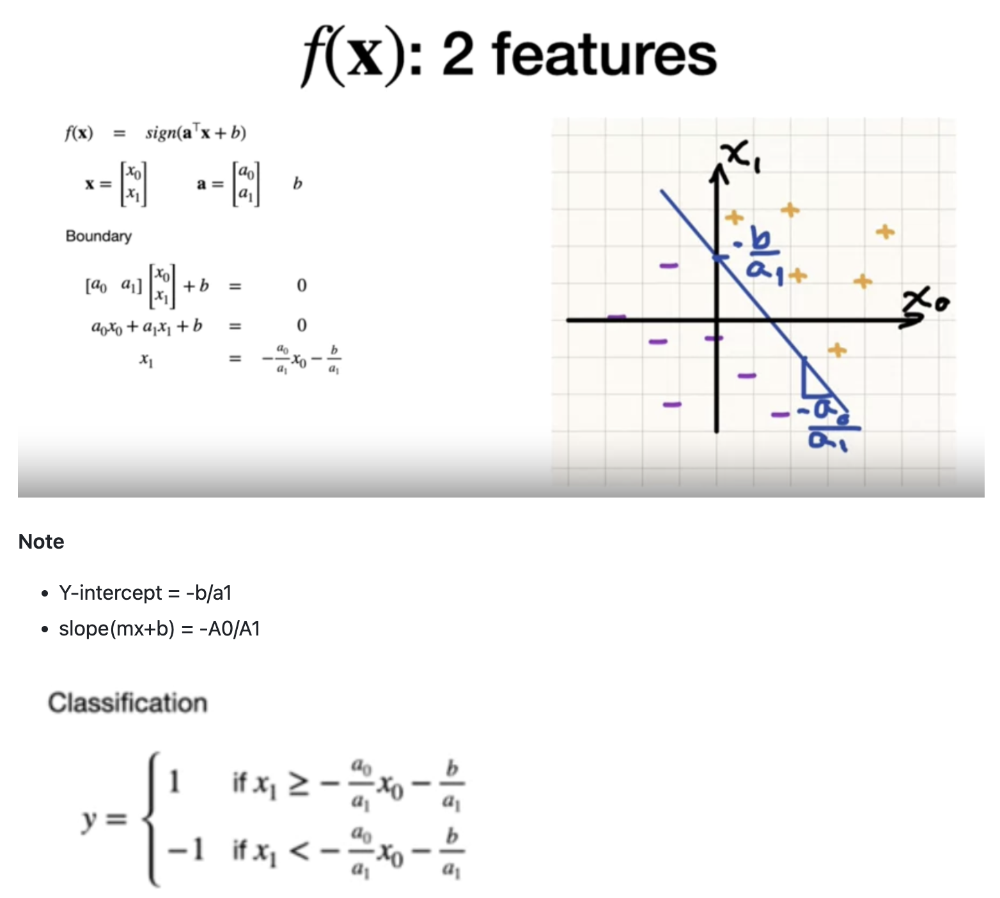
---
> COST = Training Cost + \lambda penalty

> - **Training Cost = Hinge Loss**

**Example**
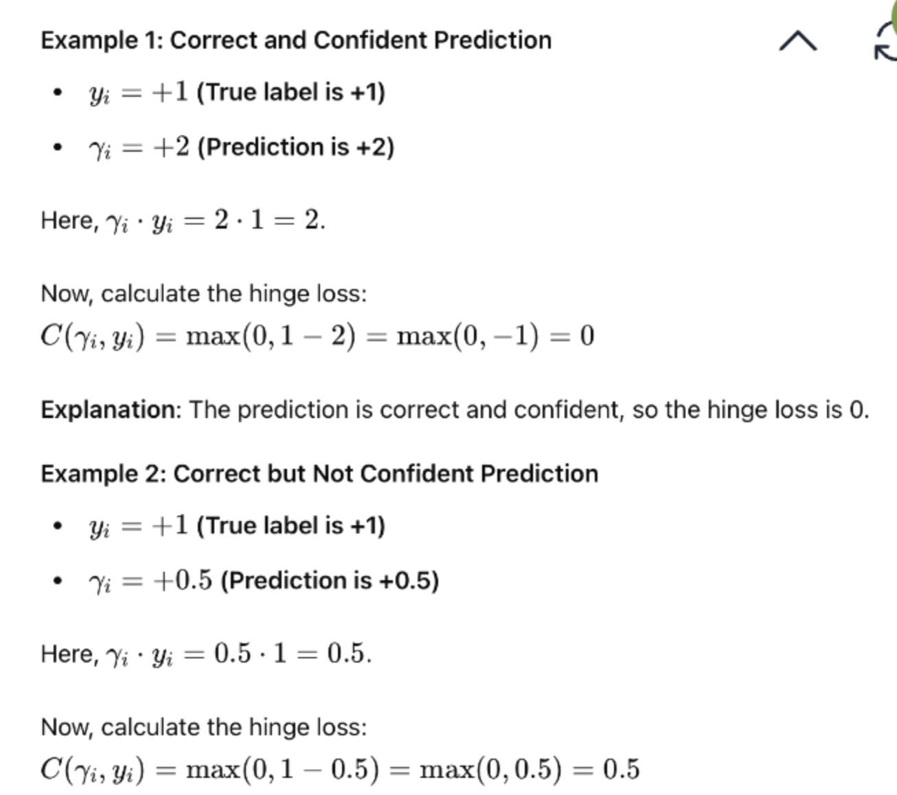
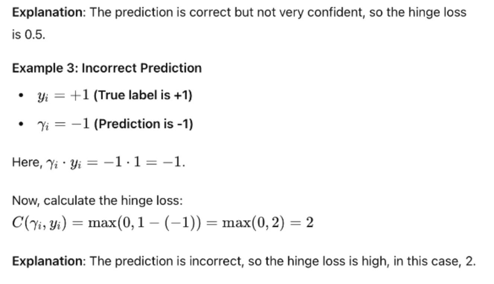

> - **Regularization term**
 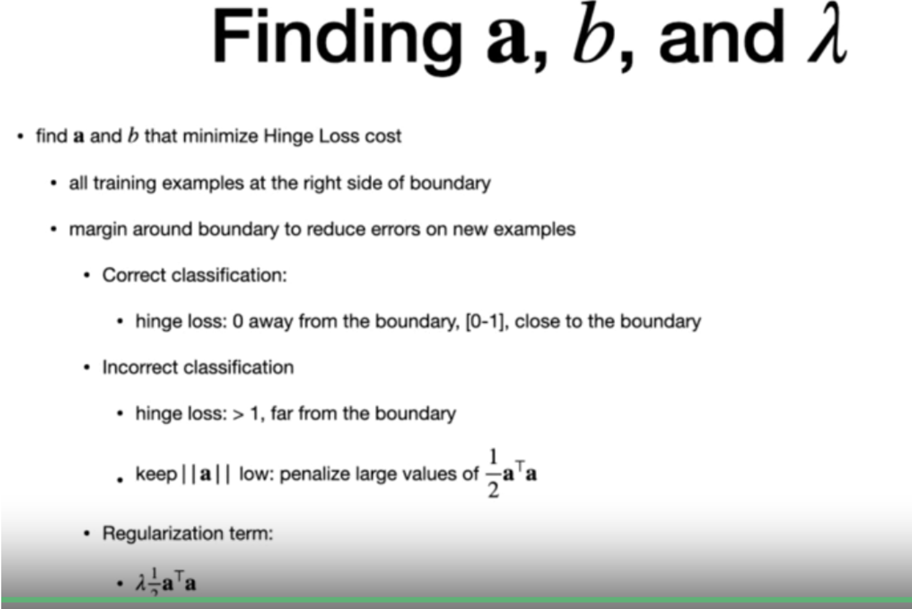

> **Overall Math**

# Stochastic Gradient descend 
> Why? Minimize cost function
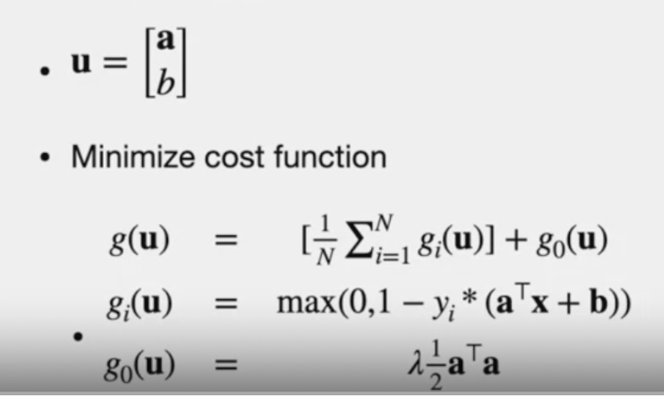
> - rescale for unit variance
> - G(i) - maximization term
> - G(0) - reguralixation term

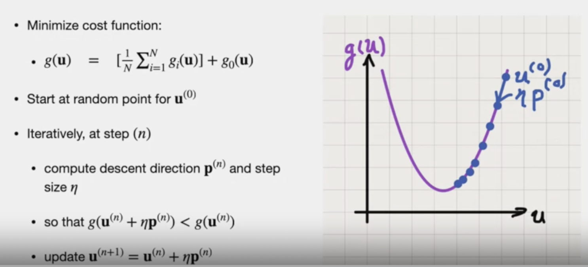

**Concept**
- iterative process
- each step si U(n).next step is U(n+1)
- aeta => small step size
- if new step smaller than previous step, we update U(n+1)
- p => Direction

## Epoch
> **NOTE:** EPOCH : Instead of full dataset size, we use batch size (denoted by "b")
> 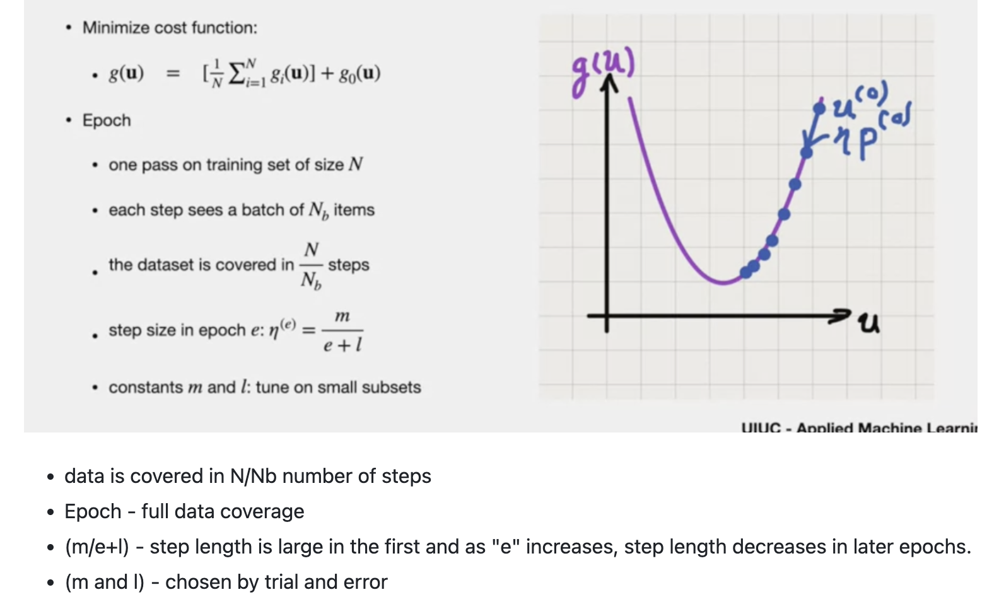

**Seasons** 
 - smaller batches than epochs
 - 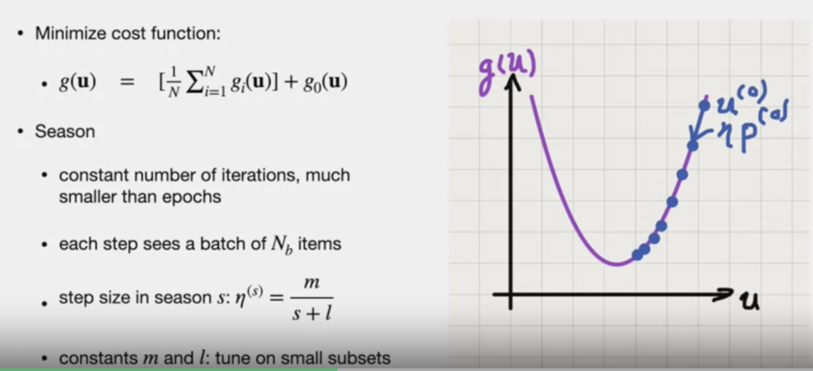

**Gradient**
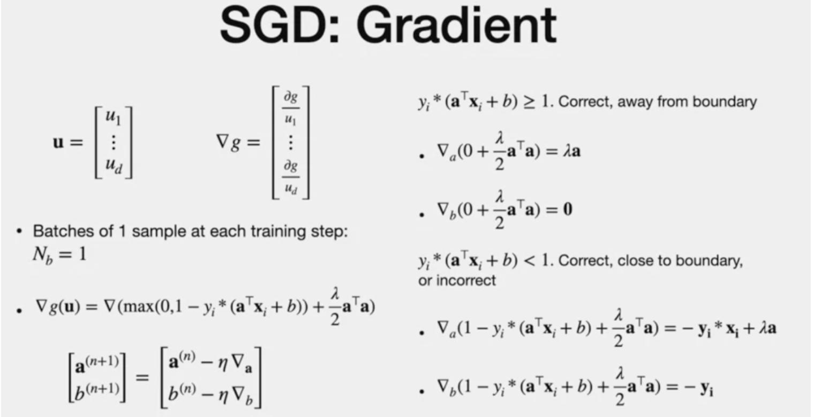

# Pros and Cons
## pros
> - Easy to train
> - Fast classification

## cons
> - Need enough features
