# Linear regression

**vs. Classification:**
- classification is small set and output is **categorical**
- regression **predicts "numeric value"**
- "Classification" can be seen as subset of "Regression" where each class is +1 or -1.

# Overview
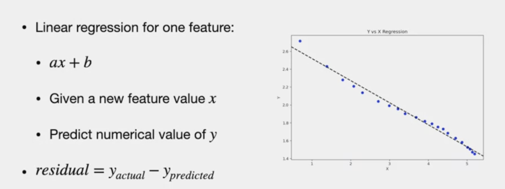

# Characteristics of regression
> value of y can be different for the same feature value
Due to
- randomness /Noise
- **Y is not function of x**(y is subjective values) (same item, different store, different prices)
  
# Practical representation
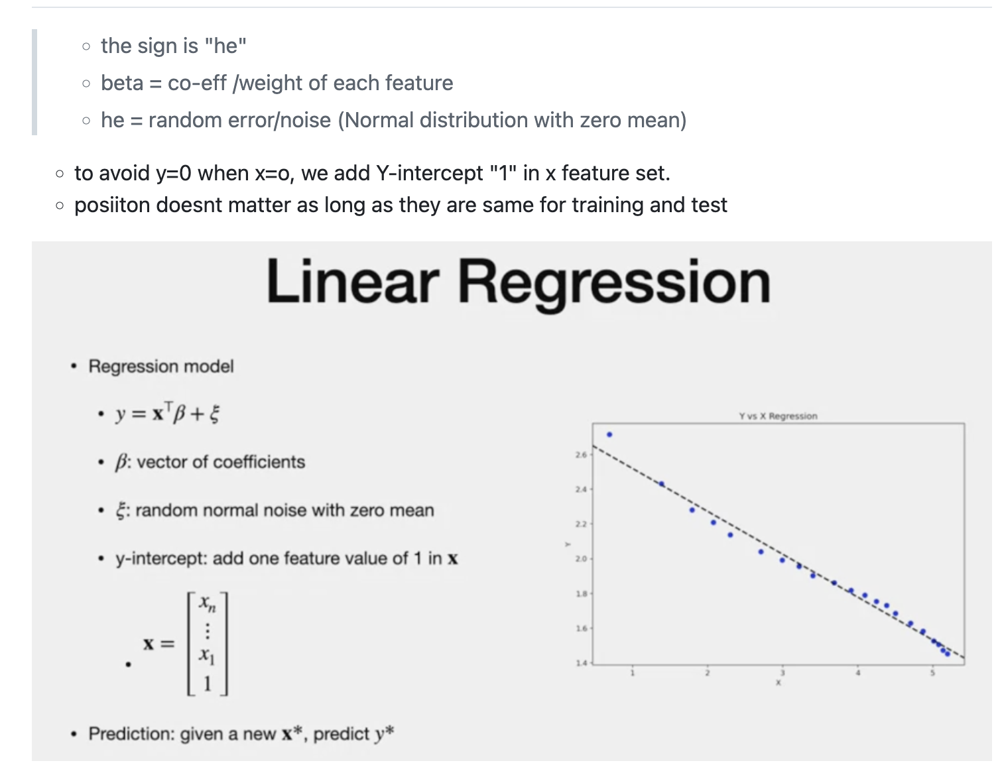
- minimise "he"- sign for error 

# Finding Beta
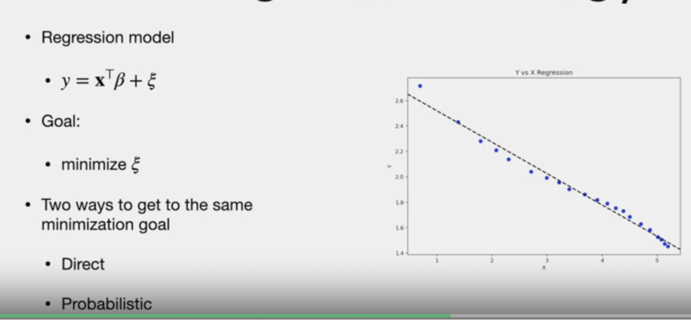

> - Both direct and probabilistic 
> - Both gives one solution. minimize mean square error to find beta
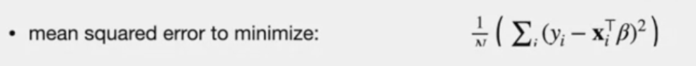

# beta - Math
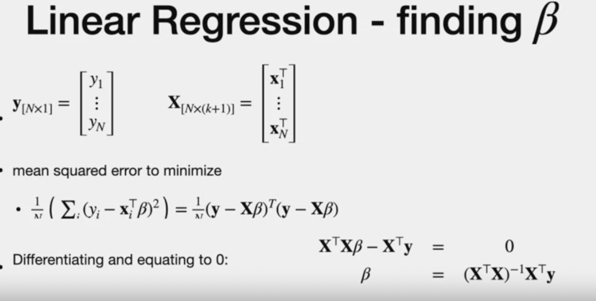
> Note :
> - This is direct if beta has full rank
> What is FULL RANK?
> 	*Full rank refers to a matrix that has linearly independent columns. In regression, this is important because if your design matrix X (which includes the features) has linearly dependent columns (co-linearity or multicollinearity), it can lead to problems when trying to compute the inverse of X^T X (which appears in the solution for ordinary least squares regression).*
> 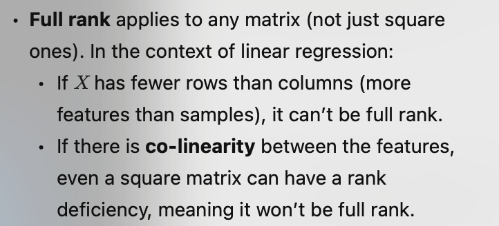
> Moore - Penrose:
> - 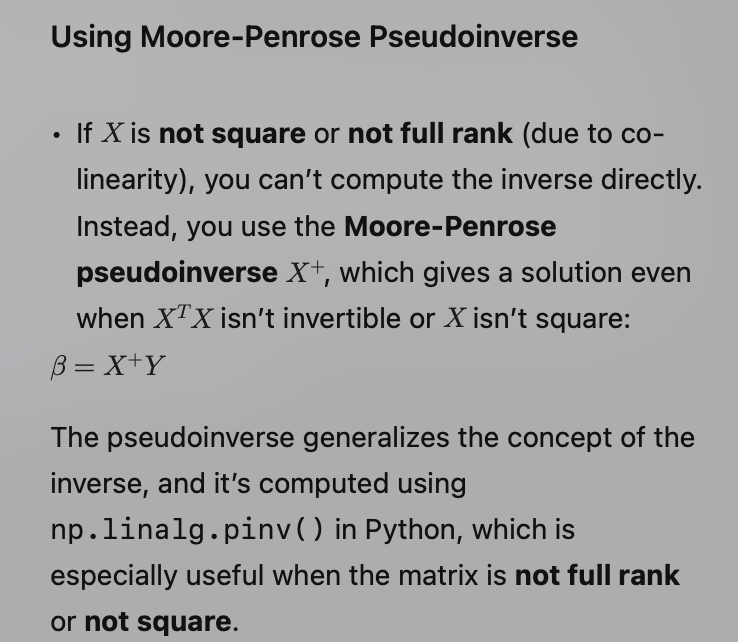

# Performance Measurement for Regression
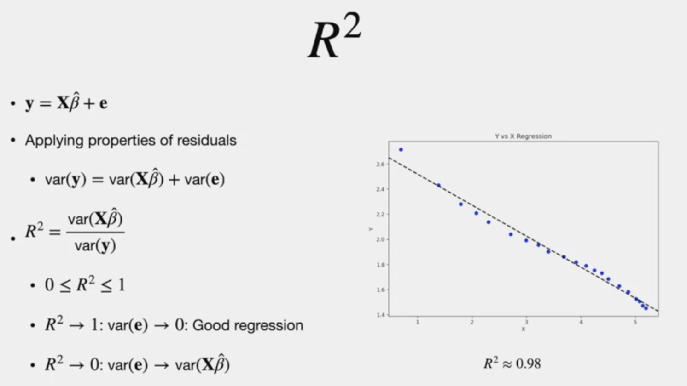

# Cons of regression
- Outlier will increase MSE and will exert force on Beta to move towards the direction of Outlier

# Two Methods to deal with Outliers

1. **Leverage and Hat Matrix**

- Hat is everything that is not "y"
- 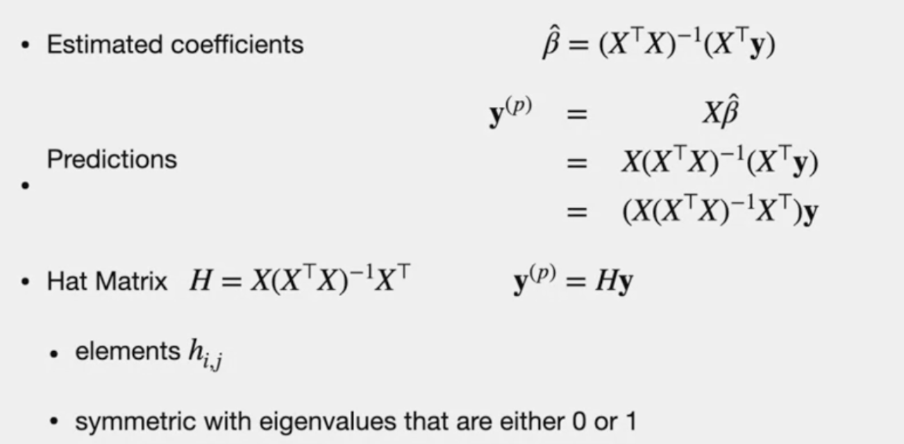
- The diagonal h(ii) is the "Leverage"
- sum of square element of each row <=1
- If "leverage" is big, then it indicates "Outlier" ashtr sum of the row is <=1. which means other values are small.

> NOTE: Another use of Hat Matrix is to standarize **residues**
> - 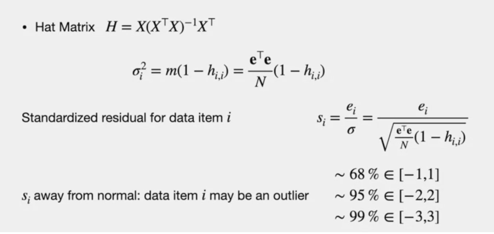
> - This aims at (1) reduce error (2) within one standard deviation

2. **Cook' distance**
 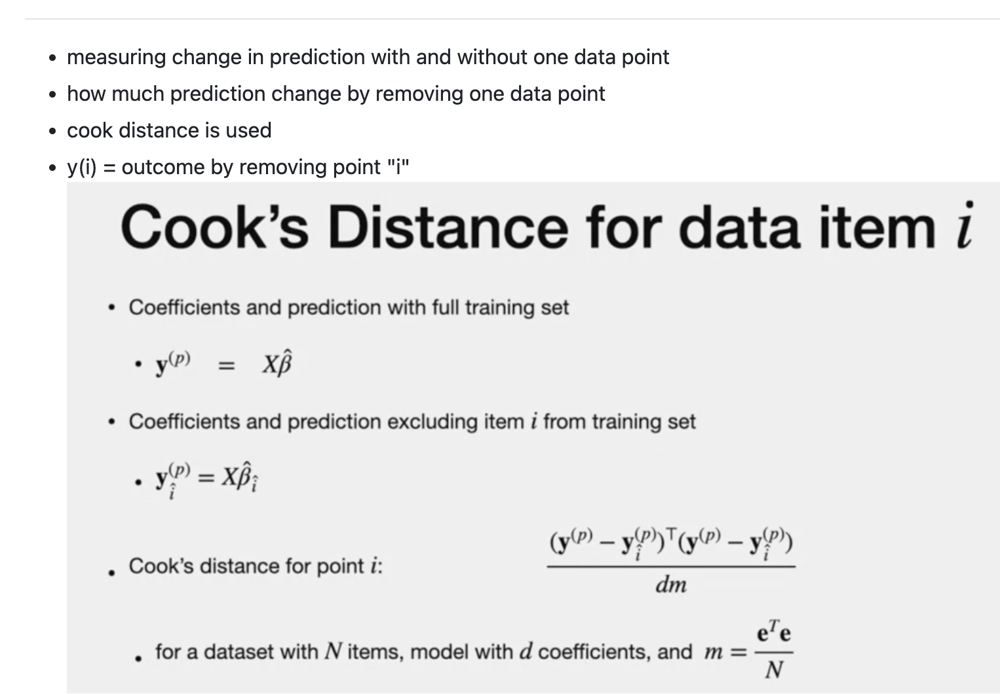

 # Linear regression transformation
 ## Why transformation?
 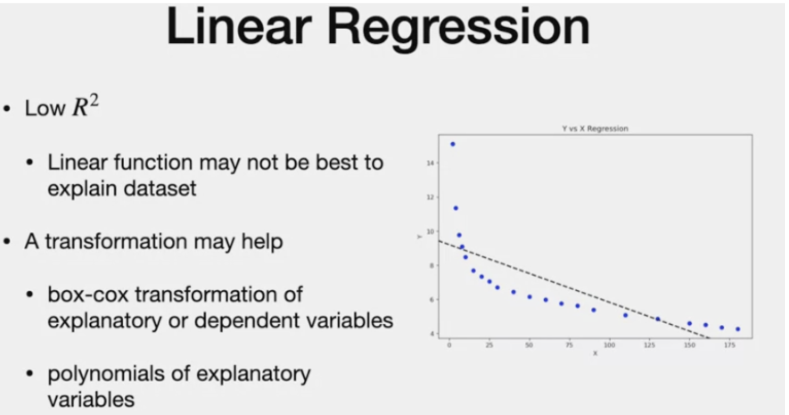
 > -LR that has low R2 can be improved with transformation
> - plotting is an option to see the fit (if one explanatory variable). To find if polynomial or log will fit better

## Two options for transformation
**1. BOX COX Transformation**
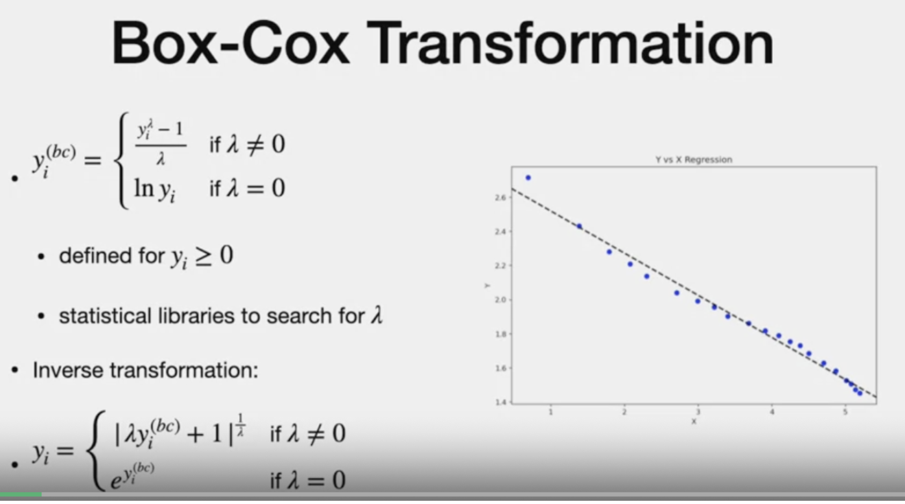

**2. Polynomial**
this is when the independant variable is dependant on "higher degree value' of independant variable

**like polynomial**
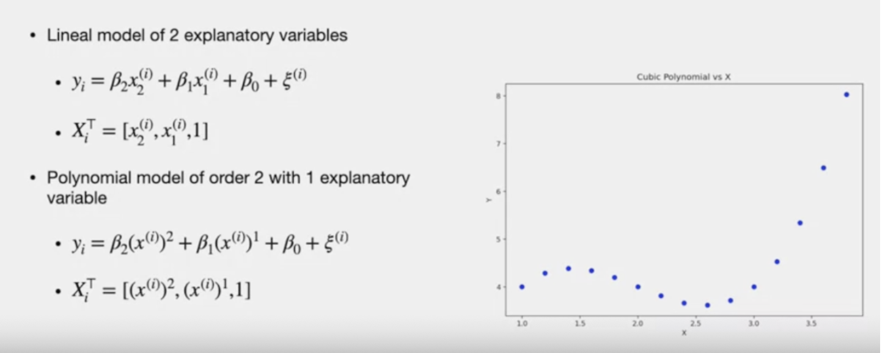

# Regularization
## Why?
- When two explanatory are co-related, then the "xTx" can have small eigen values.

- what that means is xTxBeta is also the apprxomimately same as betahat + some unknown number.

- this can cause beta_hat to be huge.

### Two types of regularization
1. Ridge /L2 Norm
 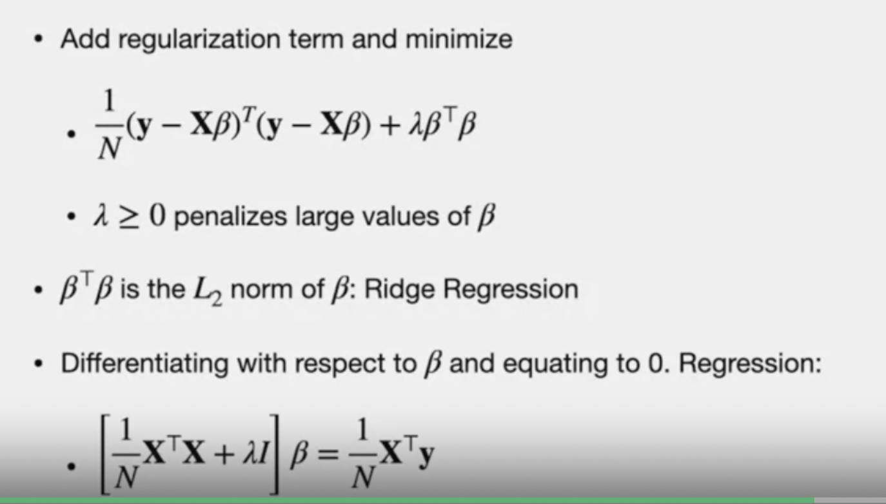

 - doesnt remove features.
 - Regularization term that penalized large value of beta
2. Lasso/L1 Norm

-- more on this later.

---
# The end
