# Bias vs. Variance

## Bias
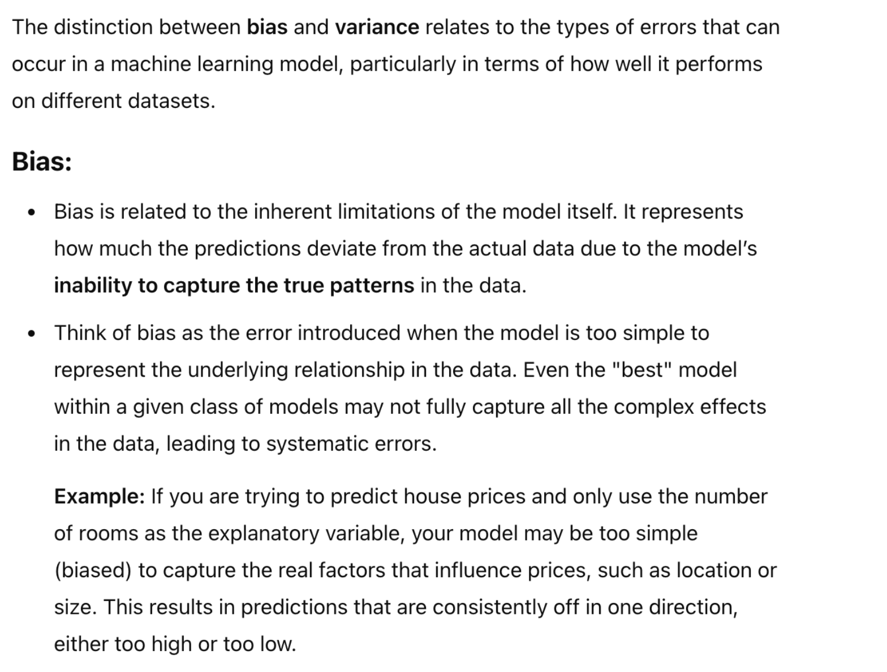

## Variance
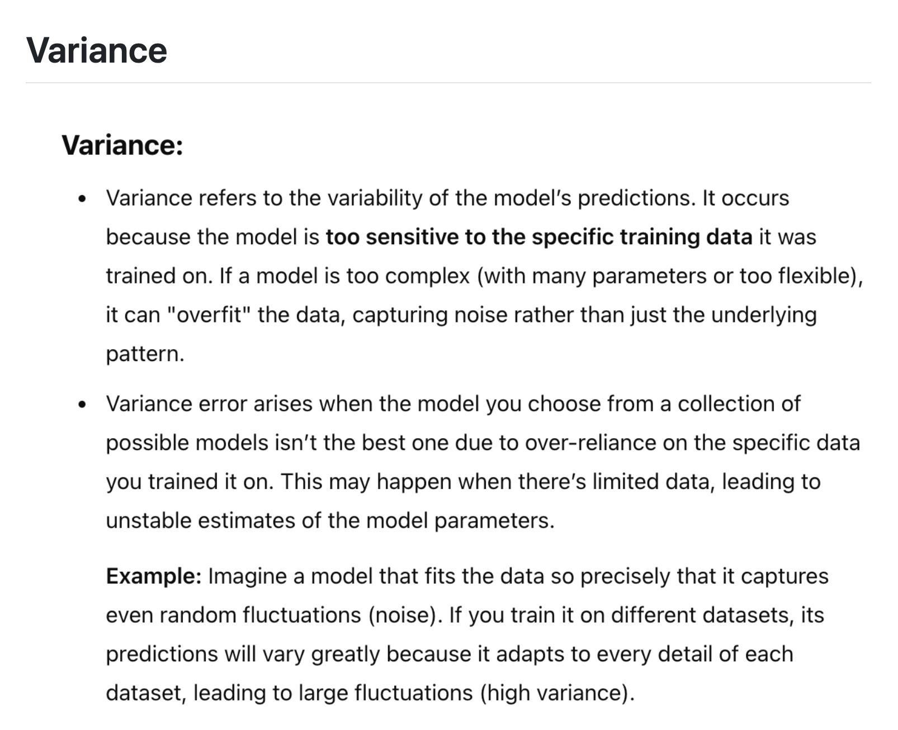

**Bias vs. Variance**

# Math - Bias/Variance
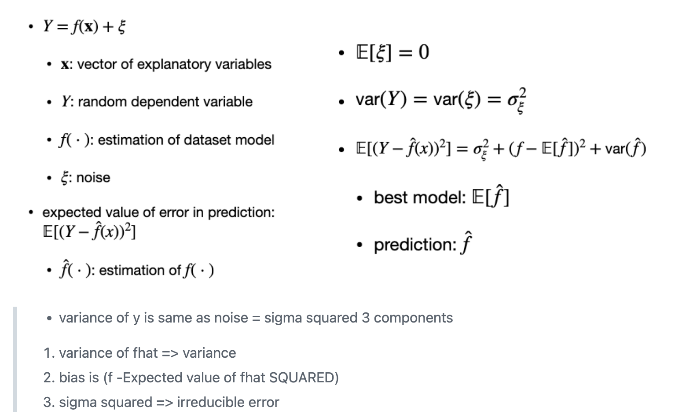

# Information Criteria (IC)

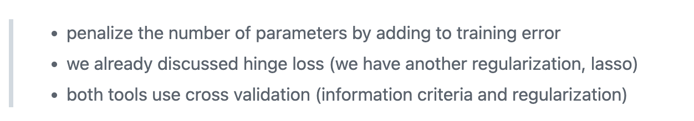

### 1. AIC (Akaike IC) and B (Bayesian IC)
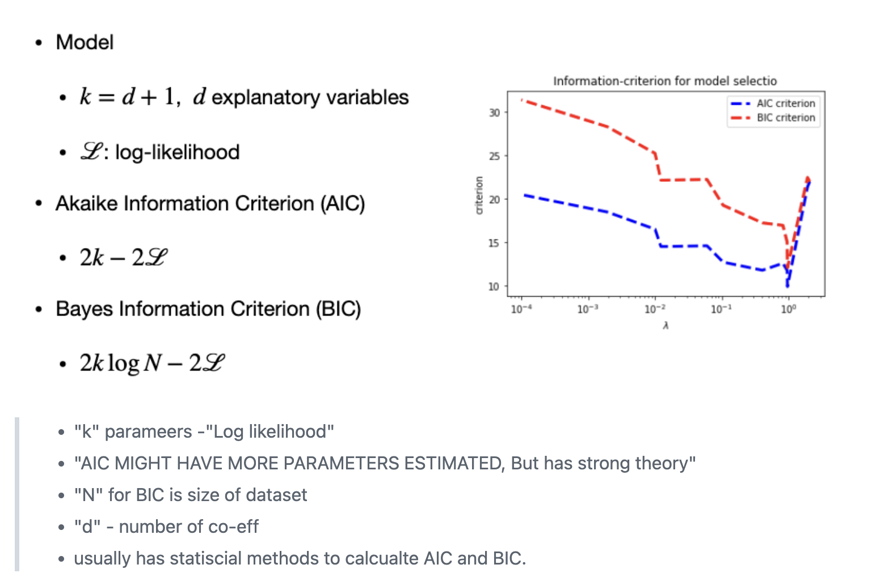

# AIC vs. BIC
- both penalize for number of parameters
- AIZ might have more parameters estimated than BIC

# Stagewise regression
## Forward and Backward regression
- greedy strategies

## Forward stepwise regression
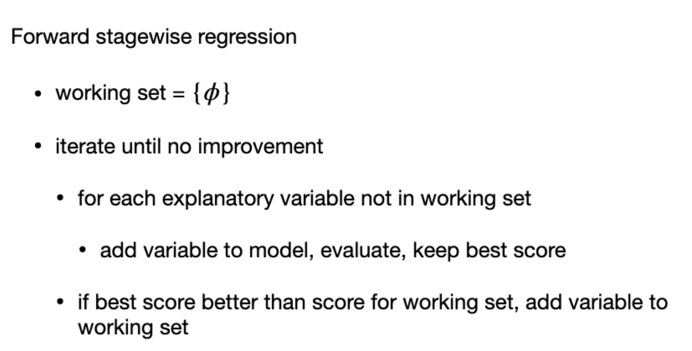

## Backward stepwise regression
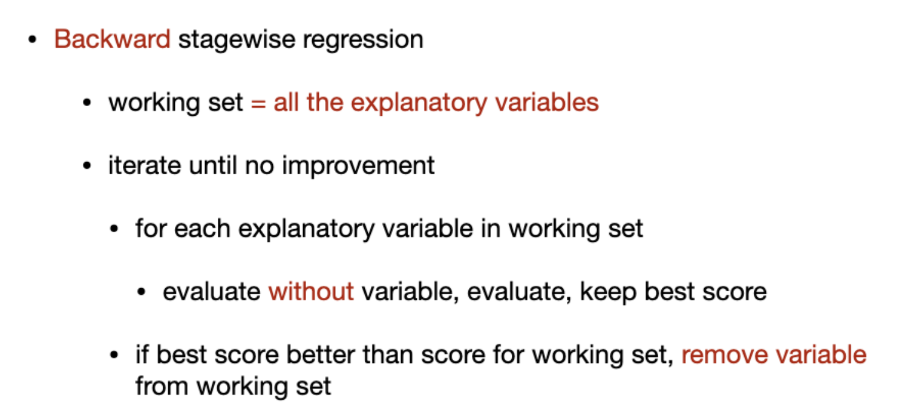

# M- estimators

**Why?**
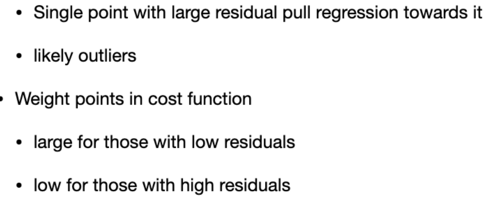
- high residuals are outliers

##  Huber Loss for estimators
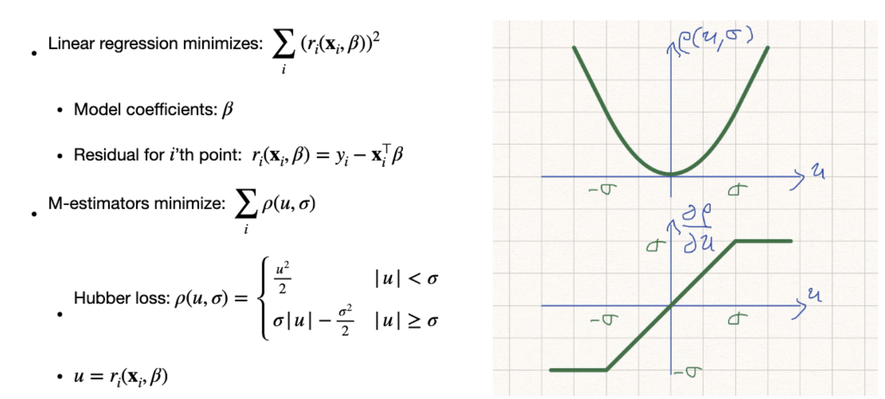

**Influence Function**
- Influence function is the partial derivative of rho with respect to "u"
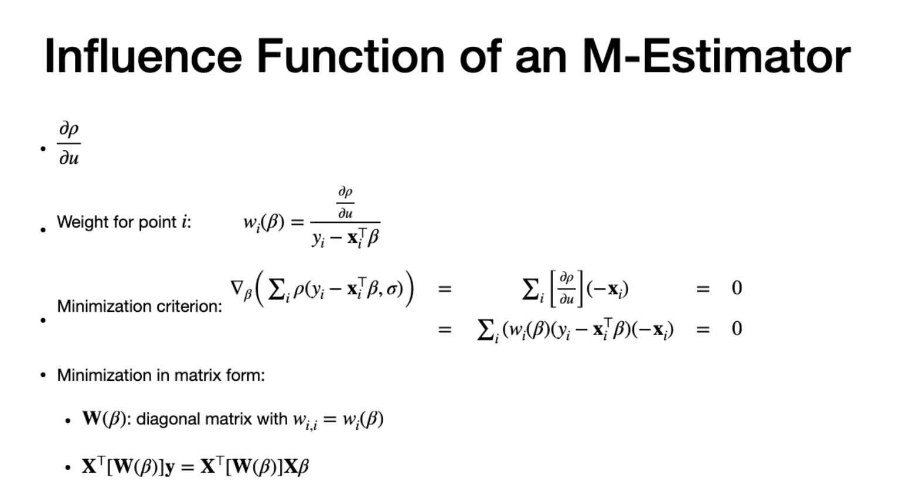

- solve by **iterative reweight least square**

# Scale of estimator
(MAD and Huber Proposal-2)
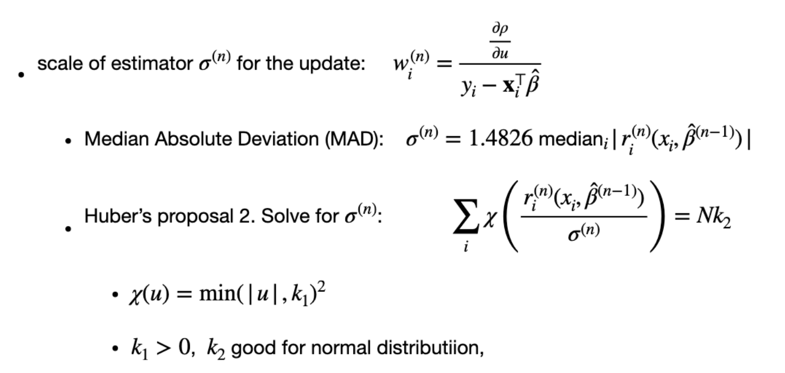

---
# The end