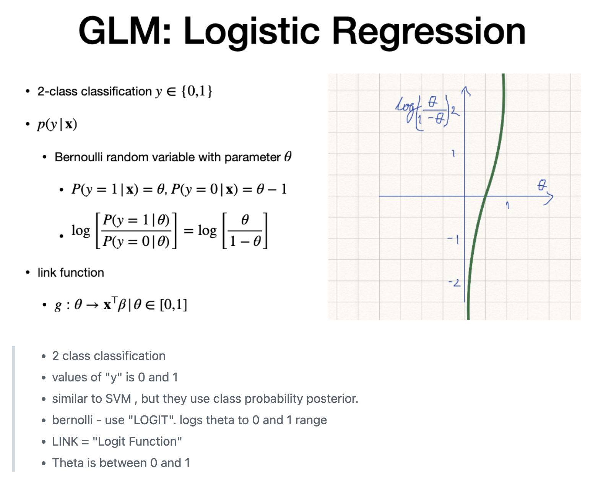
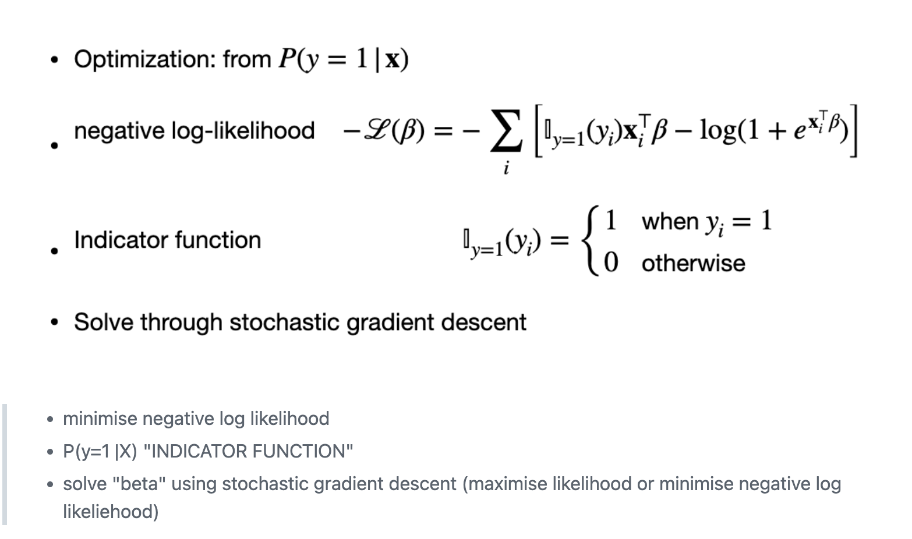
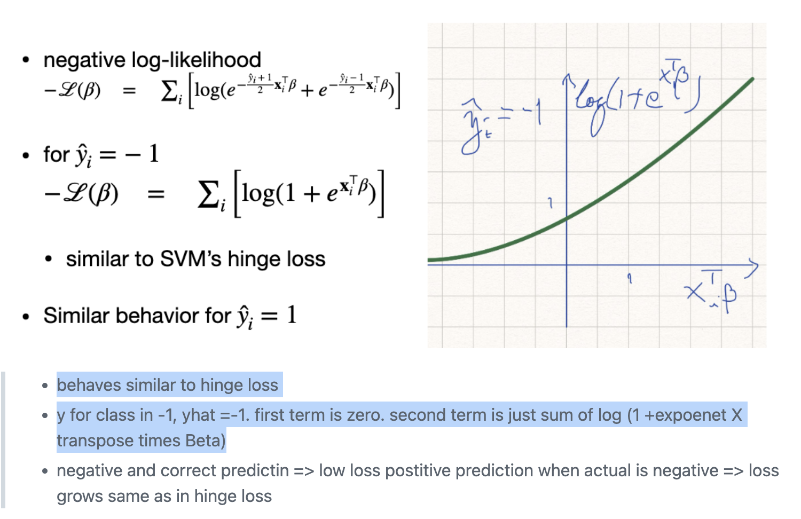
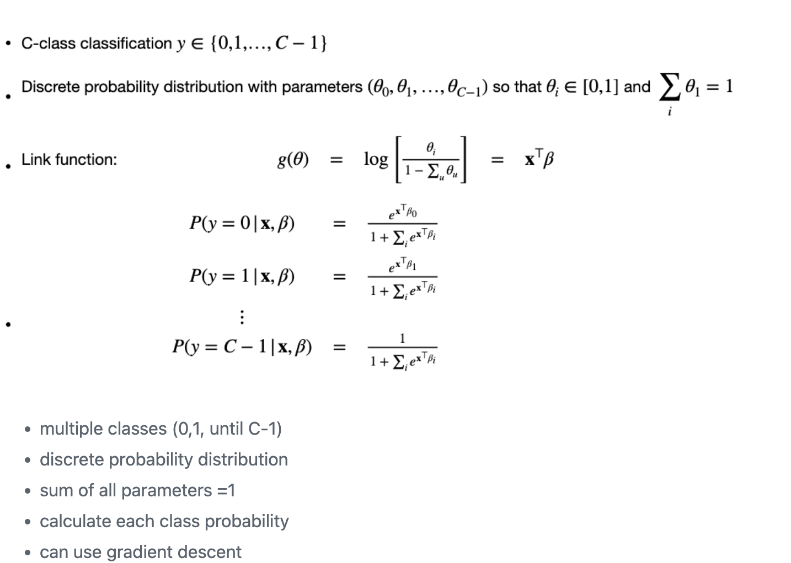
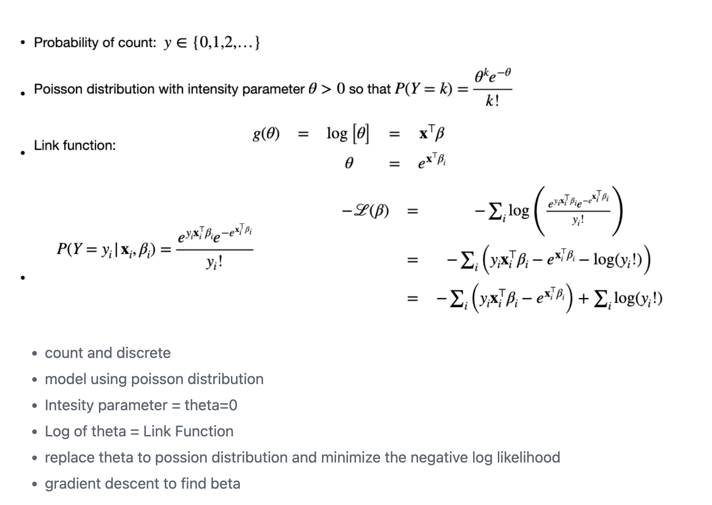
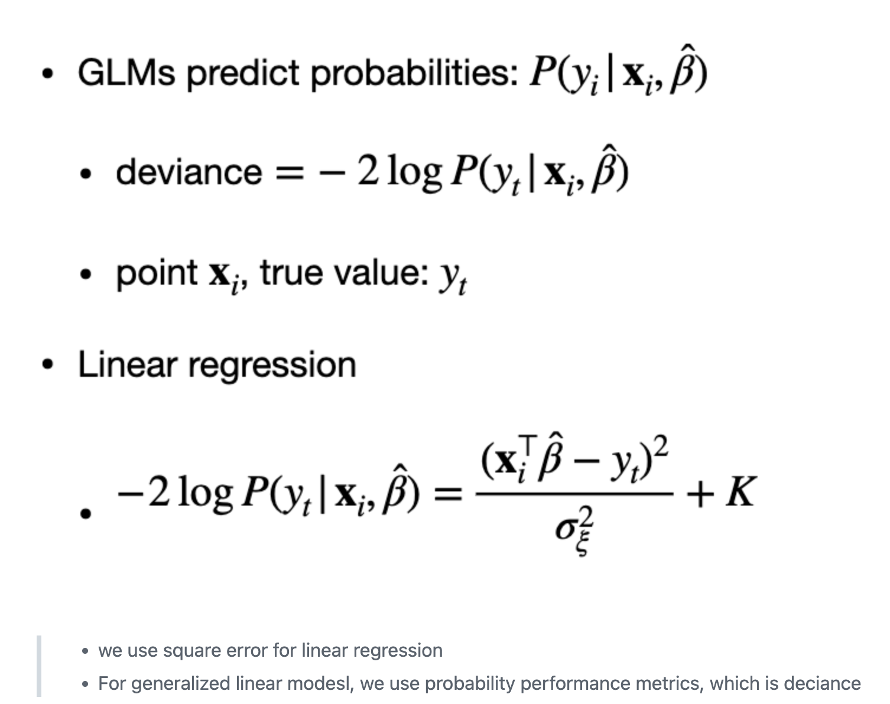

# GLM (General Linear Models)

> Types
> - Logistic regression
> - Multi class regression
> - regression by count (Poisson)

# Idea

# Logistic regression
> - Distribution = Bernoulli
> - Link = Logit function
> - predicts two class classification (not numeric)

# Indicator function and solve for Logistic regression

# Logistic regrssion vs. SVM
> - Logistic is more continuous than SVM loss

# Multi Class regression

- distribution = discrete probability function

# Regression by counting
- distrubtion = Poisson
- Link = Log of theta

# performance using Deviance for GLM Models
