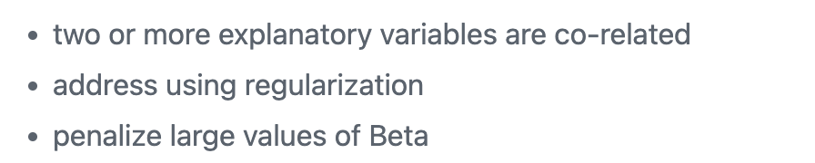
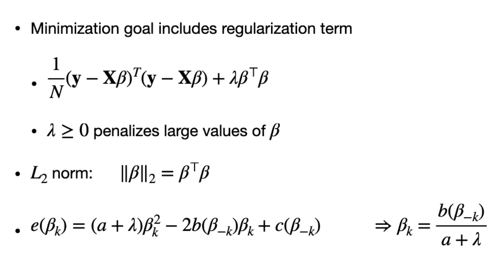
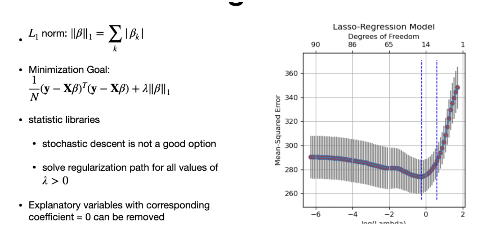
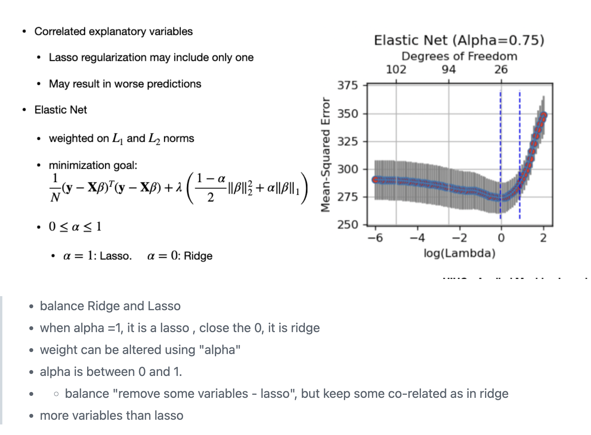

# Lasso
- L1 Regularization
- vs. Ridge which is L2

# Why?

# Ridge

**NOTE**
- Lamba - regularization ..appplied of squared
- doesnot eliminate variables(means co-eff should be zero)
- quadratic equation is the error. we equate to zero and solve for beta.
- even if beta is very small, to make it zero, we need a large value of lambda

# Lasso

**NOTE**
make zo-eff become zero
force co-eff that has less impact to Zero
penalty grows linearly , not quadratic
use L1 norm
"Stochastic gradient" - NOT GOOD to SOLVE
statisc libraries used to solve the equation
using cross validation, different lamba to make co-eff
"Good for Sparse Model" goal

# Elastic Net
- combination of Lasso and Ridge
- 

# Lasso vs Ridge
| Lasso    | Ridge |
| -------- | ------- |
| L1 Norm | L2 norm |
| linear | quadratic|
| force co-eff that has less impact to Zero | doesnot eliminate variables|

