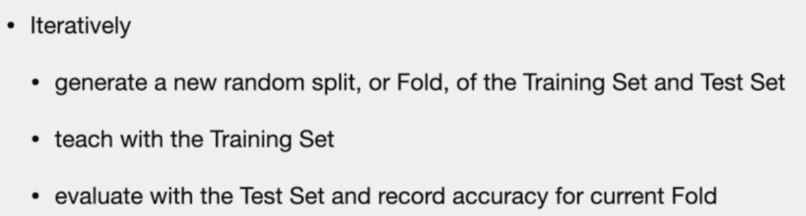
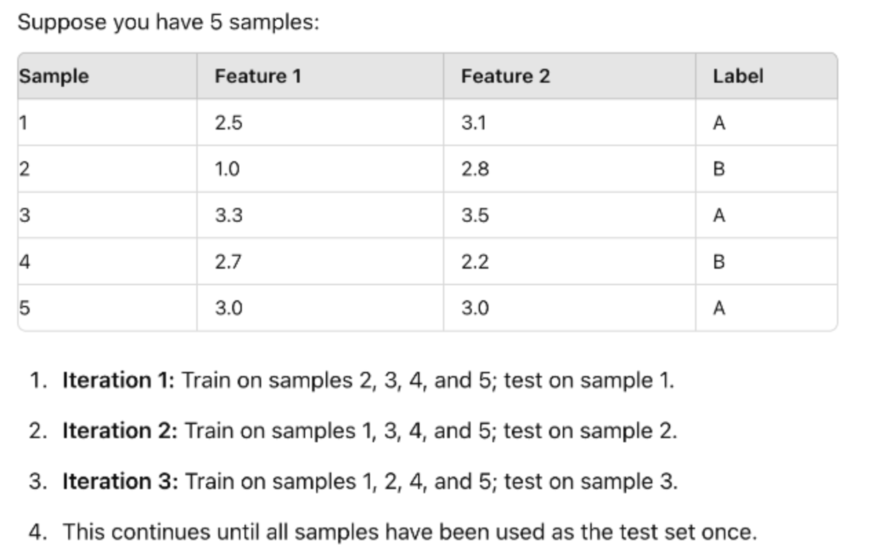

# Cross - validation
> Why ?
> - to avoid using one "Fixed" set for training and other "Fixed" set for testing, we can use Cross-validation

> - Accuracy is **average** over all the Folds

# Method

# Leave one out

# K Fold validation
> Note: Dataset = N is just the "training set", not validation set. theere is a third set for "test set"

# Difference between Leave one and K-fold

