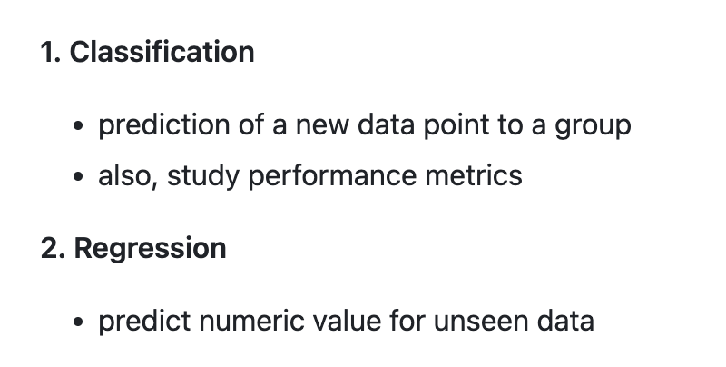
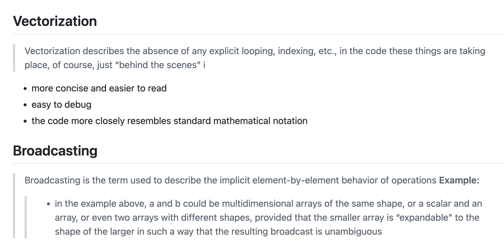
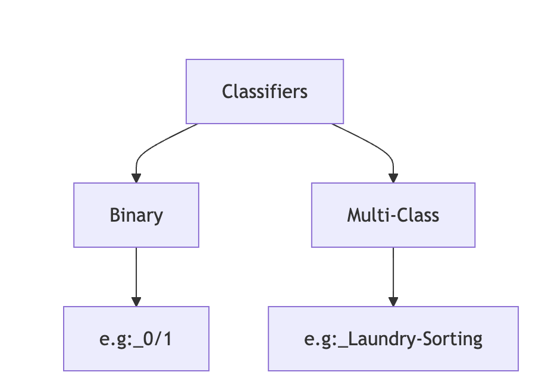
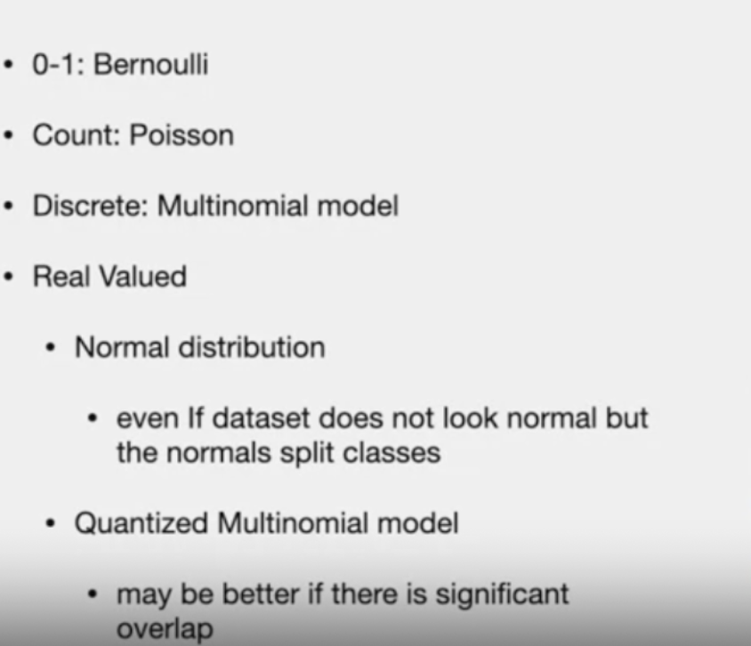

# Concepts

# Math
> - P (Y |x) - cannot be obtained
> - P(x) - not dependant on output "y". so can be ignored

# Different probability distribution

> **Note** : 
> 1. doesnt matter the accuracy of each values. You just need to select a model that is relatively better than each other
> 2. For selecting best model (from many distrubition), use cross validation