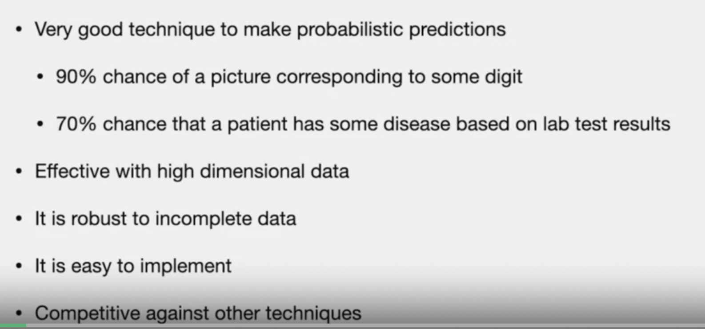
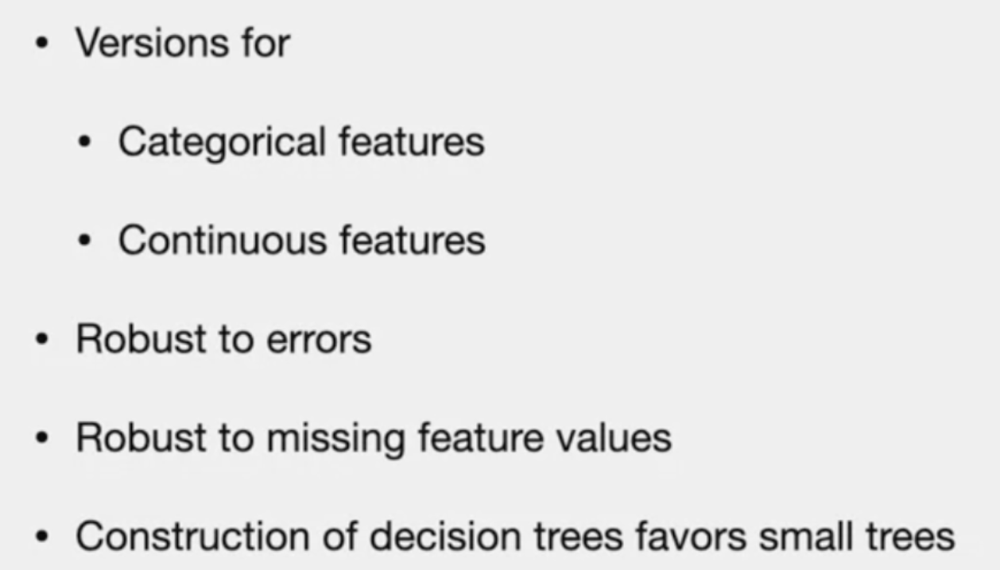
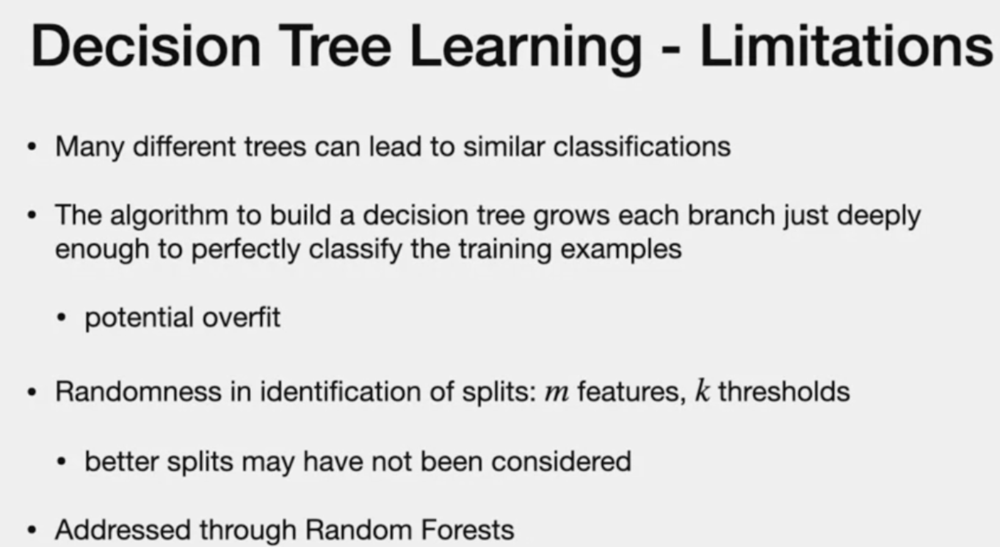
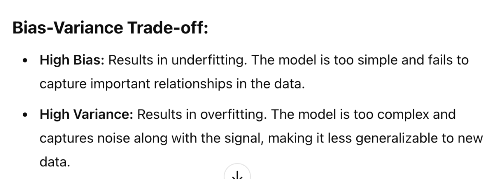

# Leave one and K-fold

| Leave one out    | K-fold |
| -------- | ------- |
| use almost all data for training each time(high variance) | use less data for training in each iteration(still good performance) |
| computational expensive as model need to train N times |efficient than LOO as it reduces number of training runs to "k" and k < N|

# KNN - pros and cons

# KNN: pros and cons of KD tree and hashing

# Nearest Neighbour vs. Naive Bayes
| KNN  | Naive Bayes|
| -------- | ------- |
| Missing data cannot be handled | robust to missing data |
| Not good for high dimensional data | Good for high dimensional data |
| too sensitive to distribution of data | not sensitive |

# Naive Bayes - Adv and Disadv

# Decsion trees - Pros and Cons 
**Pros**

**Cons**

# SVM - Pros and Cons
## pros
> - Easy to train
> - Fast classification

## cons
> - Need enough features

# Linear regression

**Regression vs. Classification:**
- classification is small set and output is **categorical**
- regression **predicts "numeric value"**
- "Classification" can be seen as subset of "Regression" where each class is +1 or -1.

 # Cons of regression
- Outlier will increase MSE and will exert force on Beta to move towards the direction of Outlier

# Two Methods to deal with Outliers
1. **Leverage and Hat Matrix**
2. **Cook distance**

# **Bias vs. Variance**

# AIC vs. BIC
- both penalize for number of parameters
- AIZ might have more parameters estimated than BIC

# Logistic regrssion vs. SVM
> - Logistic is more continuous than SVM loss

# GLM vs. LR
- GLM - use deviance for performance vs. R2 for regression

- GLM use probabilistic dis
# Lasso vs Ridge
| Lasso    | Ridge |
| -------- | ------- |
| L1 Norm | L2 norm |
| linear | quadratic|
| force co-eff that has less impact to Zero | doesnot eliminate variables|
