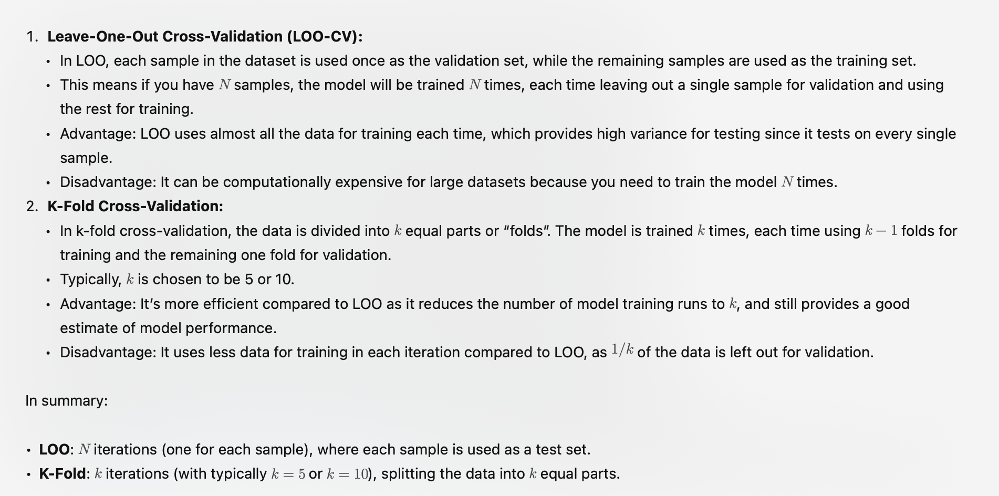
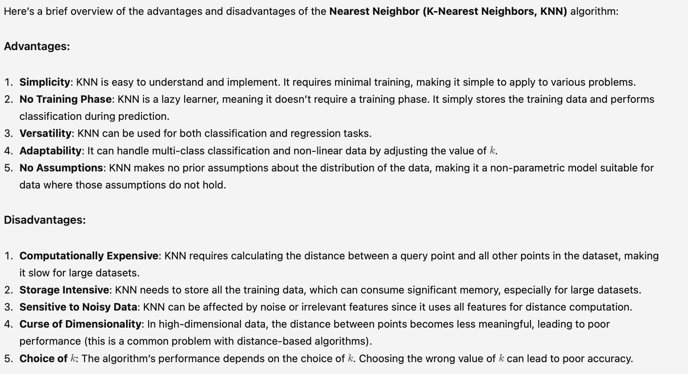

# Leave one and K-fold

| Leave one out    | K-fold |
| -------- | ------- |
| use almost all data for training each time(high variance) | use less data for training in each iteration(still good performance) |
| computational expensive as model need to train N times |efficient than LOO as it reduces number of training runs to "k" and k < N|

# KNN - pros and cons
