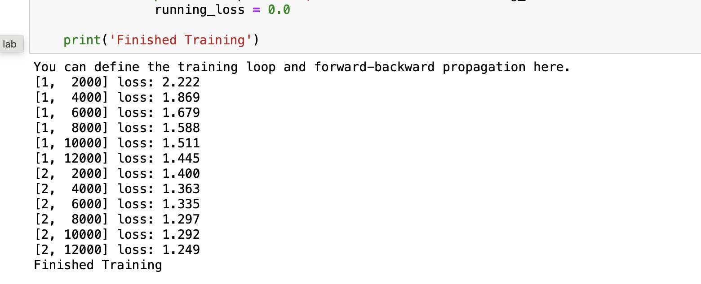
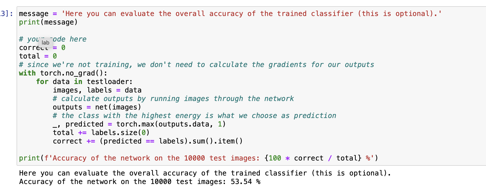
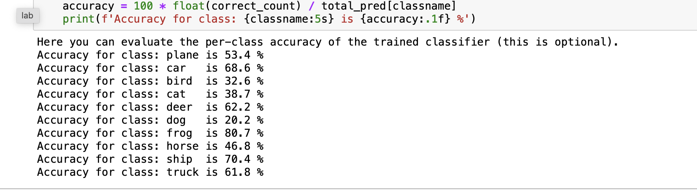
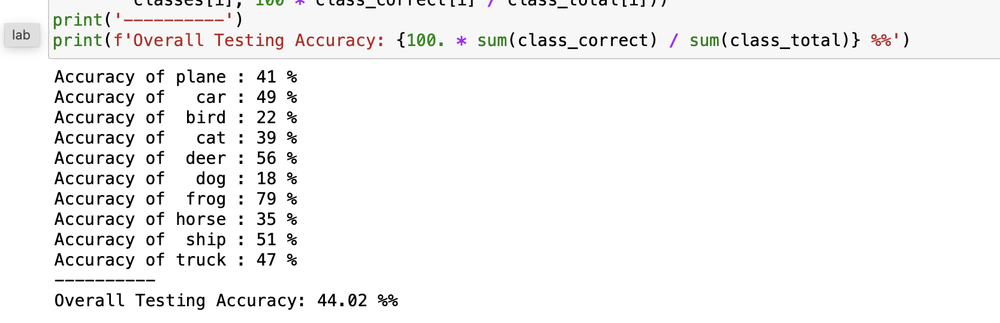
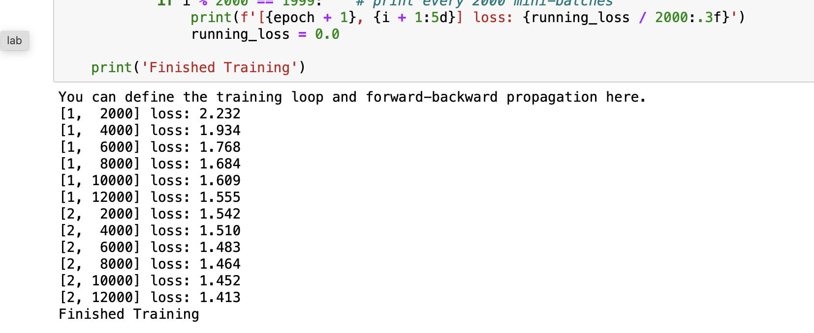
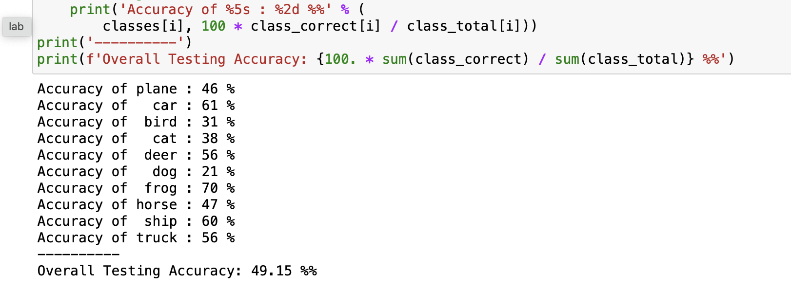
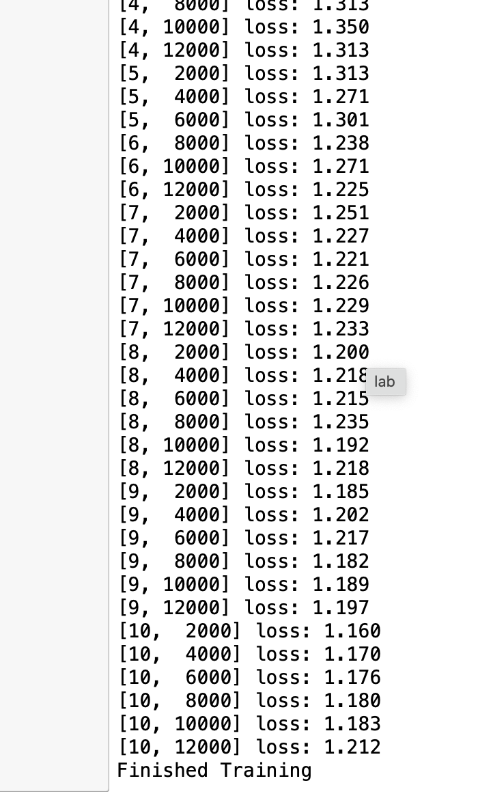
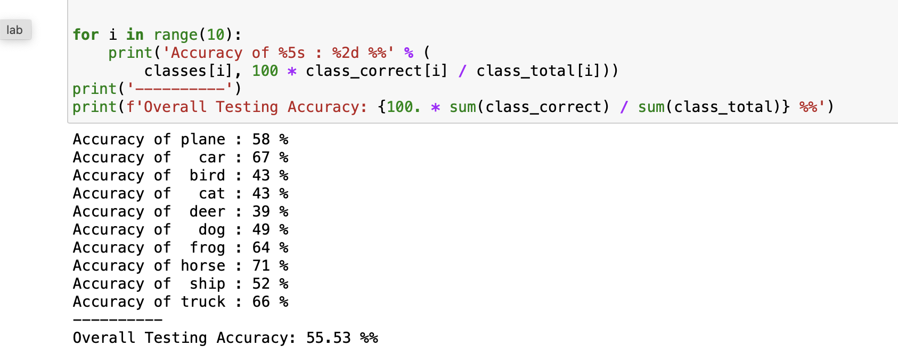
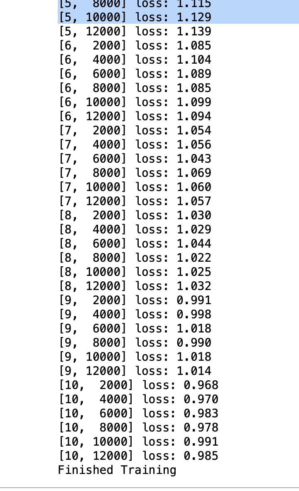
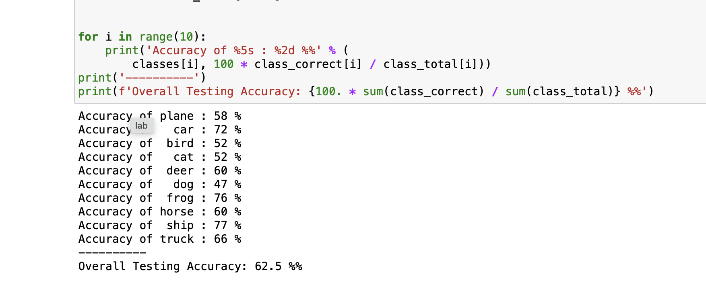

# Before Applying A7

# 2 Epochs

# Per class

# 1.8 Overall Accuracy

---
# After Applying A7

**Overall Accuracy**

--- 
# Step A8: Increasing the Number of Optimization Epochs

---
# A9

## Increasing the Second Convolutional Layer's Channels

