# 1
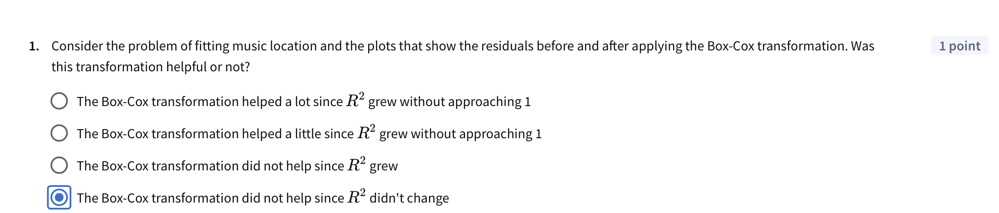

Before
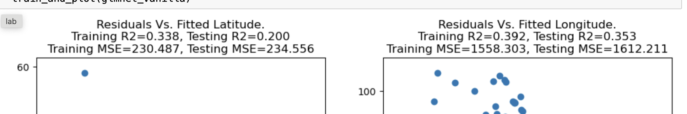

with box cox:
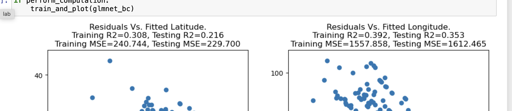

# 2

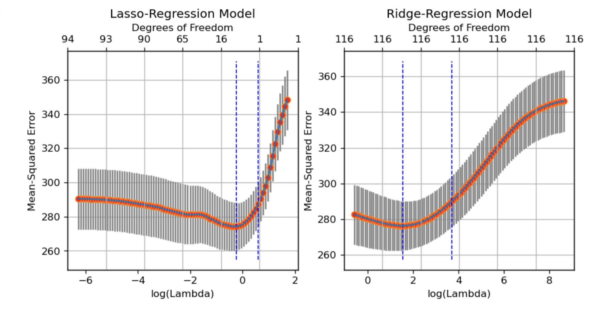

# 3
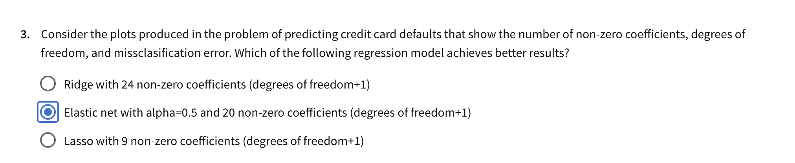

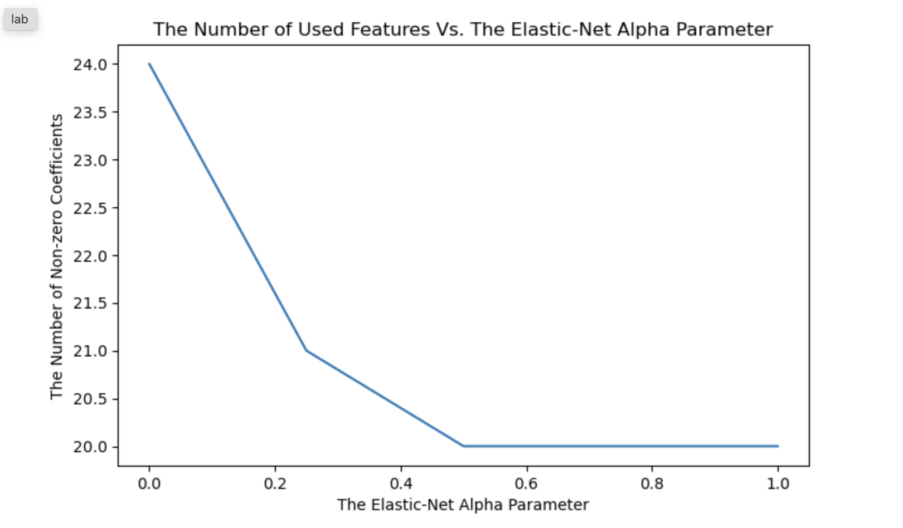
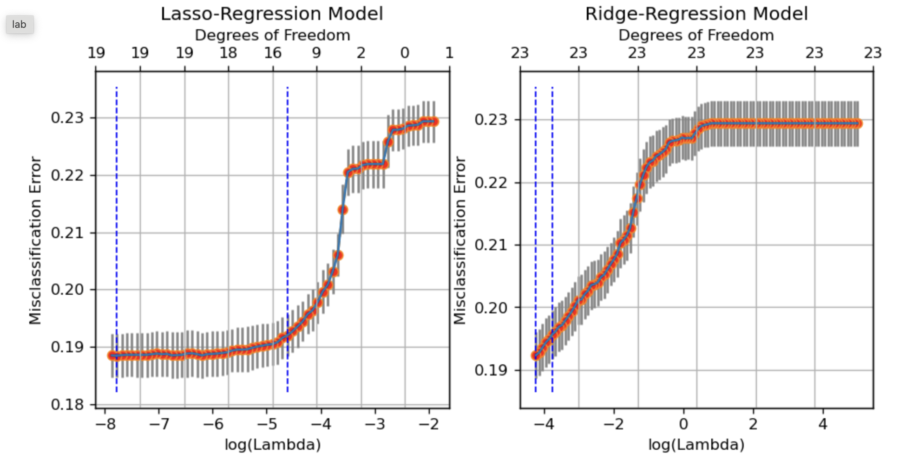
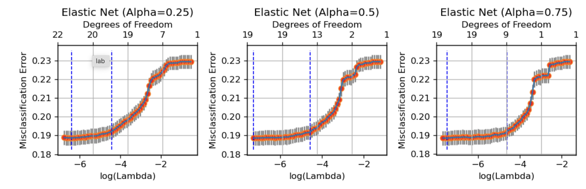

# 4
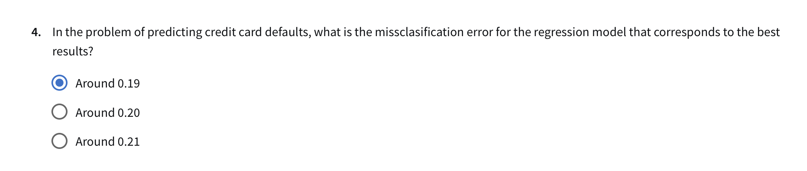

# Results
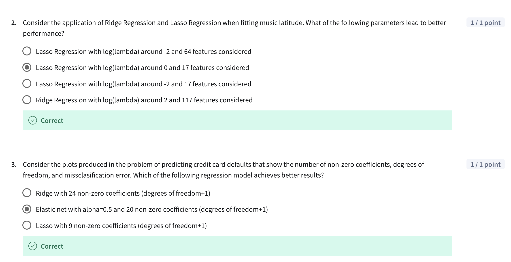
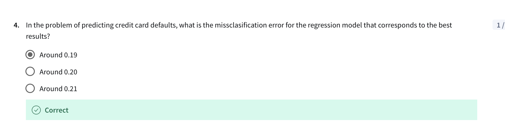
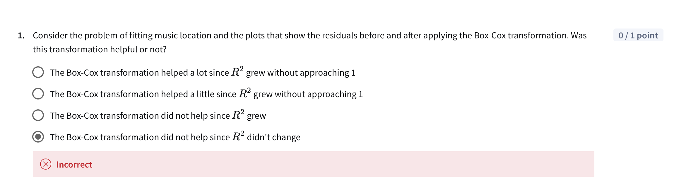

# Attempt 2

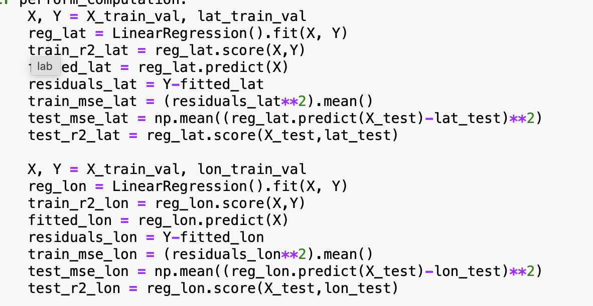
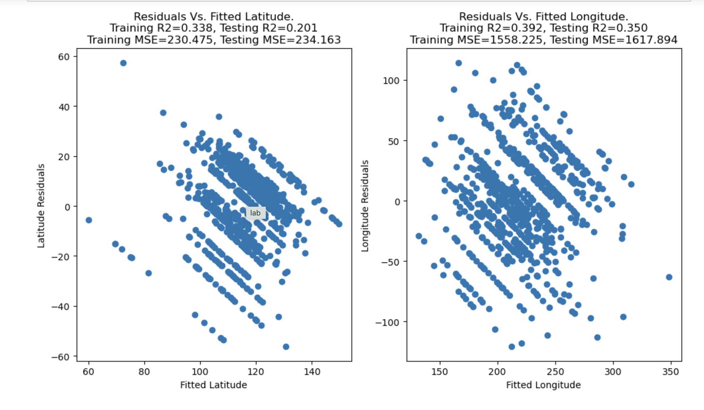

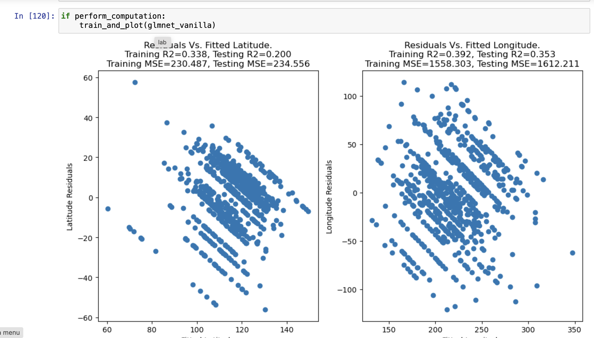
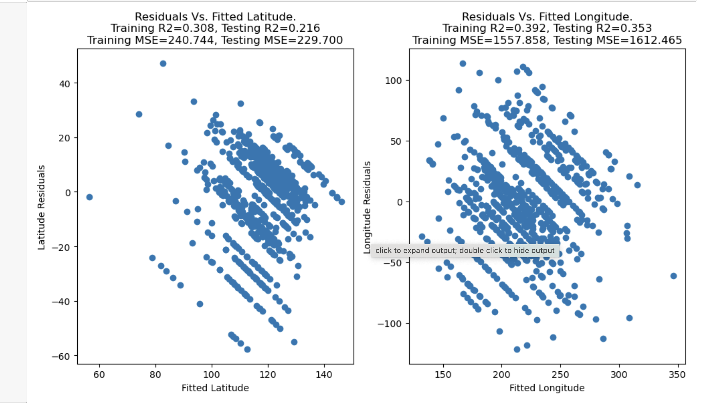

Help me answer this question. Question 1
Consider the problem of fitting music location and the plots that show the residuals before and after applying the Box-Cox transformation. Was this transformation helpful or not?

The Box-Cox transformation helped a lot since R 2 grew without approaching 1

The Box-Cox transformation helped a little since R 2 grew without approaching 1

The Box-Cox transformation did not help since R 2grew

# Attempt 2

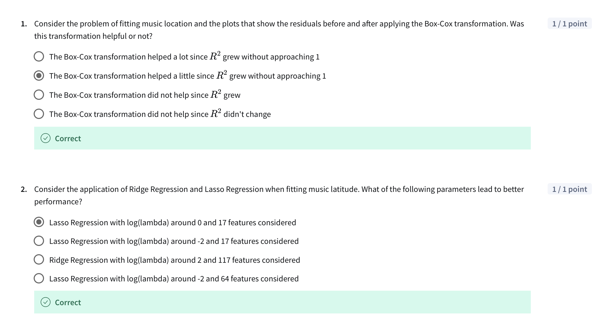
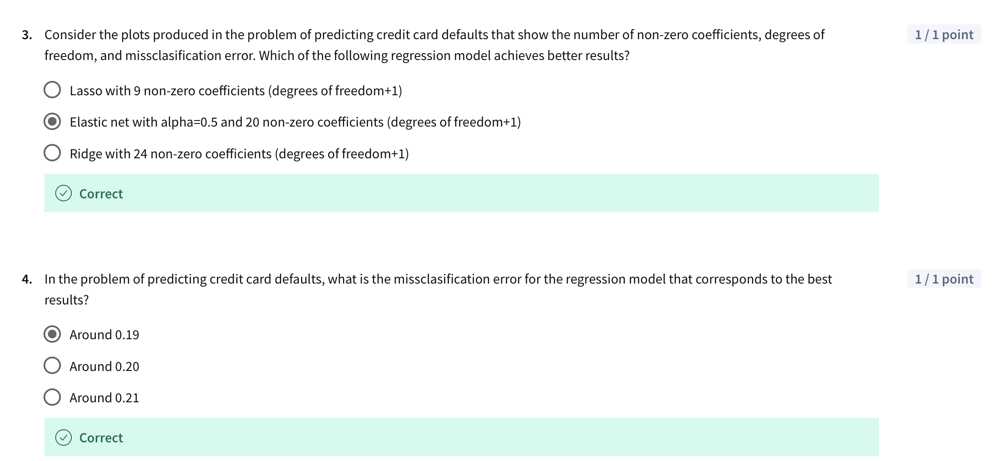