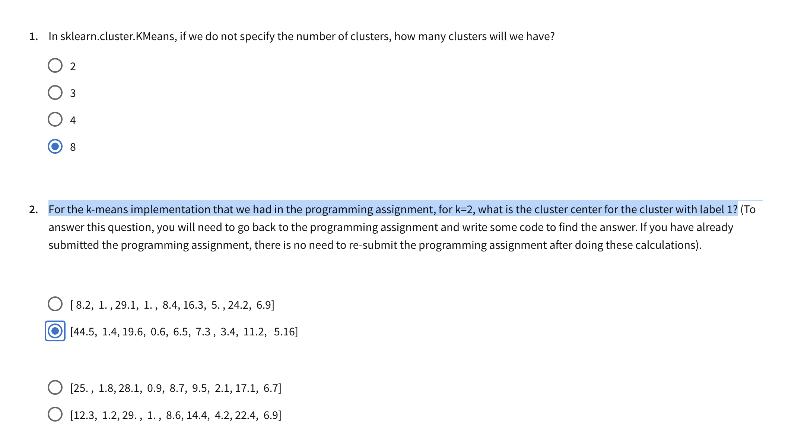
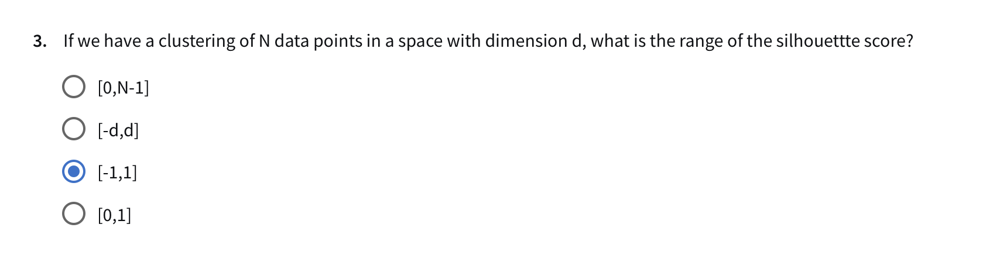

# Use this code
```python
# MyCheck
# Question 2
# For the k-means implementation that we had in the programming assignment, 
# for k=2, what is the cluster center for the cluster with label 1?

# Run KMeans with k=2
model = KMeans(n_clusters=2, random_state=12345).fit(X)

# Retrieve the cluster center for label 1
cluster_centers = model.cluster_centers_
label_1_center = cluster_centers[1]  # The center for the cluster labeled 1

print("Cluster Center for label 1:", label_1_center)

```


# Attempt 1


