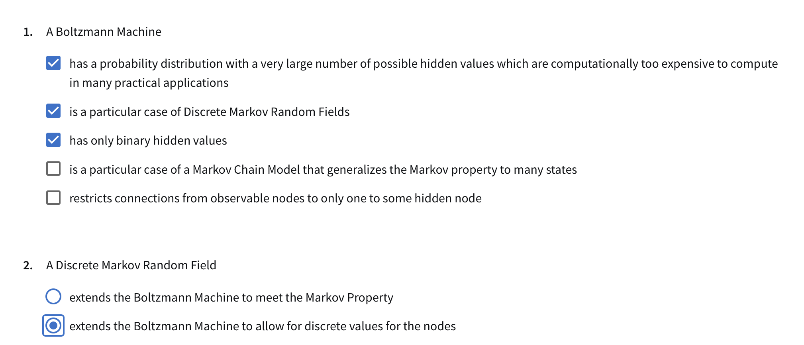

# 3
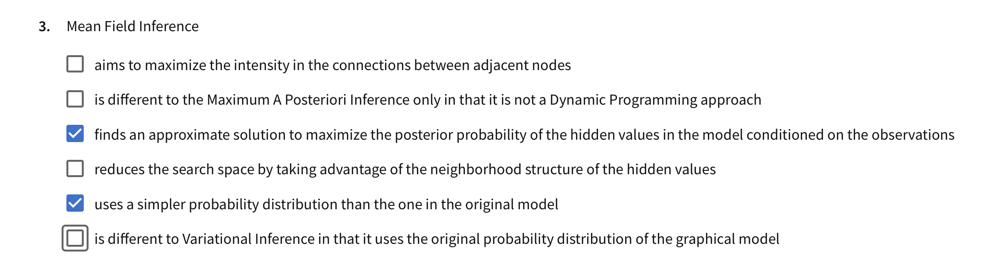

# 4
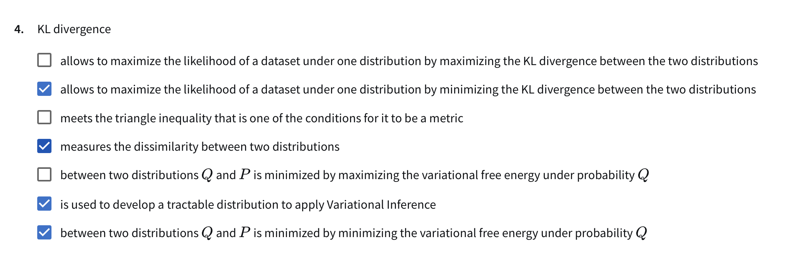

# Answer for attempt 1

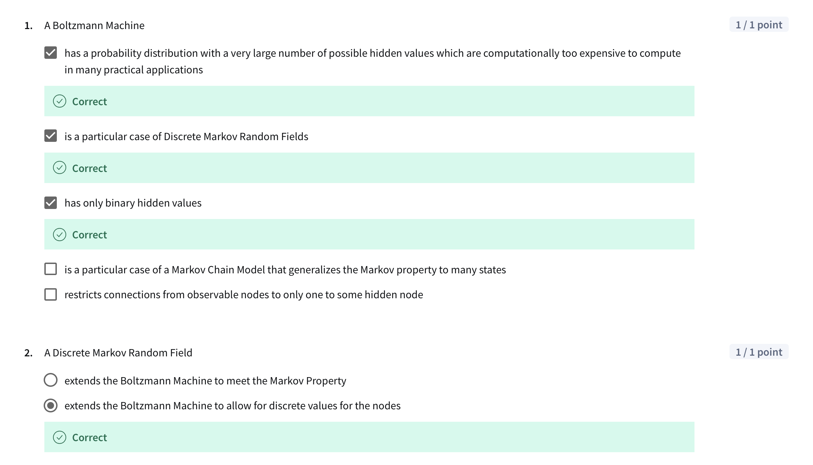

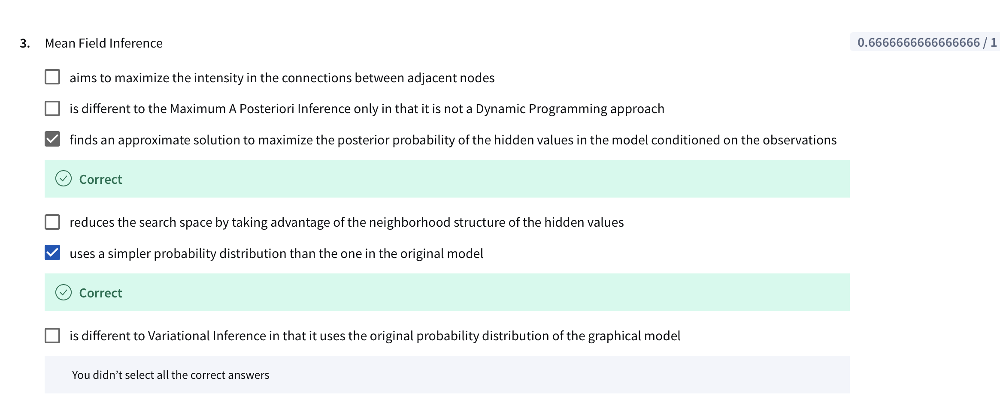

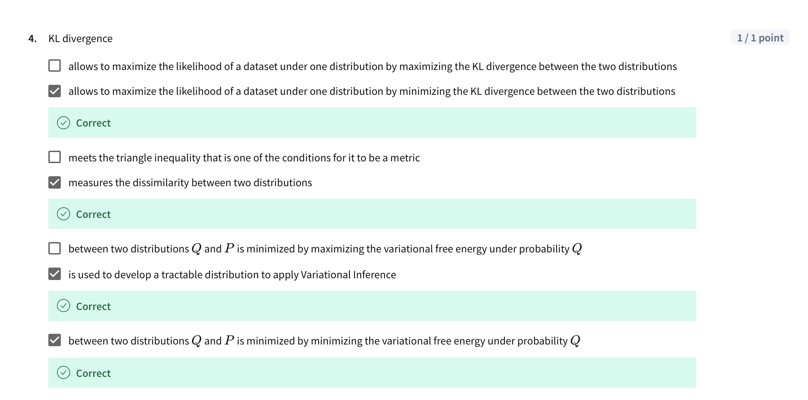

# Attempt 2

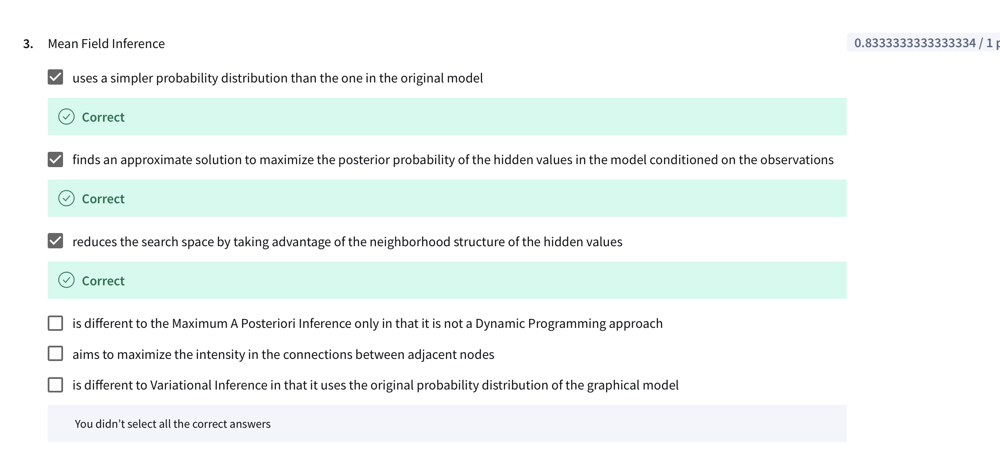

# Attempt 3

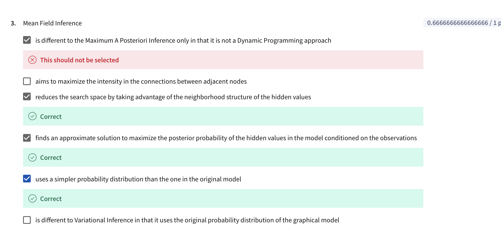

	1.	finds an approximate solution to maximize the posterior probability of the hidden values in the model conditioned on the observations
	2.	reduces the search space by taking advantage of the neighborhood structure of the hidden values
	3.	uses a simpler probability distribution than the one in the original model
	4.	aims to maximize the intensity in the connections between adjacent nodes

# FINAL FULL GRAADE
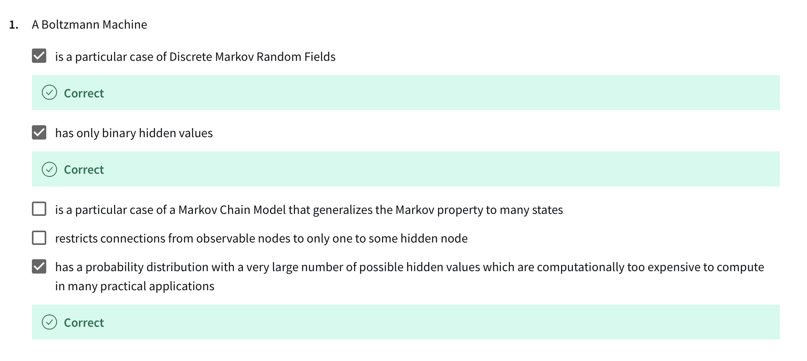
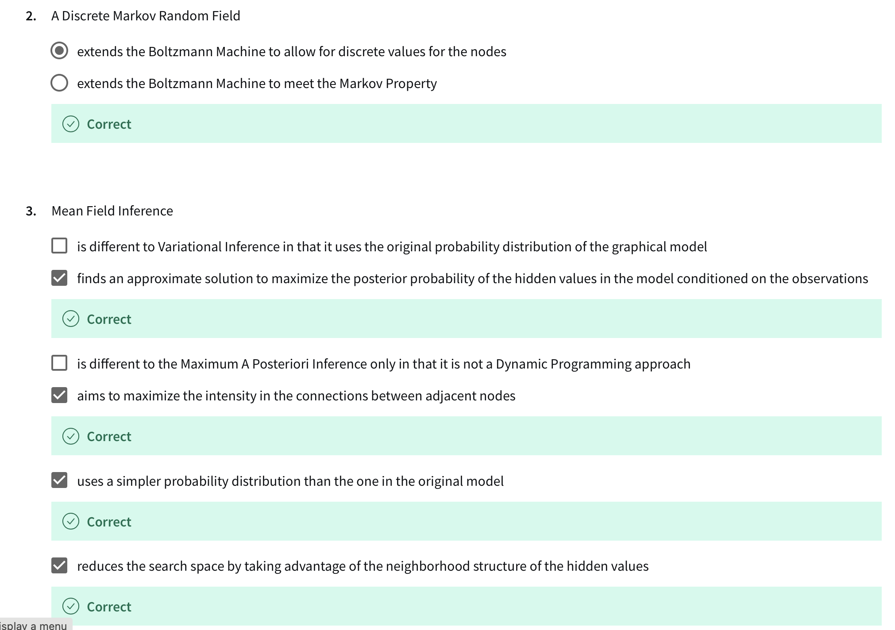
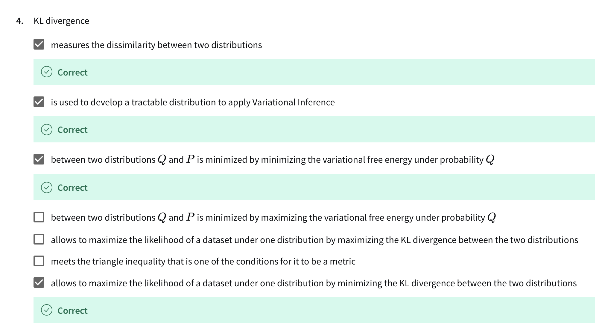