# 1 Convolution (Missing maybe 1 option)

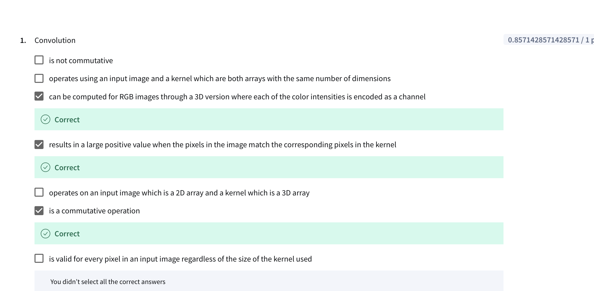

	•	Option 2: “Operates using an input image and a kernel which are both arrays with the same number of dimensions.”

# 2 Padding
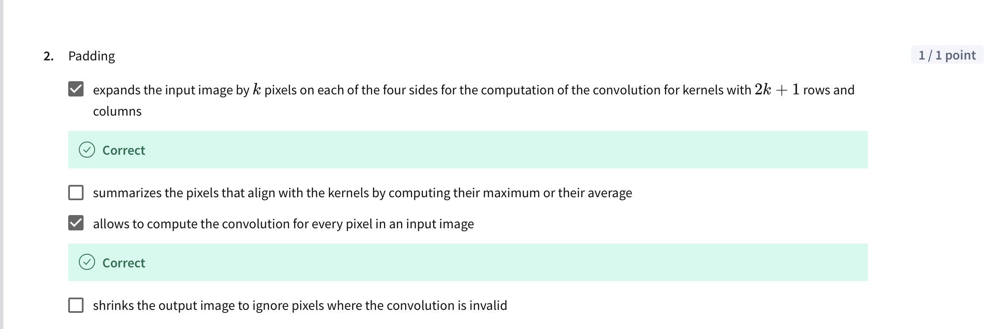

**Ref:**
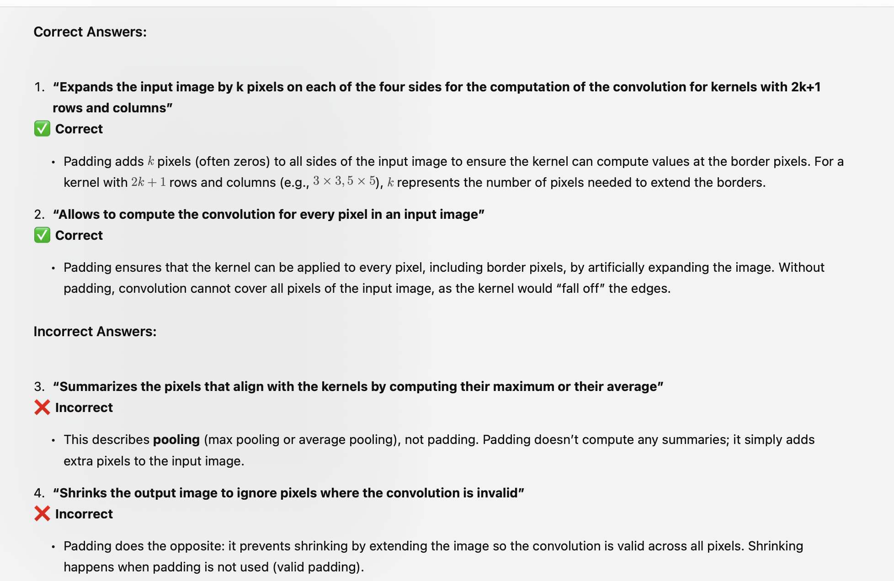

# 3 Feature Map
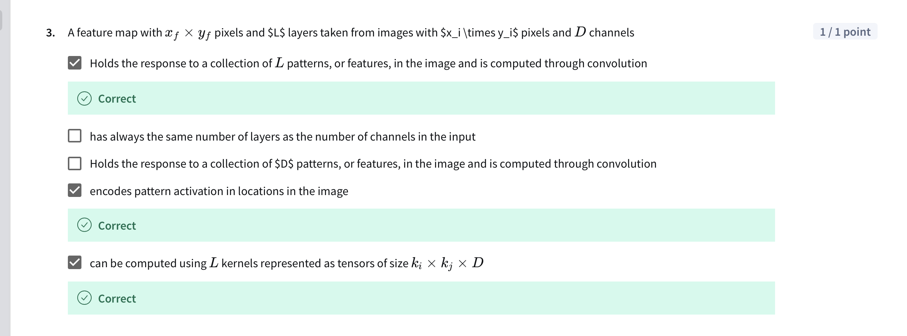

**Ref**
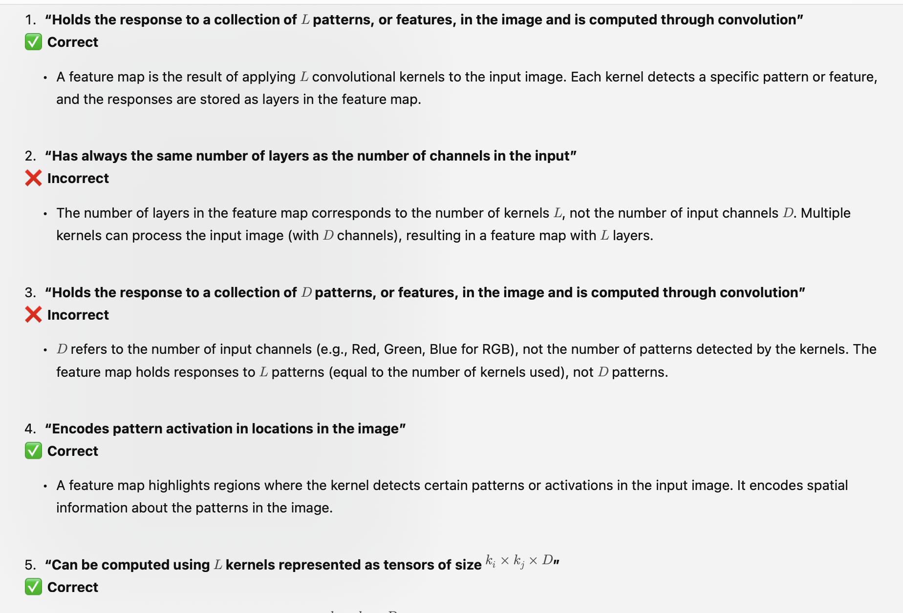
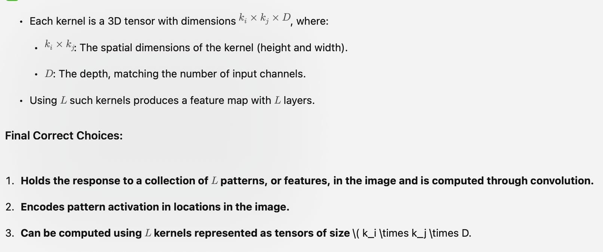

# 4 Convolutional Layer
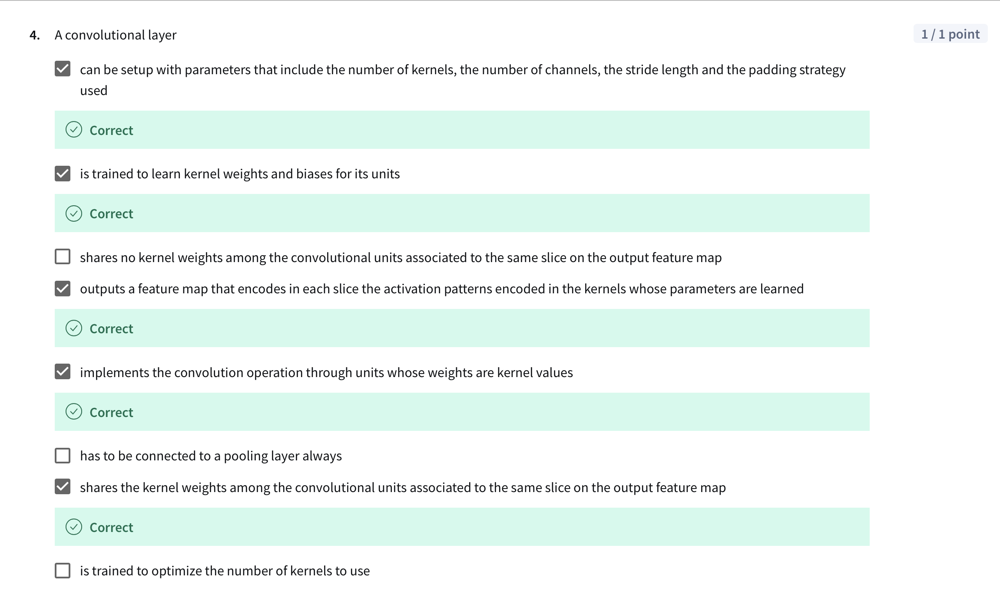

**Ref**
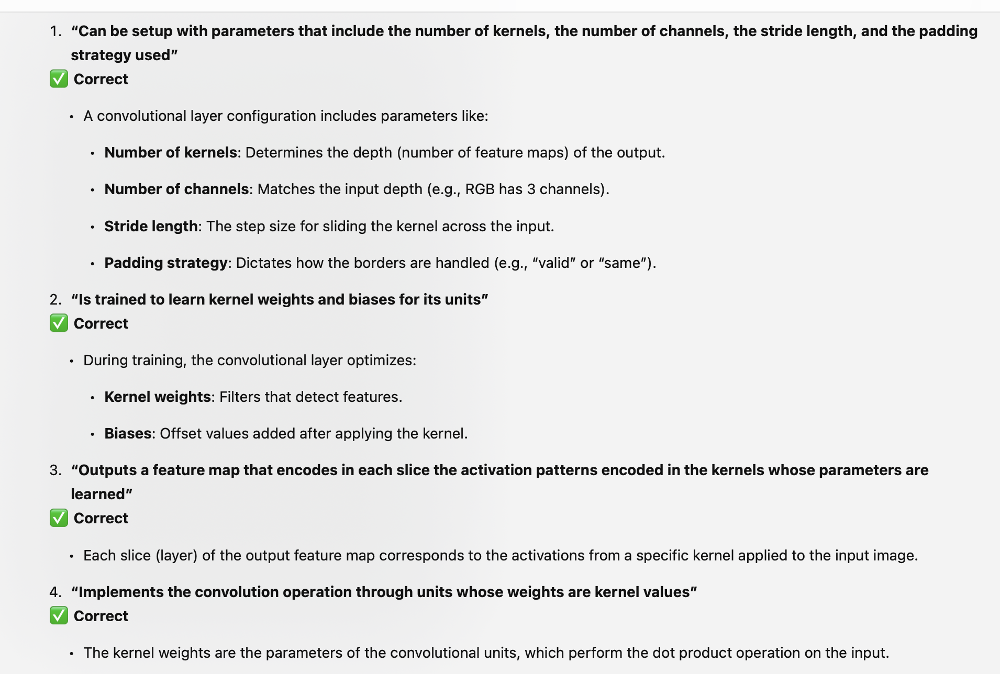
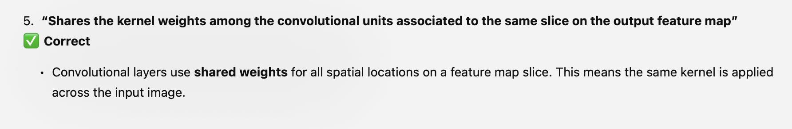

---
# Attempt 2
---

# 1 Convolution
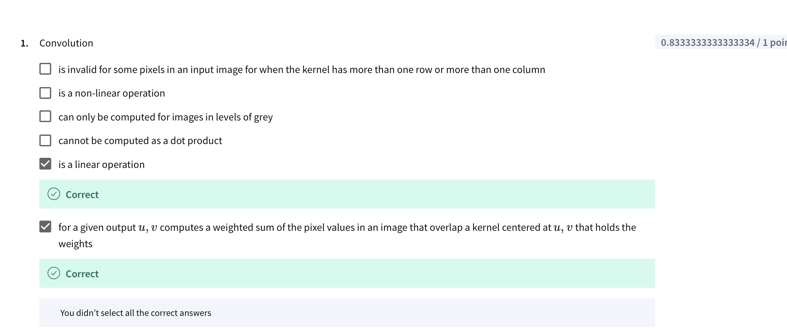

**Ref**
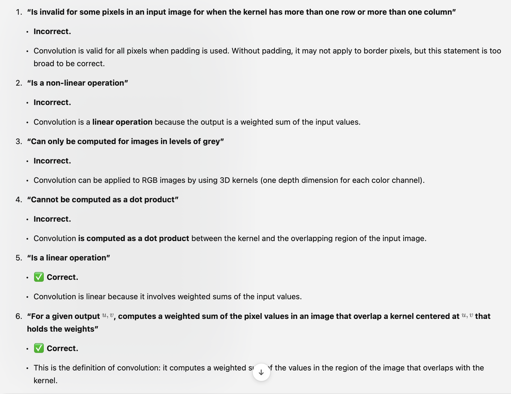

# Question
For question on Convolution, I got 0.8333333333333334 / 1 point

1. is invalid for some pixels in an input image for when the kernel has more than one row or more than one column

2. is a non-linear operation

3. can only be computed for images in levels of grey

4.cannot be computed as a dot product

5.is a linear operation - Correct

6. for a given output u,v computes a weighted sum of the pixel values in an image that overlap a kernel centered at  u,v that holds the weights -Correct

Feedback : "You didn’t select all the correct answers"
Ask: 2 correct answers (5 and 6). In 1,2,3,4 what is likely to be a correct answer

**Ref2 (Updated answer)** 
"
is invalid for some pixels in an input image for when the kernel has more than one row or more than one column"

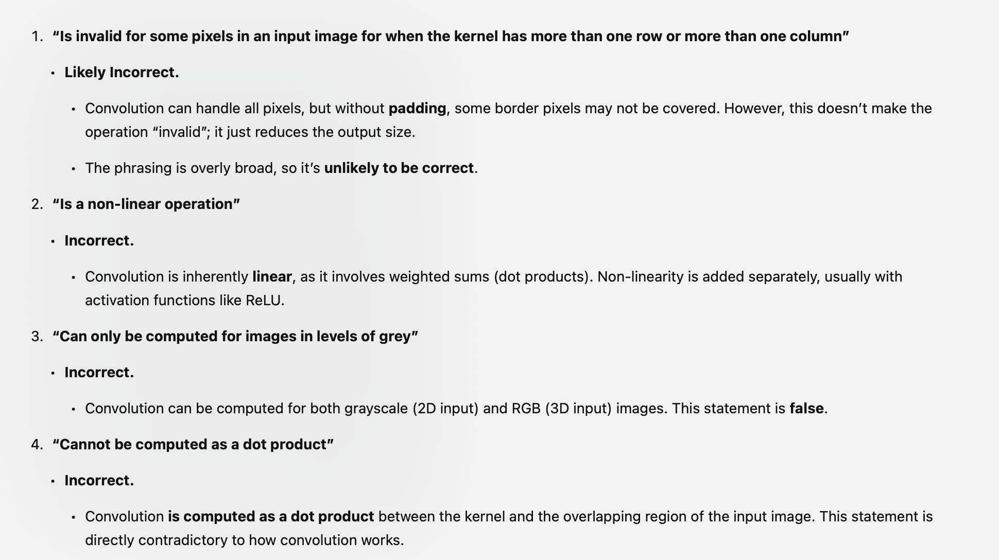

# Pooling
**Question**
pooling

1. uses a patch of length  ku. × kv that is slid through the input image

2. in pooling layers in NNs, the stride length and patch size are learned

3. consists in applying a function to the pixels on a patch to compute an output value that summarizes the pixel values that align with the patch

4. can be taken in strides of length  s>1, and the resulting output in each dimension is about the size of the input in each dimension divided by s

5. expands the input image by k k pixels on each of the four sides for the computation of the convolution for patches with  2k+1 rows and columns

5. in pooling layers in NNs is configured by setting the stride length and patch size without any learning involved

**Answer**

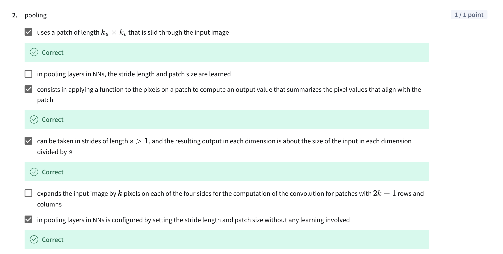

**Ref**
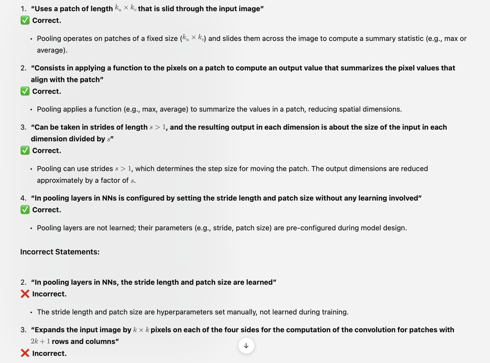

# 3 Feature map (same as attempt 1)
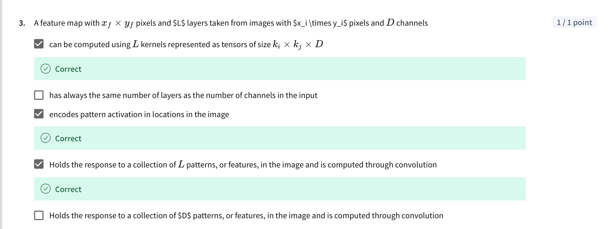

# Question 4 
## Image classification through Deep Neural Networks

1.can get the final classification by connecting a softmax output to each pixel in its output feature map

2.is achieved by identification of patterns at increasing levels of complexity that account for larger patches in the input

3.can be achieved through a stack that include convolutional, ReLU, fully-connected, and softmax layers

4.may involve a flattening fully connected layer close to the output

5.require to use ReLU functions in their non-linear units

6.can get the final classification directly at the output of a Convolutional Layer without any flattening layer

## Answer

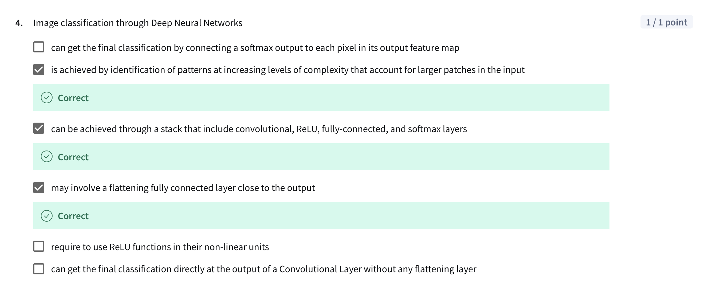

**Ref**
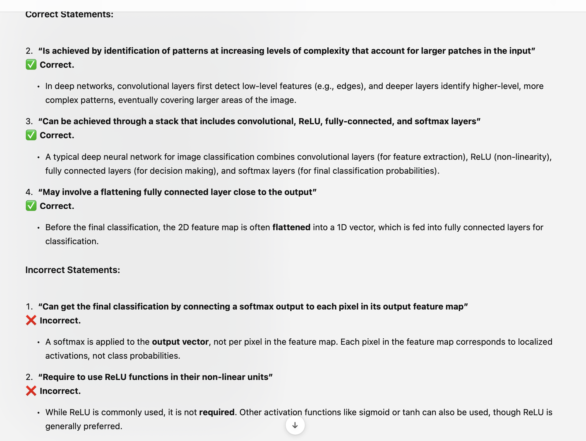