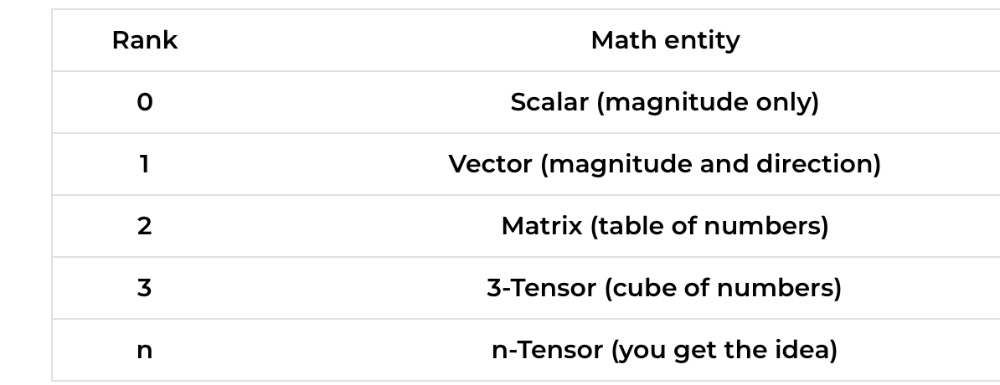
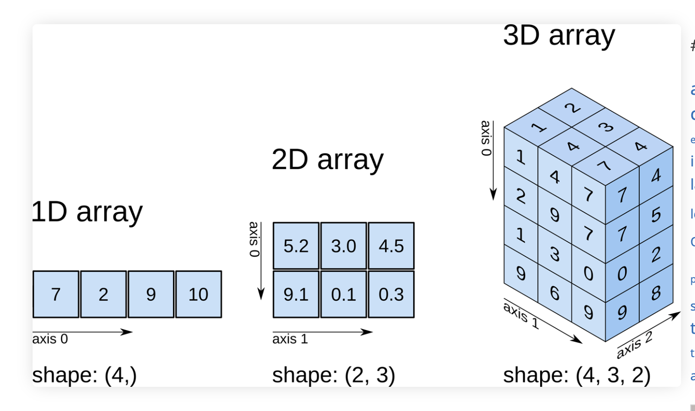
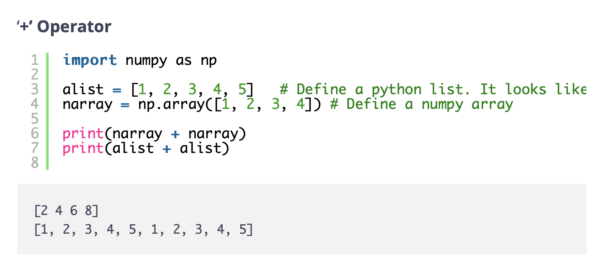
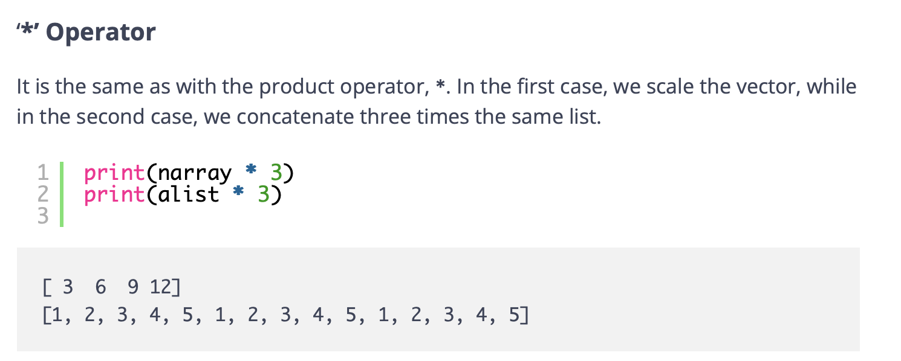
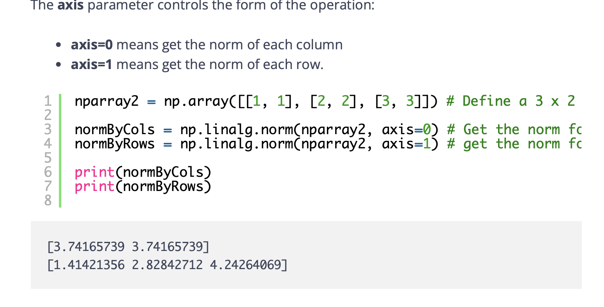
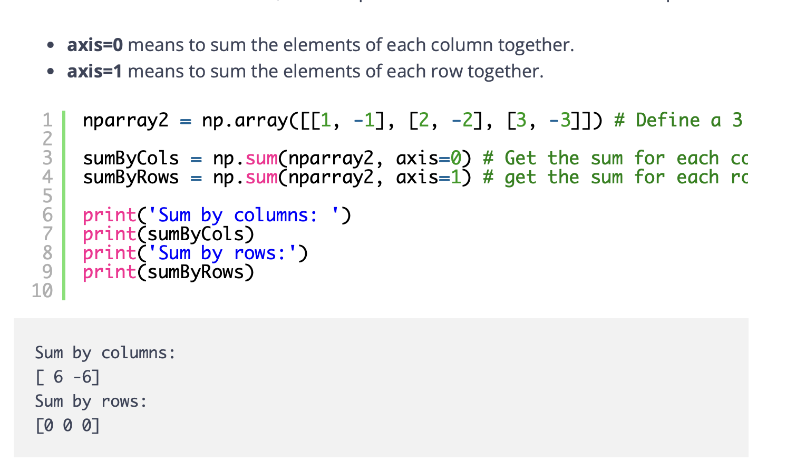
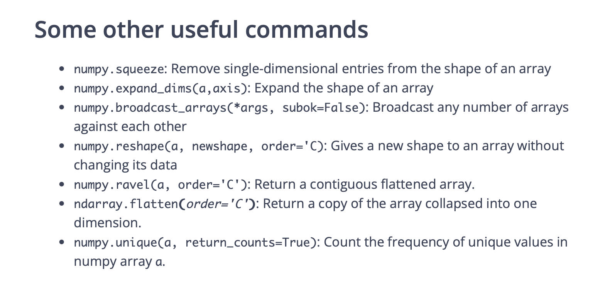

https://www.i2tutorials.com/what-do-you-mean-by-tensor-and-explain-about-tensor-datatype-and-ranks/

# Tensor

- Only one data type

# Rank

# Numpy array
https://predictivehacks.com/tips-about-numpy-arrays/

# List vs. array

# Axis

# Dot product

# sum by columns and rows

# Other useful
