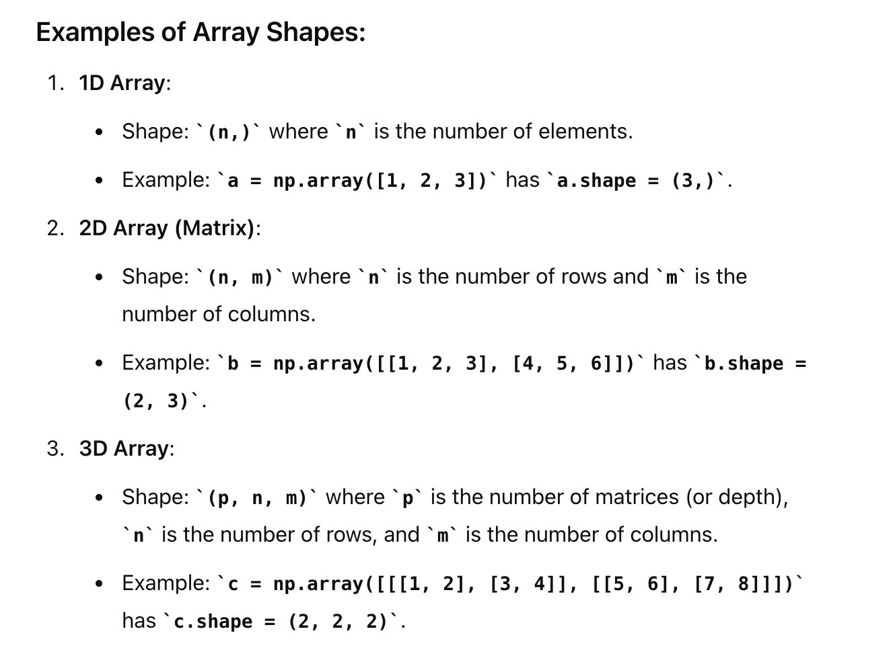
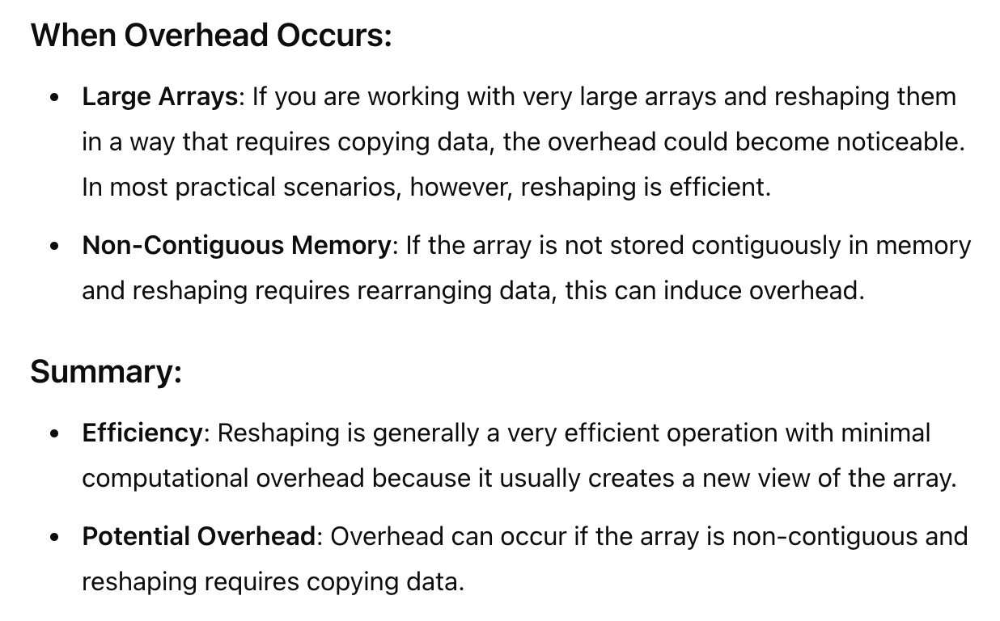
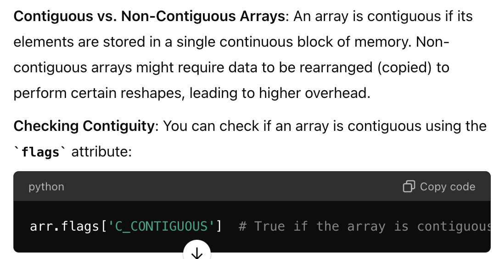
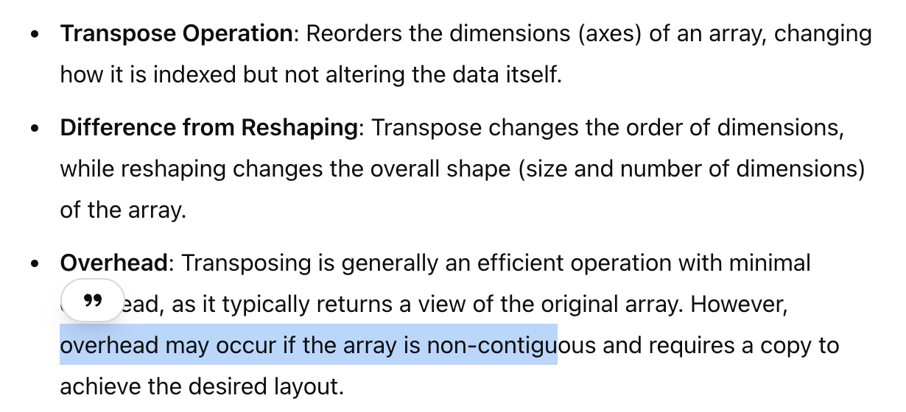
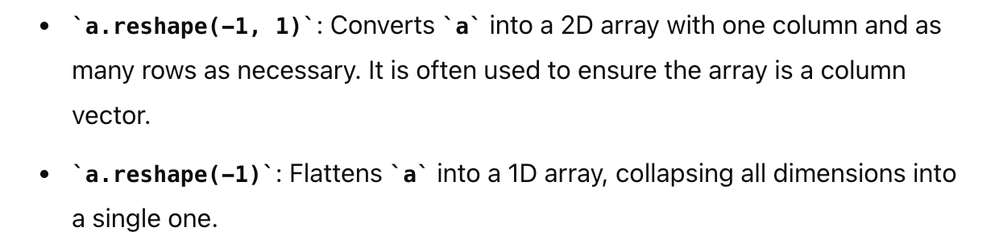
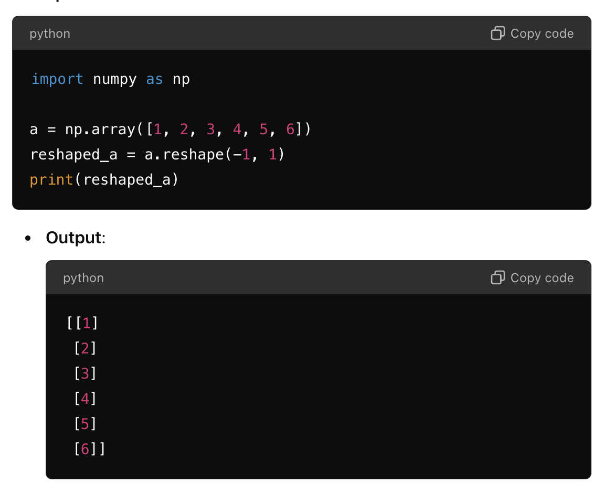
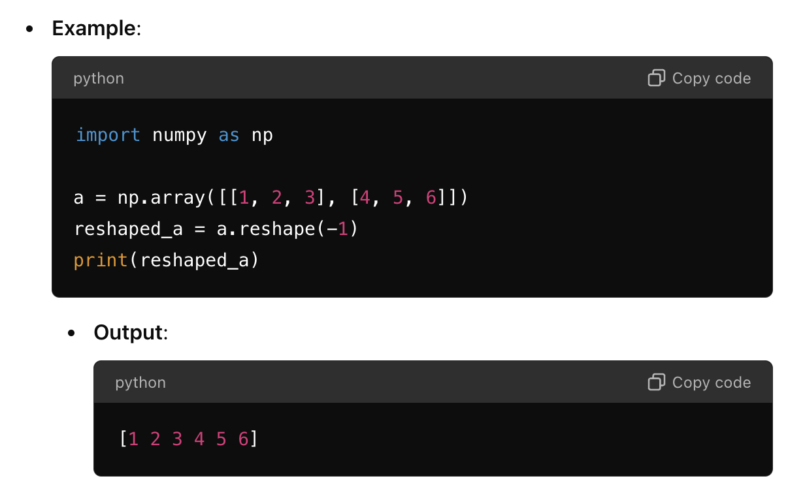
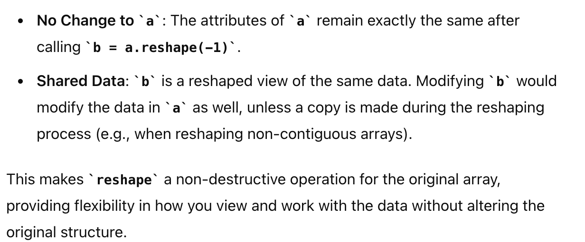
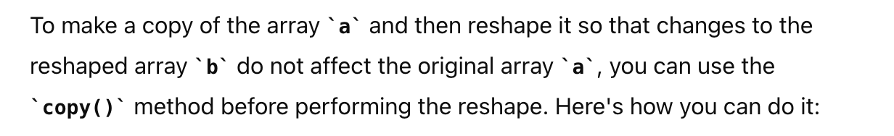
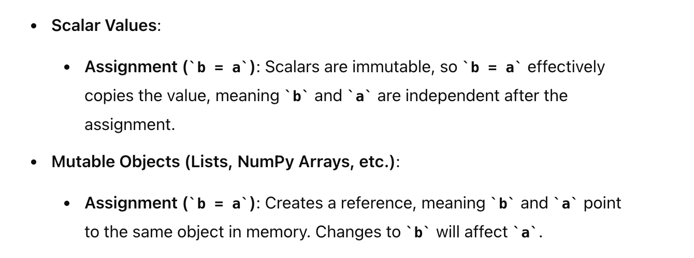

# Learn
In this assignment you will implement the Naive Bayes Classifier. Before starting this assignment, make sure you understand the concepts discussed in the videos in Week 2 about Naive Bayes. You can also find it useful to read Chapter 1 of the textbook.
Also, make sure that you are familiar with the numpy.ndarray class of python's numpy library and that you are able to answer the following questions:
Let's assume a is a numpy array.

---
 **What is an array's shape (e.g., what is the meaning of a.shape)?**
>An array's shape in NumPy refers to the dimensions of the array, which indicates how many elements are present along each axis. The shape is represented as a tuple of integers, where each integer represents the size (number of elements) along a particular dimension (or axis) of the array.
>>

---

**What is numpy's reshaping operation? How much 
computational over-head would it induce?**
>The reshaping operation in NumPy allows you to change the shape (i.e., the number of dimensions and their sizes) of an array without changing its data. The reshaped array is a new view of the original array, meaning the underlying data in memory remains the same, and only the interpretation of the data changes.
>>
> **Contiguous/Non-contiguous**
> 
---

**What is numpy's transpose operation, and how it is different from reshaping? Does it cause computation overhead?**

---
**What is the meaning of the commands a.reshape(-1, 1) and a.reshape(-1)?**
>
**Example**

---

**Would happens to the variable a after we call b = a.reshape(-1)? Does any of the attributes of a change?**

#### Answer:
>

**Note!!!**

---
**1.How do assignments in python and numpy work in general?**
>In Python, assignments generally create references to objects rather than copying the objects themselves. This behavior applies to both standard Python objects (like lists, dictionaries, and scalars) and NumPy arrays.

---
**2.Does the b=a statement use copying by value? Or is it copying by reference?**

> Copy by reference for numpy array and python list
>
**3. Would the answer to the previous question change depending on whether a is a numpy array or a scalar value?**
#### Answer

---
**Reference**
You can answer all of these questions by
1. Reading numpy's documentation from https://numpy.org/doc/stable/.
2. Making trials using dummy variables
--