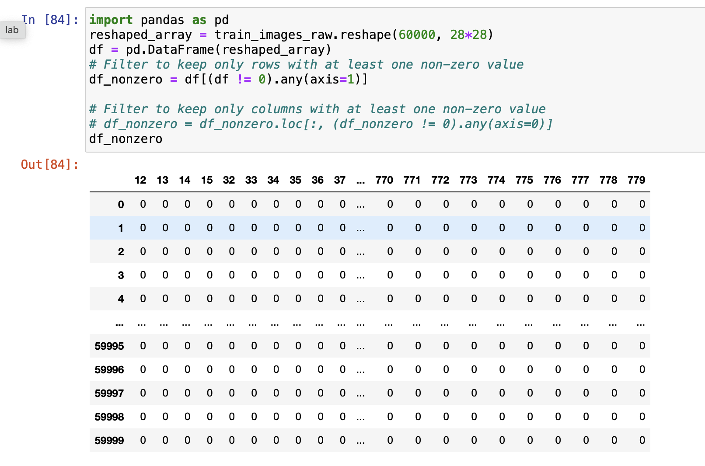
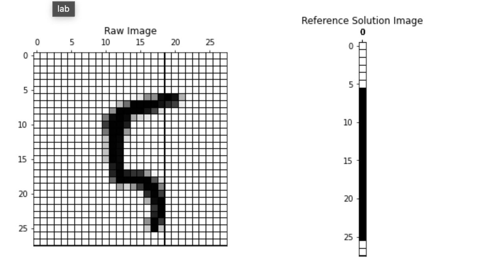
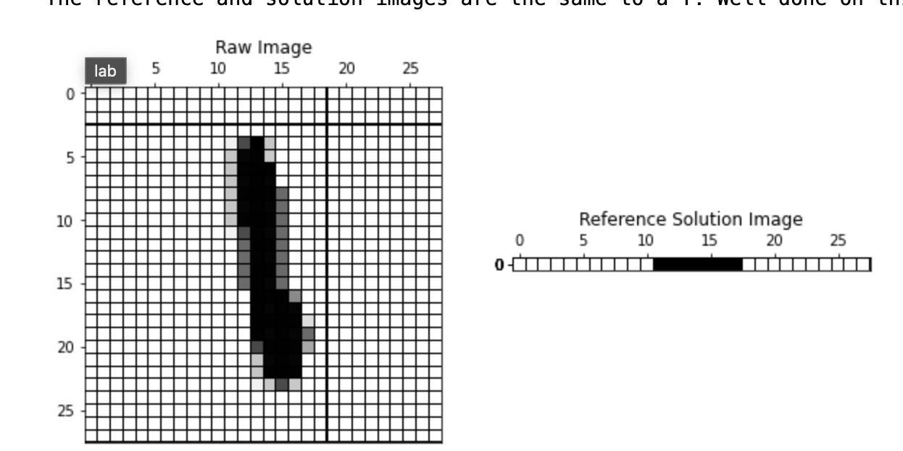
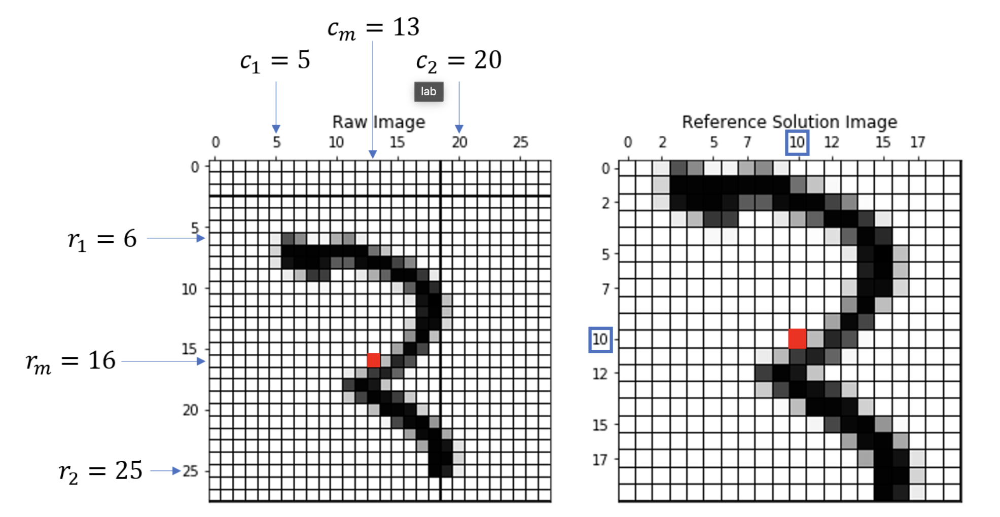
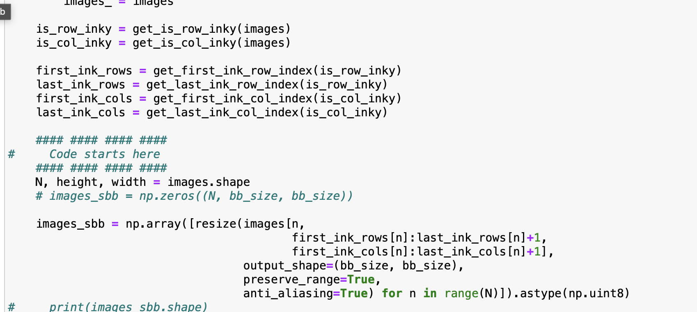

# My understanding
# 1. The numpy MNIST database can be converted to a dataframe
It will look like this


---

# 2. Step 2: Thresholding an image
   
   > - Thresholding an image in the MNIST dataset, or in general, is a **simple technique **used to **convert a grayscale image into a binary image. **
   
   > - thresholding helps in enhancing the contrast between the foreground (the handwritten digit) and the background, which is typically empty or has very low pixel values.

   ---

# 3. Step 3: Identify the row that has ink

 ```
 is_row_inky = np.any(images > 0, axis=2)
 ```
**Solution**
 

---

# 4. Step 4:  Identify the row that has ink
    
    ```
    is_col_inky = np.any(images > 0, axis=1)
    ```

**Solution**


---

# 5. Find First inky row and column

```

# Find the index of the first True value in each row (axis=1), if no True exists return -1
    first_ink_rows = np.argmax(is_row_inky, axis=1)
    
# Handle cases where there are no inky rows by replacing 0 with -1 for those cases
    first_ink_rows[~np.any(is_row_inky, axis=1)] = -1v
```

**First inky column**

```
# Find the index of the last True value in each row by reversing the array and using np.argmax
    last_ink_rows = is_row_inky.shape[1] - 1 - np.argmax(np.flip(is_row_inky, axis=1), axis=1)
    
# Handle cases where there are no inky rows by replacing with -1 for those cases
    last_ink_rows[~np.any(is_row_inky, axis=1)] = -1
```

---

# 6. Final "Bounding Box" 
Find mid point and impose the middle point shifts

The red box is calculated as middle of the image canvas


**Solution**


---

# 7. Stretched Bounding Box
use skimage.transform.resize function

