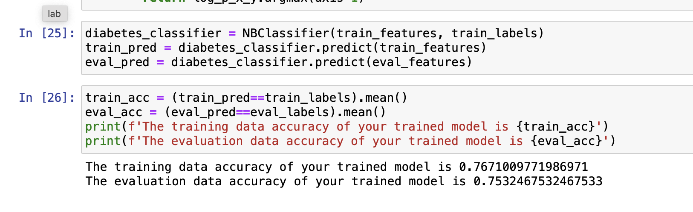
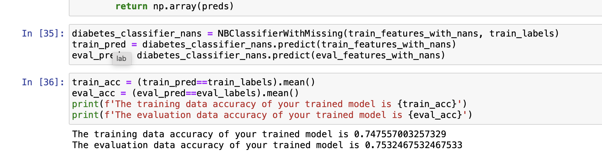
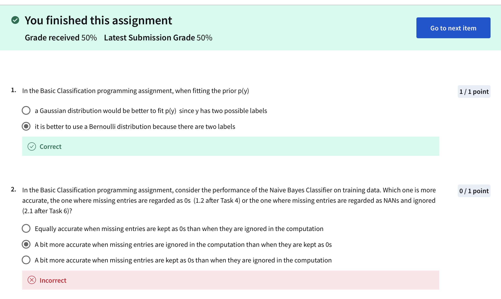
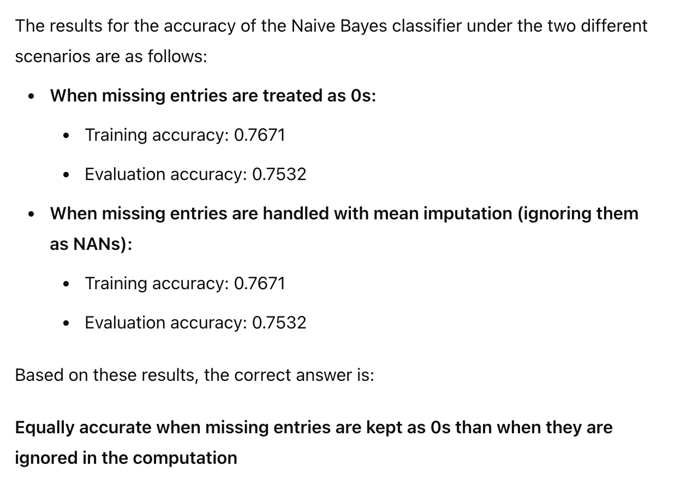
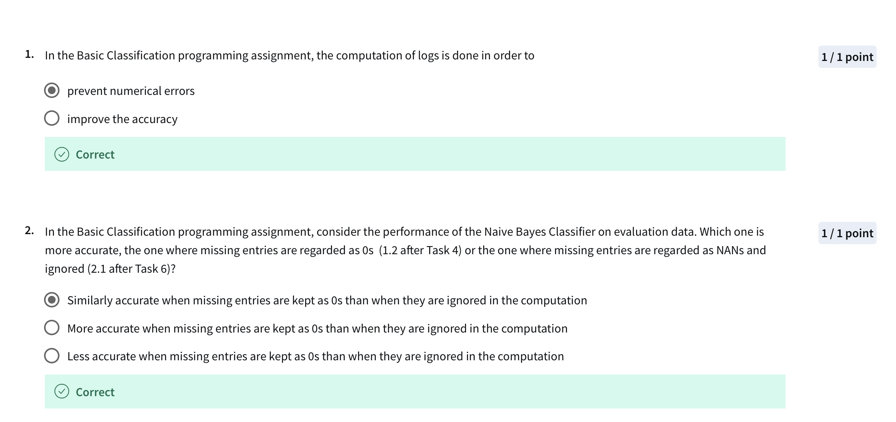

**Ignore missing**

### with nan

# Attempt 1

# Next attempt

# Attempt 2

**Note**
> Prevent numerical errors

In classification tasks, particularly with Naive Bayes classifiers, the computation of logs is typically done to prevent numerical errors. 
This is because multiplying many **small probabilities can lead to very small numbers, which can cause underflow issues.** 
By taking the logarithm of probabilities, the multiplication of probabilities becomes a sum of log-probabilities, which is numerically more stable and prevents such errors.