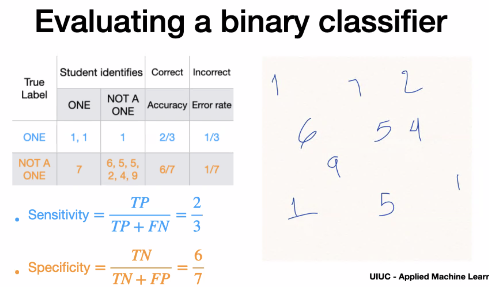
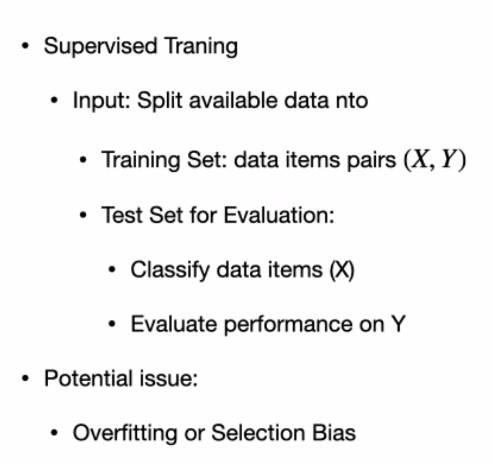
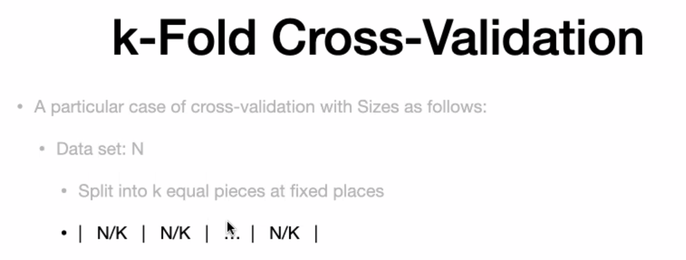

# Topics

*Classification, regression, high dimension data, graphic models,  deep learning

# Week 2 Classification

- what class an item belong to based on features
- Class - 'scalar value" =y

# evaluation

# training vs. test

# Cross validation - training,validation, testing

- training set ="N" not including test
- 12 records , k=4 (4 buckets)
- n/k = 12/4 = 3 in each set
- training = n-n/k = 12 -3 = 9

**Usage**
-----
- pick the best model
- Also pick the best regularization term

---
# Nearest neighbour
- not fre quently used
- even with kd tree and lacality based hashing , its performance is slow
- Cons: missing values, can cause issue

---

