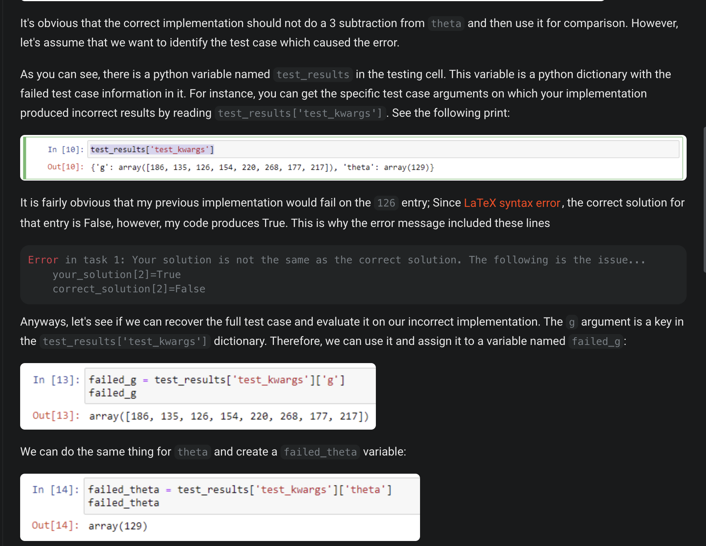
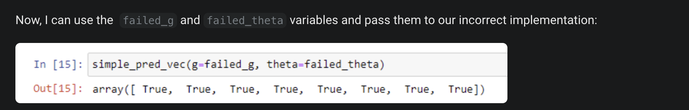
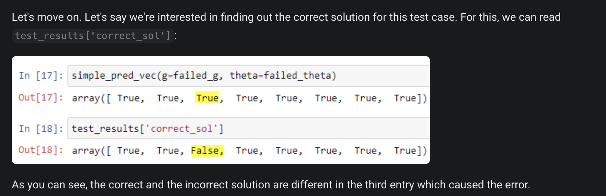
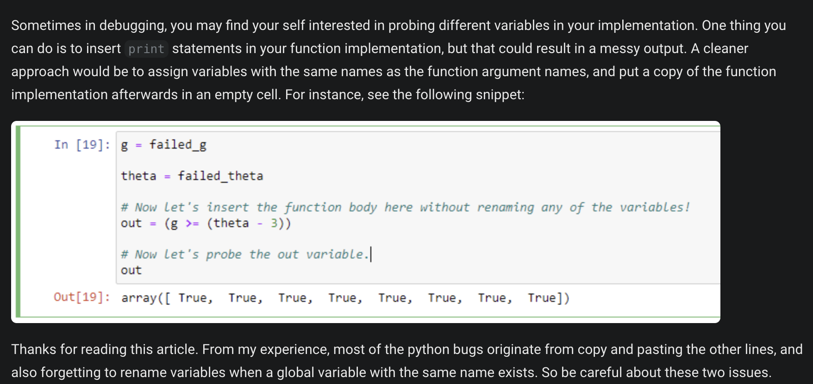

https://campuswire.com/c/GC92AFBD6/feed/6

Many of you have already started on the first Numpy assignment 1B. 
This is a note to help you id**entify which arguments caused your code to fail the pre-computed test cases.** Most of the upcoming assignments use the same structure, so it may be worthwhile to learn about the pre-computed testing interface. We tried to repeat the same information in many places throughout the assignment, but I will re-mention the same topic to make sure everyone has an easy time identifying their error cases.

Let's consider the first task of the Numpy assignment 1B. Here is an intentionally mistaken implementation:

---

--
# Simpler solution to see the failed use case

---
# Compare failed and expected scenario

---
# Important piece of Debugging

---
# The end