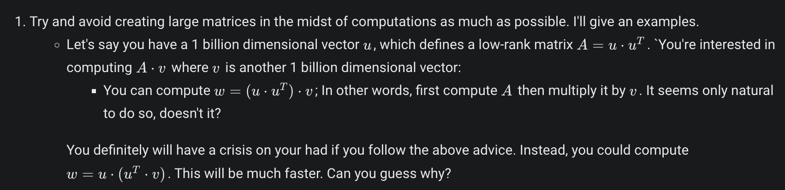
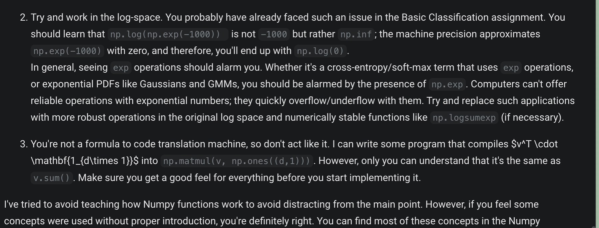

# Numpy Zen
It's no secret that we 
(1) condemn using avoidable python loops, 
(2) steer you in the direction of vectorization and using libraries such as Numpy.  

"But Numpy is a huge library!", you may ask, "What should I do or avoid doing in Numpy?". 
Here are a few essential tips:

**Features You Definitely Should Learn about**
> **Broadcasting:**

You'll need it sooner or later. Without it, your code will get unnecessarily difficult and slow. Just take the time to read what we referenced for you in the first week: 
https://numpy.org/devdocs/user/basics.broadcasting.html 

This allows you to add/multiply/etc. two arrays with different shapes! You may not know this, but it'll make your code way faster, generalizable to many shapes, and less cluttered.

> **Indexing and Slicing:**

This is also another extremely handy way of manipulating arrays. Believe me, it'll be worth your time: https://numpy.org/doc/stable/reference/arrays.indexing.html

> **Element-wise vs. Matrix Multiplications:** 

The operators *, +, -, and / work in an element-wise manner. If you need matrix multiplication (which is mostly used in theoretical derivations), you should look for np.matmul or @ or np.dot functions/operators.

>**The axis Argument in Most Numpy Functions :** 

You'll inevitably need to understand it.

# Things You Can Use More Often

**Reshaping:**
It has almost no over-head; the underlying data stays the same, and only a few numbers (i.e., the .shape attributes of the python object) change when you use reshaping on an array.
**Basic Comparison Operators:**
Believe it or not, c = a > b and c = (a==b) and c = (a==5) can work on two (broadcast-able) arrays.
Do you see any notion of shape or dimension in this short implementation? No! This means that you can possibly add more dimensions to all your arrays without even changing the inner workings of your code (e.g., you could insert an extra "batch" dimension at the beginning).
These operation can provide very powerful tools when you combine them with slicing.
Although c will have the np.bool dtype, you can convert it to an np.int or np.float in case you absolutely need so. However, you can multiply c by another floating point array without converting it to float; Numpy is smart enough to treat True values as ones, and False values as zeros when computing such multiplications.

# Things You Should Use Less Often
> **Transposing:** 
Although this operation may seem similar to reshaping for 1-D arrays, it's actually very different from the other one. Transposing an array pretty much ends up re-arranging all its underlying data. In particular,

Having two consecutive transposing operations should be a warning sign about inefficiency for you!
IRL, if you plan the order of the dimensions of your data carefully, there will be little (or no need at all) for transposition operations. In your assignments, we carefully preprocessed the data and provided you with inputs which don't require such manipulations.

**np.vectorize:**
It just doesn't work the way you think/want. The name can be somewhat misleading; you expect to feed it some scalar function, and get an efficient vectorized implementation. However, that's neither why this function was designed, nor how it works:

This function was added to generalize Numpy operations to all python objects. Once you learn about all the cool features of Numpy (e.g., broadcasting, reshaping, etc.), you start to wonder, "Wow, can't we have all these nice things for all python objects and not only numbers?". This function is a response to this need; you can define your own object classes, and "addition"/"multiplication"/etc. methods for them. Numpy can then create an array out of your objects, and then apply nice Numpy features such as broadcasting using this "np.vectorize" functionality. It's not about efficiency; it's about being able to define and work with arrays of customized objects.
This function is not targeting efficiency. There is no way this Numpy function has a "smart" agent reading your python addition code, and then thinking with itself that this addition can be accelerated using SIMD assembly instructions, and replace your python addition with accelerated C addition. AI just hasn't caught up being this smart yet!
np.where: You just don't need it! There's always a simpler workaround. Let's say you want to only increment the positive numbers in an array a = np.array([-1, 3, 4, 8, -6]).  You have the following two options:

> **Using np.where:** 
You can write a = np.where(a>0, a+1, a).
Using Slicing: You can write a[a>0] += 1.
The second one is preferable over the first; you won't compute the whole a+1 array and then dispose the negative elements. Besides, Slicing is way cooler; you can do multi-dimensional slicing! For instance, if you had an array b with b.shape == (3, 4, 5), you can compute things like b[:, :, b[0,1] > 1] +=1. Doing the same thing with np.where will both require more effort, and would be less efficient.

>**np.gradient:** 

The name is again misleading; it doesn't compute the gradient of a function (no program can compute gradients based on function values at certain points as they're inherently independent of each other). It just computes consecutive element differences, and that's why it seems like a "discrete derivative" or a "finite-difference" per se, hence the np.gradient name.

> **np.concatenate, np.stack, np.hstack, and np.vstack:**

These functions sometimes are absolutely necessary, especially when you're dealing with pre-processing, and you're data is coming from different places. However, you should avoid over-using them; they can be anti parallelization!

Let me give an example: I see lots of students do something like a = np.stack([y==0, y==1, y==2, ..., y==9]) or similarly with other mentioned functions. Assuming that y.shape==(d,), you can perform a = (y.reshape(1,-1) == np.arange(2).reshape(-1,1)). The second method is more efficient, and out-sources the job to Numpy and C for better parallelization.

> **np.append:**

Just don't use it; arrays are not lists, and appending to them is just expensive.

> **np.array([f(x) for x in arr]):** 
1.

https://numpy.org/doc/stable/. F
or instance, the absolute beginner guide https://numpy.org/doc/stable/user/absolute_beginners.html 
or the quick tutorial https://numpy.org/doc/stable/user/quickstart.html are well-written. 

I find our students to have extra-ordinary capabilities to find and uncover really nice resources, so please share any resources you find useful with others down in the comments.

---
# The end