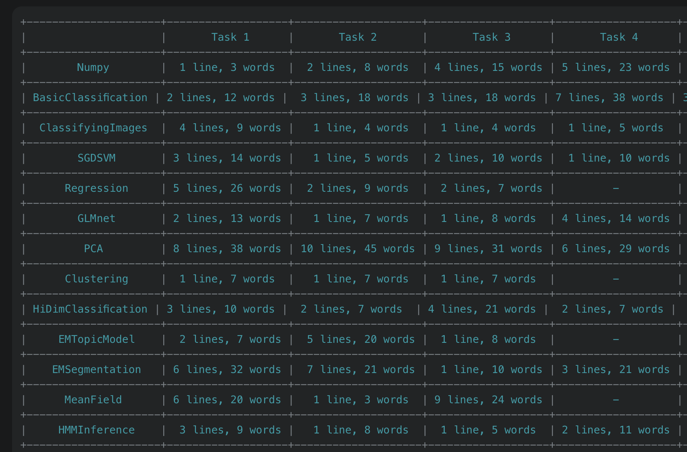
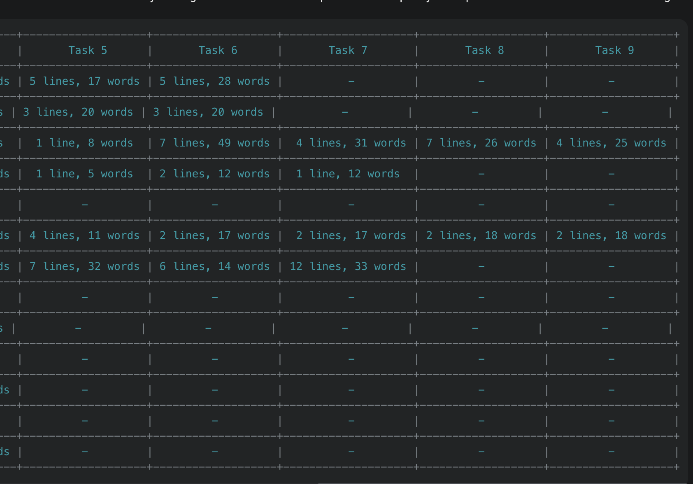

Many of you may find a more difficult time solving the assignments than we intended to. 
While building things from scratch indicates a strong determination on behalf of the student, we fault ourselves for not successfully communicating the necessary building blocks for implementation to you. 
Ideally, any course should teach students new knowledge and set of skills, and expecting the students to always “build from scratch” doesn’t serve this goal well. 
This note is an effort to detect and address this shortcoming as early as possible.

Although a plethora of tutorials and notes exist on learning library functions, including but not limited to

The Numpy quick-start: https://numpy.org/doc/stable/user/quickstart.html , and

The Numpy basics for beginners: https://numpy.org/doc/stable/user/absolute_beginners.html , and

Broadcasting in Numpy: https://numpy.org/doc/stable/user/basics.broadcasting.html , and

Indexing in Numpy: https://numpy.org/doc/stable/user/basics.indexing.html , and

Assignments 1A and 1B,

it is not realistic to expect all of you to read and know about all library functions and capabilities in advance. Many students prefer a "Learn on the Job" approach towards the assignments, and we certainly don't want to judge or discourage them; each students has a unique way of effectively learning the subject, and we trust their wise choices.

While we try our best to let the student know about any methods that could improve their solutions, it is usually too late for such an advice. Obviously, students can't know in advance if there is an easier and more effective solution. Mostly, questions are only posted after the student hits a road-block, spent hours of their time, and wrote large amounts of code. At this point, telling the student "there was an easier solution" can seem like an insult or an evil act. On the other hand, helping the students continue applying non-optimal procedures and making a habit of them is not particularly the right action. Therefore, it is always better for you to have a rough estimate of the amount of effort that is supposed to go towards a task before starting to implement it.

The following table provides you with such an estimate; we compiled the number of lines and words that are supposed to be inserted by the student, using our own reference implementation. To be clear, this is merely done to notify the student about whether there is an important feature they're missing on, and should not be treated as a contest to write smaller code. Writing fewer lines of code is absolutely not a good measure of the implementation quality or its performance or the student's learning.





Hopefully, this information can let you know if there is any major functionality you're missing out on. Once you know about such an issue, you can start reading about relevant library features on a need to know basis, or even make inquiries. We tried to include such necessary references in the task descriptions, but it is completely understandable if you miss them out in some of the tasks.

Finally, we hope this information to help you and improve your learning experience by the tiniest amount. Thanks for taking the time to read this post.

Sincerely
CS 441 Team

P.S. If you're curious what "words" are in the table above, they are supposed to be variable names, library names and functions, and things alike. Perhaps, the function used to extract the "word" count from a string of code can be more descriptive:

# WORDS Code
```python
def count_words(code_string):
    s = re.sub('[^0-9a-zA-Z_]+', '*', code_string)
    words = [w for w in s.split('*') if (w.isupper() or w.islower())]
    return len(words)
```