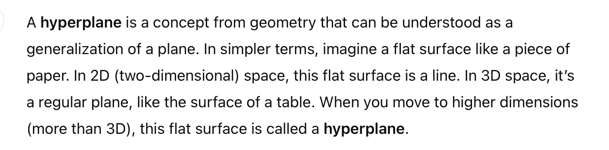
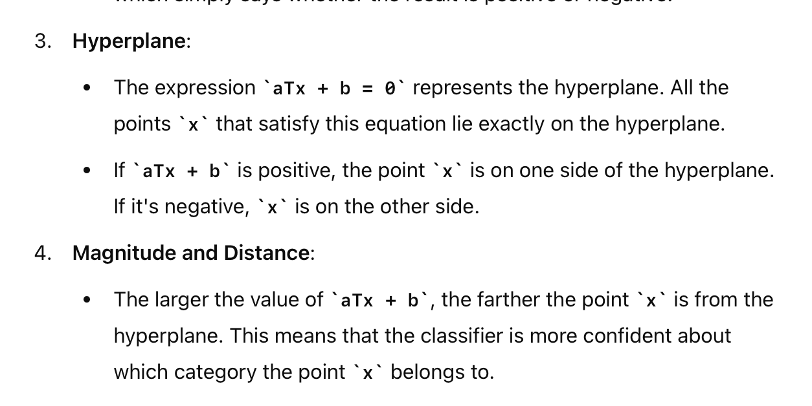

> Think of the hyperplane as a boundary line (or surface) that helps separate different groups of data. The linear classifier is a tool that uses this boundary to decide where new data points belong. The equation aTx + b = 0 is like the mathematical description of this boundary.

## What is Hyperplane?

## How to infer?
