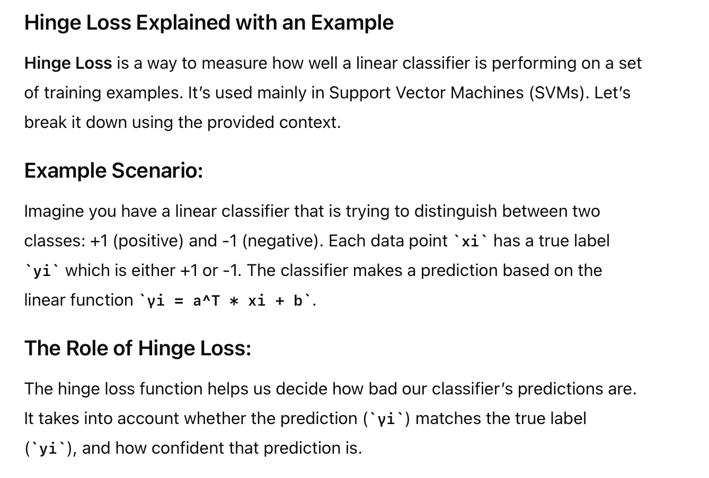
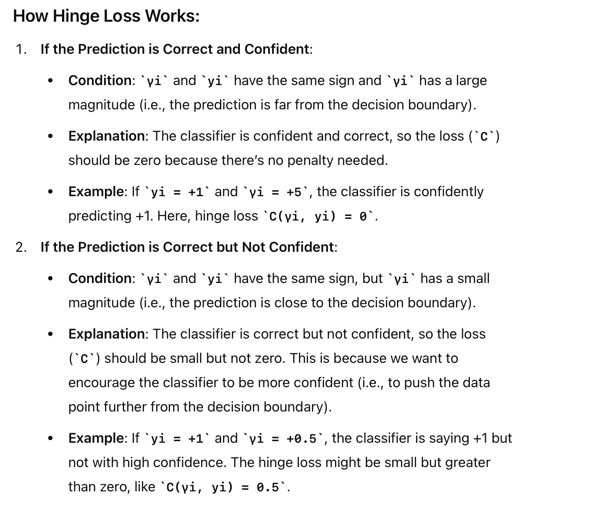
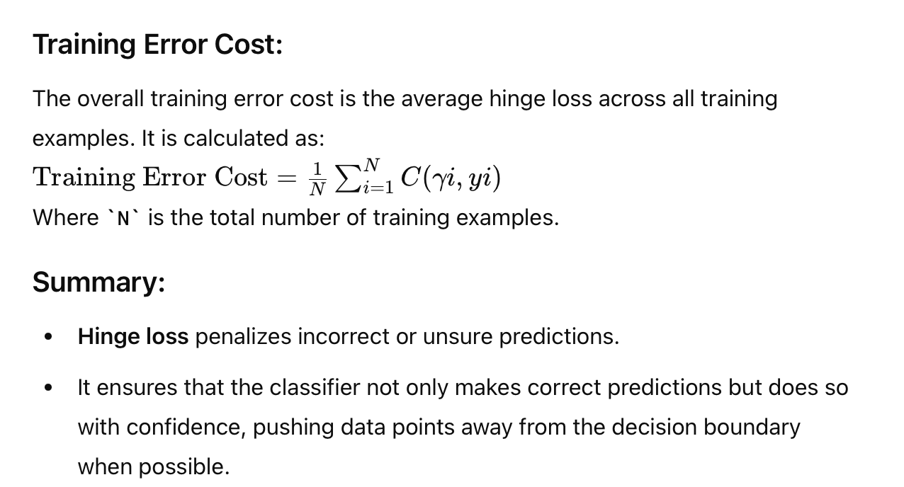
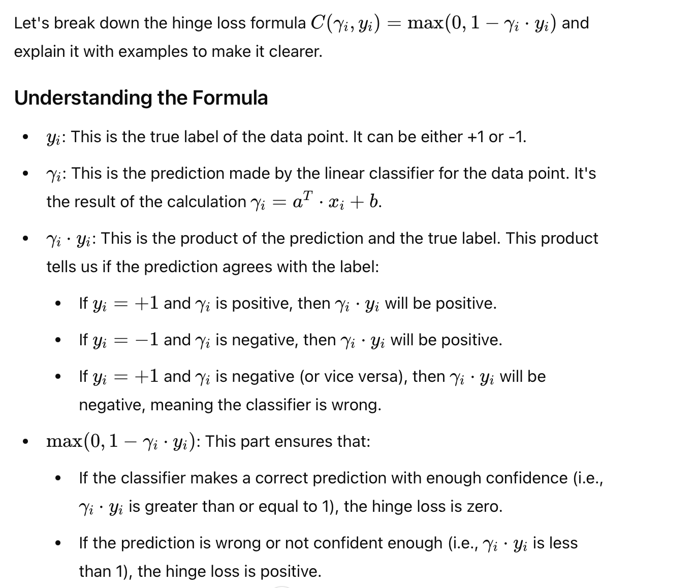
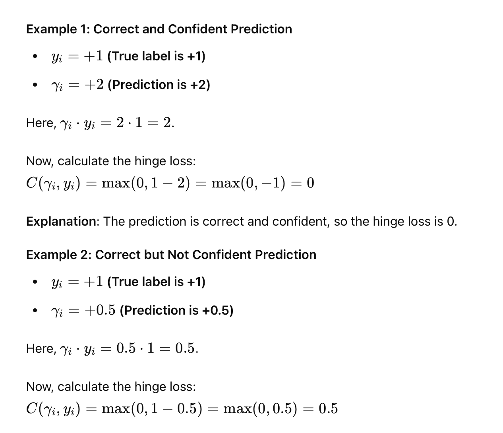
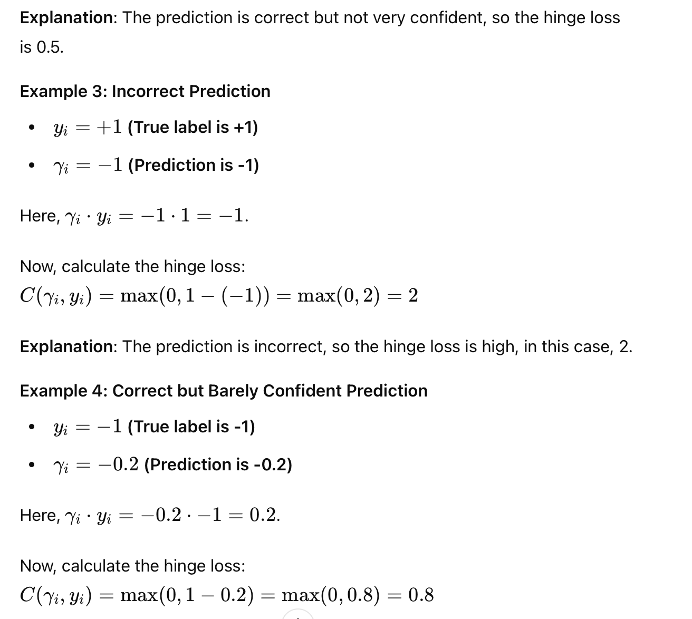
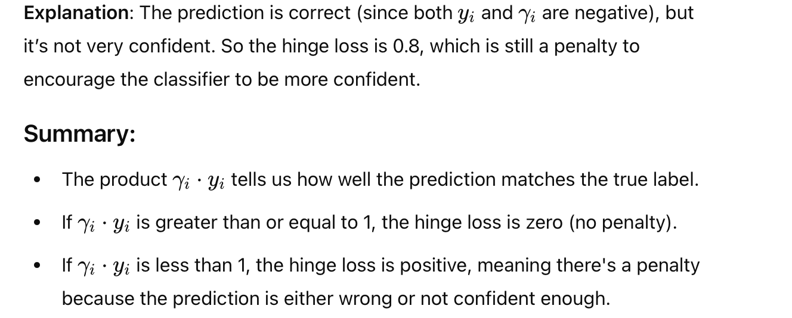

# Cost Function

Cost is probability function that is the difference of estimated value vs. Predicted value.

We intend to keep Cost function low

> This is also called "LOSS" Function
>
# Hinge Loss (Good one)

# Lets Breakdown Hingeloss Formula

## Example

