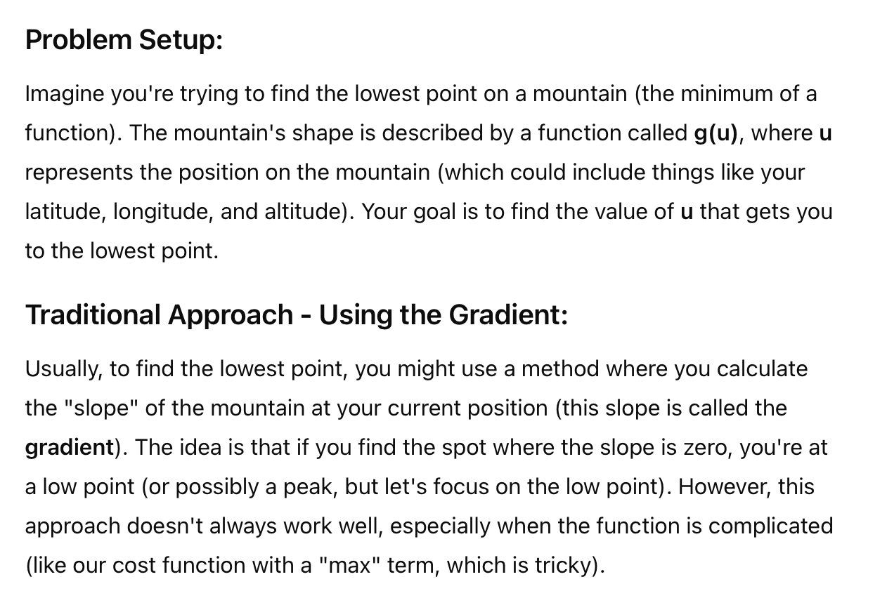
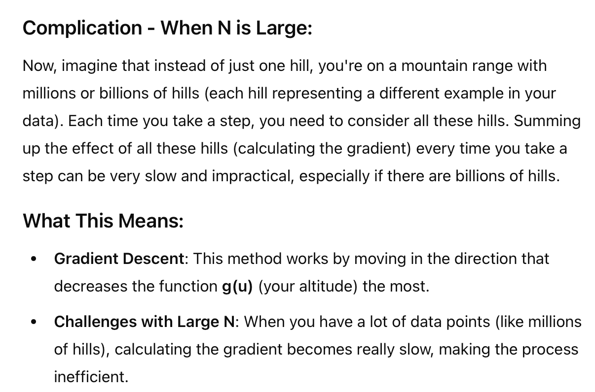

# Basic Understanding

# Example
## Why Numerical and Gradient descent wouldnt work?
> Ref: 2.1.3 Finding a Classifier with Stochastic Gradient Descent

# Issue with Gradient

# Issue with Numeric Differentiation

# Issue and Conclusion

# What is stochastic gradient descent

> Stochastic Gradient Descent (SGD) is a faster and simpler version of the traditional gradient descent algorithm used for optimizing machine learning models. Let's break it down into simple terms:

**Basic Idea of Gradient Descent:**
Imagine you’re on a hill and want to find the quickest path to the bottom (the minimum point of a function). Gradient descent helps you do this by calculating the slope (gradient) of the hill and taking steps downhill.

**Problem with Regular Gradient Descent:**
In regular *gradient descent (also known as batch gradient descent)*, you calculate the average slope using all the data points in your dataset at once before taking each step. This works well if you have a small dataset, but if you have millions of data points, calculating the slope for every single step becomes very slow and computationally expensive.

**What is Stochastic Gradient Descent (SGD)?**
Stochastic Gradient Descent **speeds** up the process by doing something simpler: instead of using all the data points to calculate the slope, it randomly picks just one data point at a time.

**Stochastic: **
This term means "**random**." Instead of using the entire dataset, SGD randomly selects one data point (or a small group) at each step.
****Gradient Descent: ** **
It still moves in the direction that reduces the error (downhill), but because it uses just one point, it’s much faster.
**Example in Simple Terms:**
Imagine you’re in a dark room and trying to find the lowest point on the floor. Regular gradient descent would involve you carefully feeling the entire floor (using all data points) before taking a step. SGD, on the other hand, would have you randomly pick a spot, feel the slope there, and take a step. It might not always be as precise, but you’ll reach the bottom much faster because you’re not considering the entire floor every time.

**Pros of SGD:**
Speed: It’s much faster, especially with large datasets.
Efficiency: It can handle huge amounts of data without needing to load everything into memory.
**Cons of SGD:**
1. **Noisy: **Since it only uses one data point at a time, the path it takes can be a bit jumpy and less smooth.
2. May Not **Converge to the Exact Minimum**: It can bounce around the minimum instead of settling exactly at the lowest point.
**Summary:**
> Stochastic Gradient Descent is like taking quick, random steps toward the goal instead of carefully planning each step by considering all the information. It’s a bit less precise but much faster, making it perfect for very large datasets.

