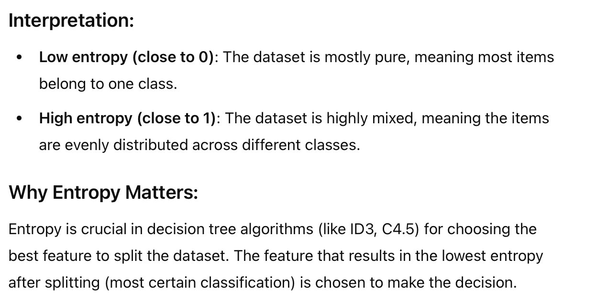
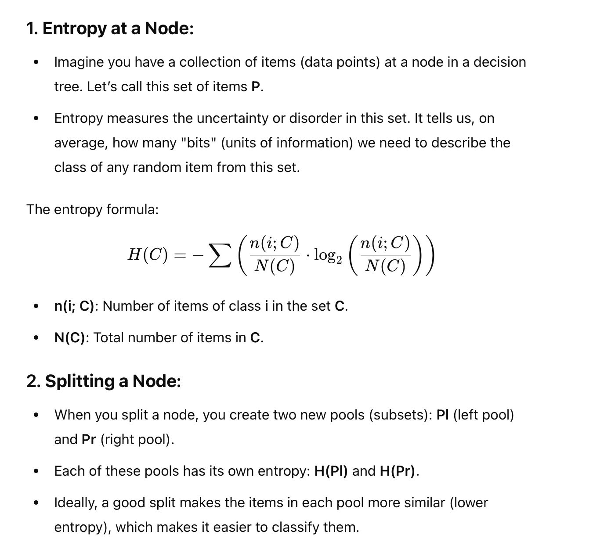
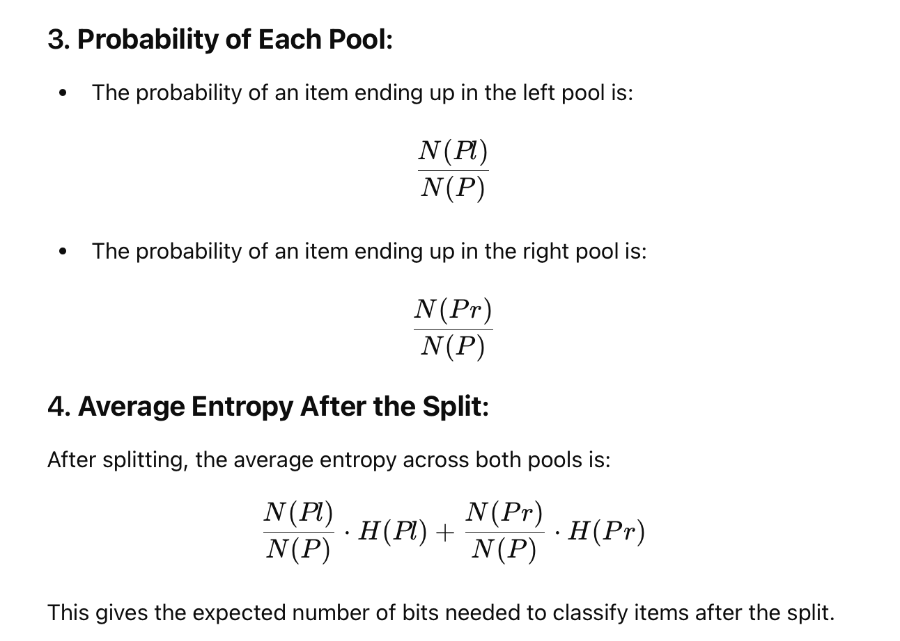
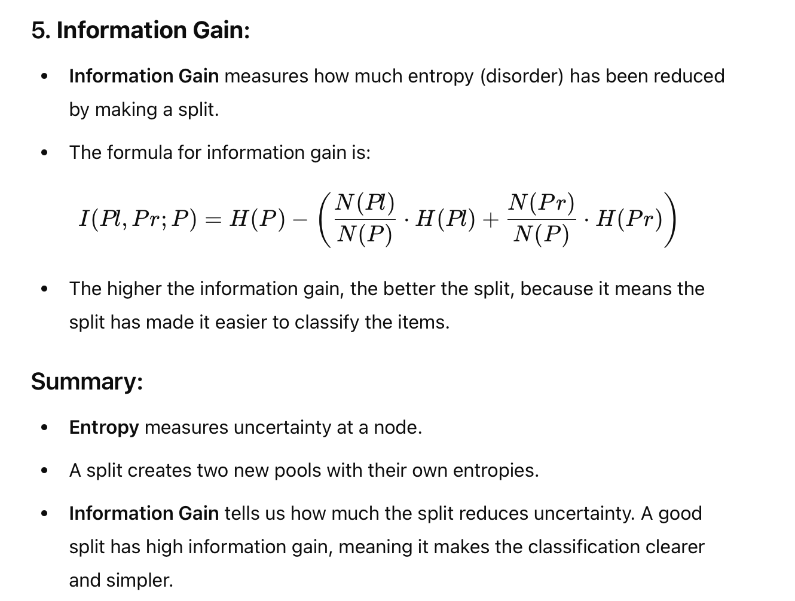

# Entropy

Entropy in the context of a dataset is a measure of uncertainty or disorder. It is used in decision trees and other algorithms to quantify how "mixed" or "impure" a dataset is in terms of its classification labels.

**Key Concept:**
If all the data points in a dataset belong to the same class, the entropy is 0 because there is no uncertainty or disorder.
If the dataset has an even mix of different classes, the entropy is high because there is a lot of uncertainty (maximum disorder).

# Understand the book explanation

