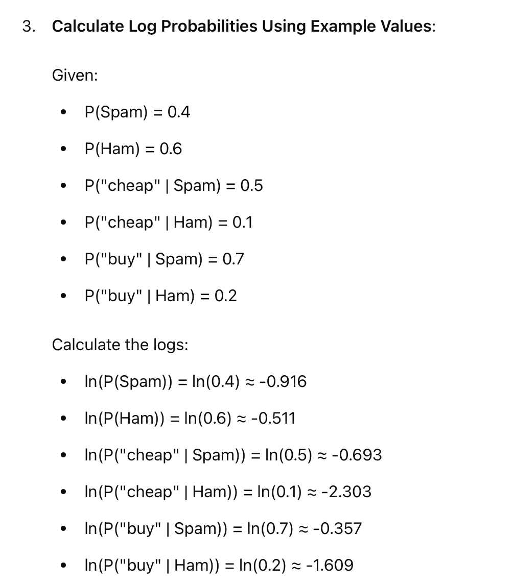
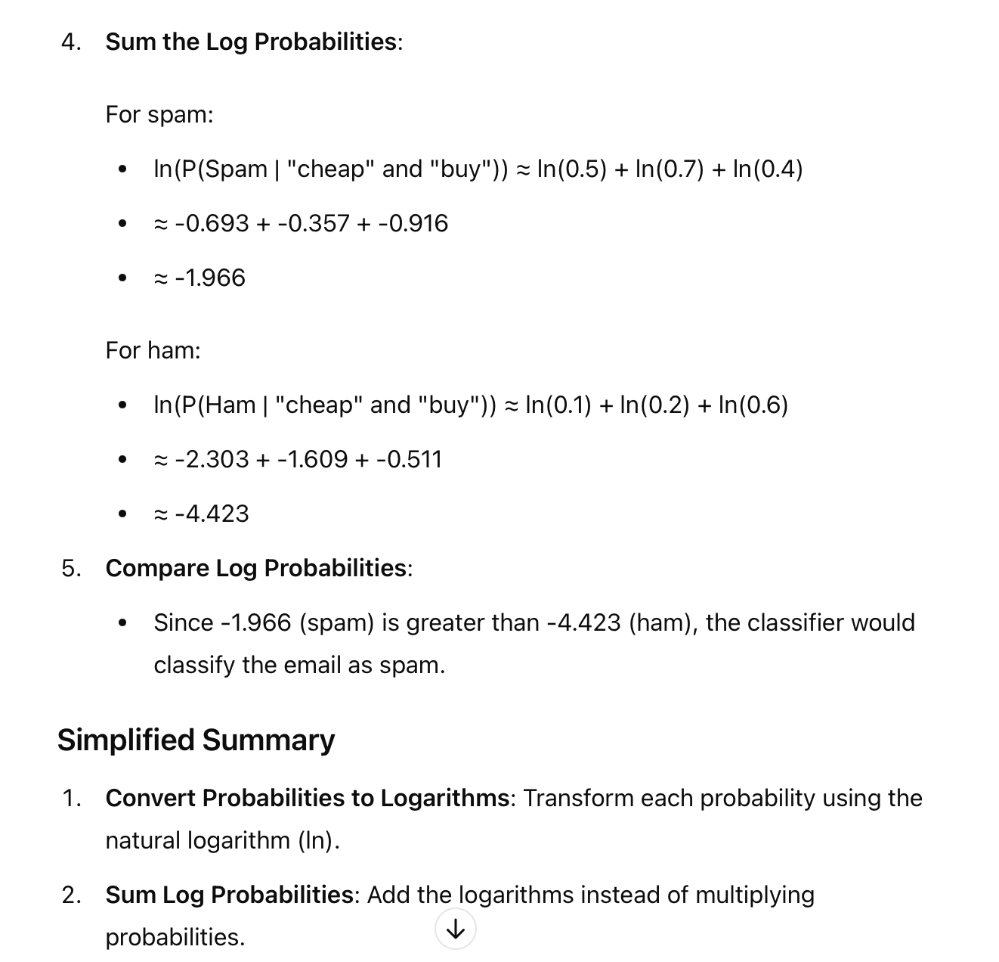

# Why Log for Naive Bayes

# Challenge

###  **Why Use Logarithms?**
**Preventing Underflow:** Multiplying many **small** probabilities can result in very tiny numbers, which can lead to underflow in computers. Taking the logarithm transforms multiplication into addition, which avoids this problem.
**Simplifying Calculations:** 
***Logarithms turn products into sums***, making calculations easier and often faste

#### **Issues with Large Values**
**Numerical Overflow:** When dealing with probabilities in Naive Bayes, if the dataset or feature set is very **large**, the product of many probabilities can become extremely large, leading to overflow.
**Computational Efficiency:** Multiplying large numbers can be computationally expensive and inefficient, which can slow down the computation.

----
.. Continue to 3. Normal distribution