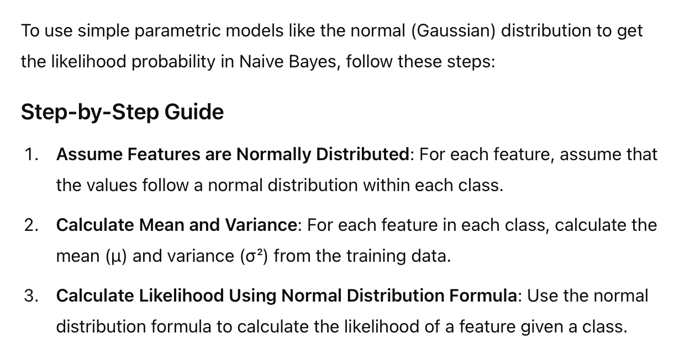
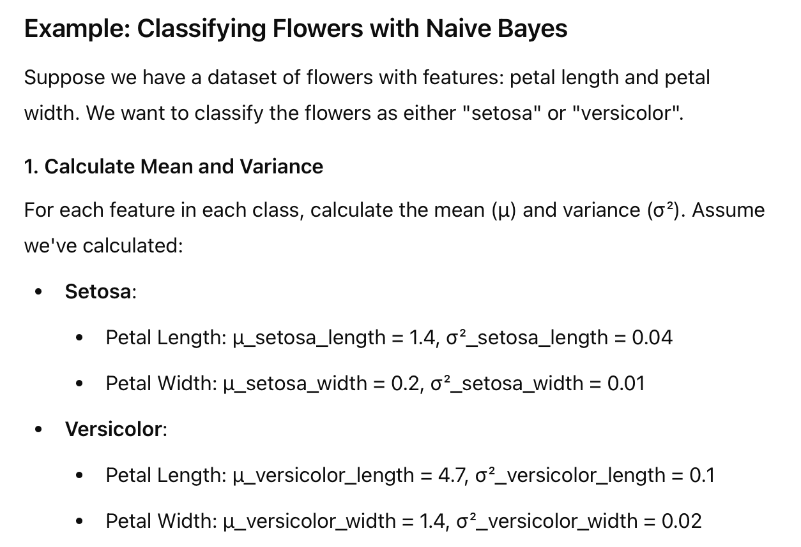
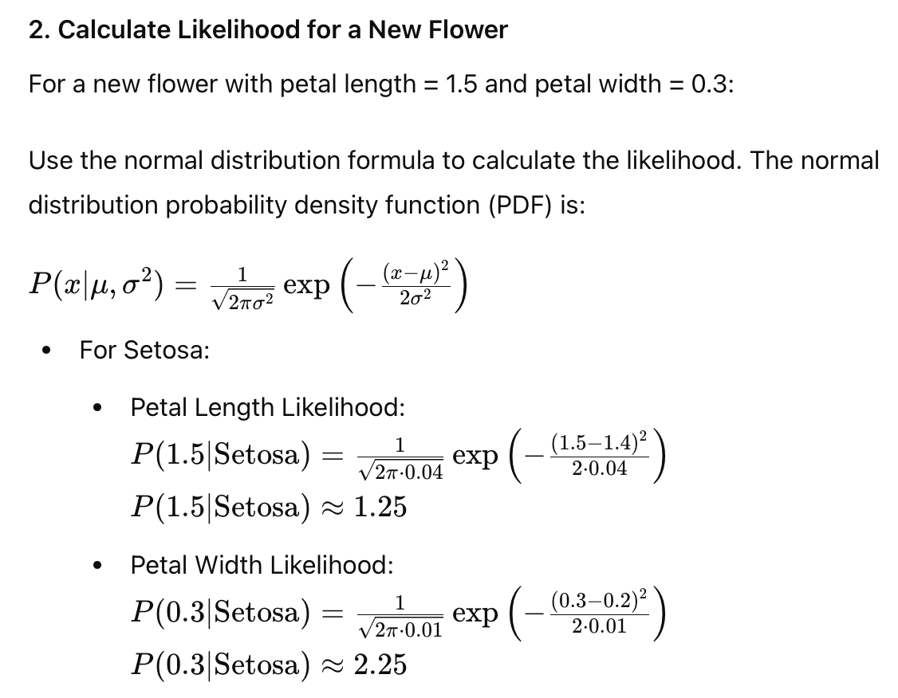
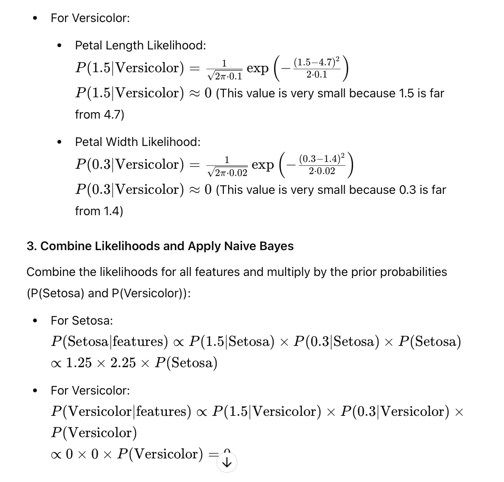

# Use Parameteric Model to determine "LIKELIHOOD" P(X|y) in Naive Bayes

#### Normal/Gaussian Parametric model

**Since the likelihood for "Versicolor" is zero, the classifier would predict the flower as "Setosa".**

#### Summary
- Calculate mean and variance for each feature and each class.
- Use the normal distribution formula to calculate the likelihood of each feature value given a class.
- Multiply the likelihoods together (along with the prior probabilities) to get the final classification.
- This method leverages the assumption that features follow a normal distribution, simplifying the computation of the likelihoods in Naive Bayes.
