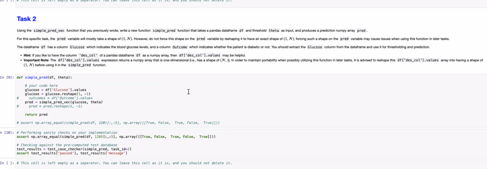
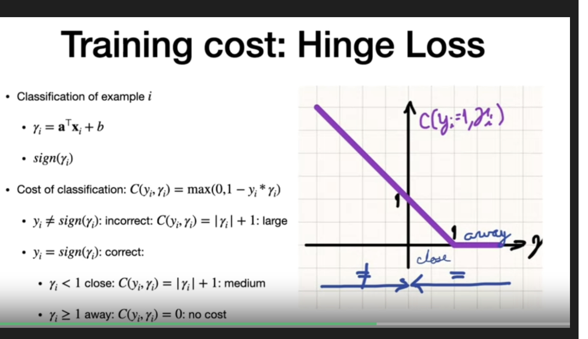
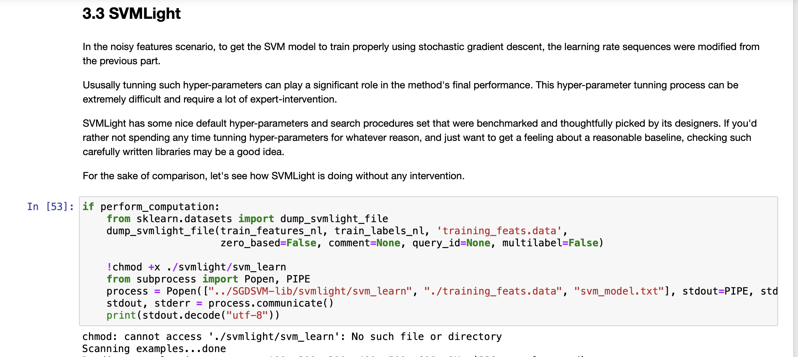

# Week 1

- Syllabus has 
- "Programming assignments and quizzes can be submitted as many times as wanted before the deadline without penalty" and Quiz has ONLY two attemps?

# general
Is below 60 fail or below 80 fail?

# Assignment

- Is there a correc answer for coding assignment?
- Incorrect answer - explanation in Quiz?
1. asisgnment - exact words and lines (auto grading is final)

2. General schedule that we can expect on the course
- incremental opening - all at once 

Hour - 3 or 4 hours between submission
(words , line - guidelines, not mandatory)
- end of week - 1 through 5 out
- 5 -10 out..batches end of the week

-- grading? 99.5 is A+ - fixed?
-- marco

# Campuswire

When actual sign and predicted value sign is different, shouldnt this be actual X precit +1.
why is it magnitude of gamma+1?

#######
# As of 9/14
#########

**Week 4: Assignment SVM**

**Section 3.3**

#######
# Instructor Hours As of 9/20
#########

# Questions?
- Confusion matrix - only on taining and test data?
- unsupervised - how is confusion matrix found?
- how is confusion matrix fit to regression or classification
- Difference between K fold and leave one out?

# 10/9/2024

MP week 9 High dimensional data.
Accelerator data is not accessible and erroring
https://archive.ics.uci.edu/ml/datasets/Dataset+for+ADL+Recognition+with+Wrist-worn+Accelerometer

Below link works
https://archive.ics.uci.edu/dataset/283/dataset+for+adl+recognition+with+wrist+worn+accelerometer