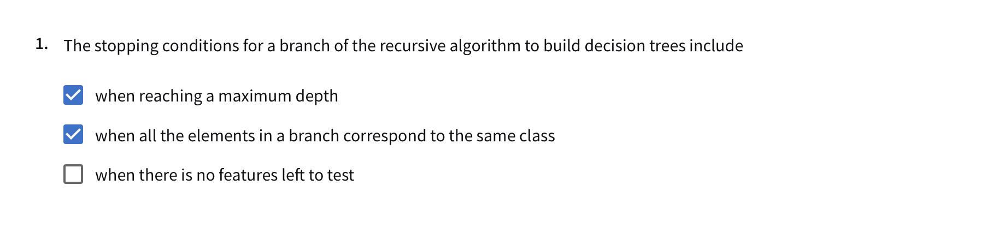
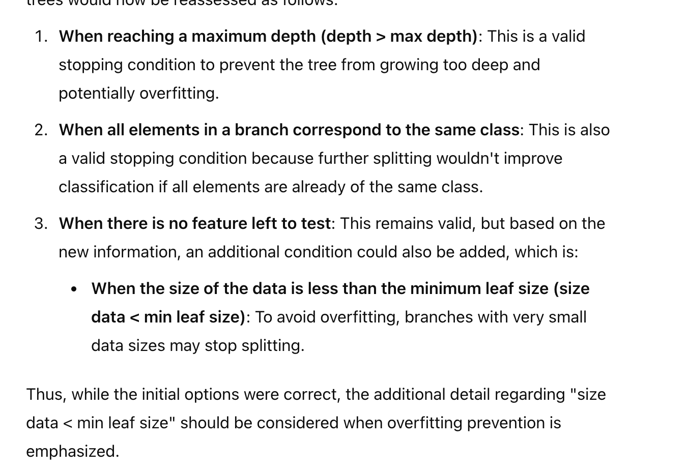
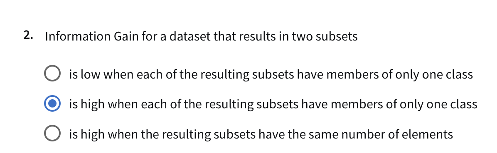
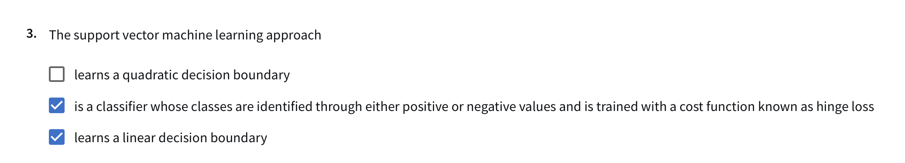
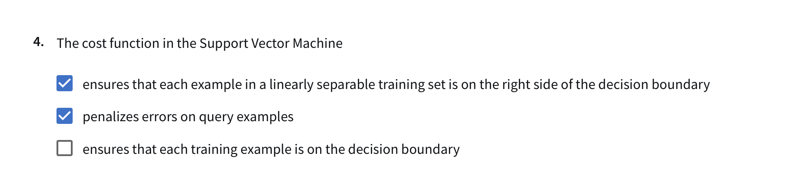
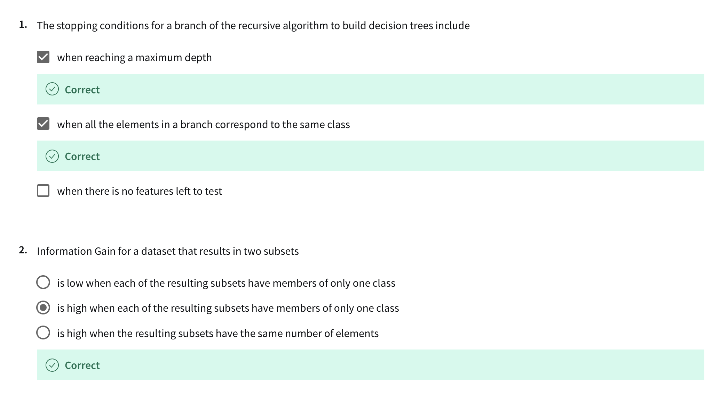
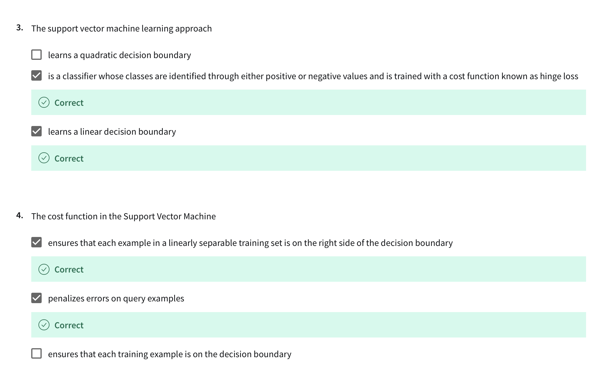
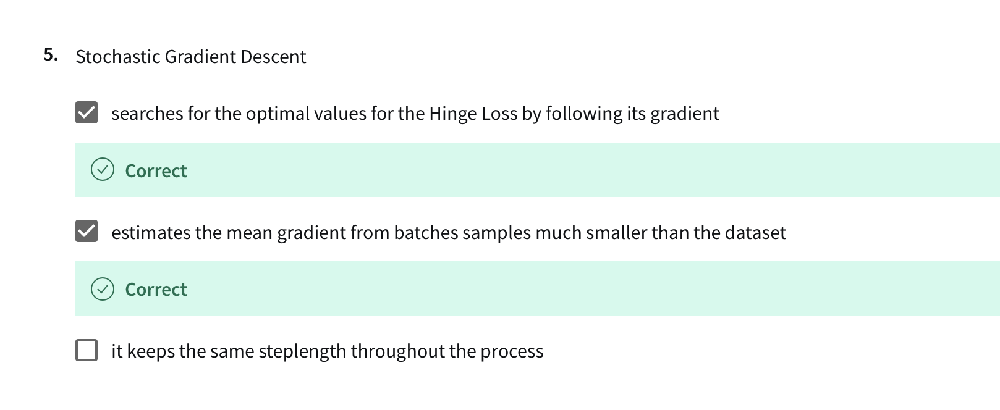

# Question 1
Course:
1. depth > max depth (dont want tree to be too deep)
2. size data < min leaf size (we dont want  overfitting)
3. All elements are in same class

# Alt.

# Question 2

# Question 3

# Question 4

# Question 5

# Results

