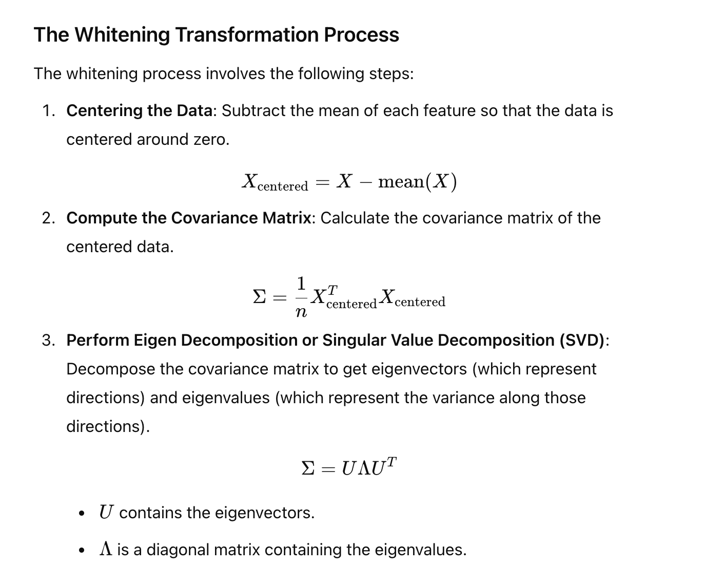
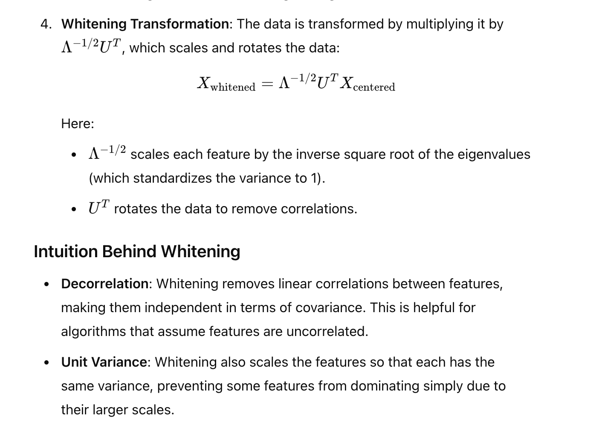
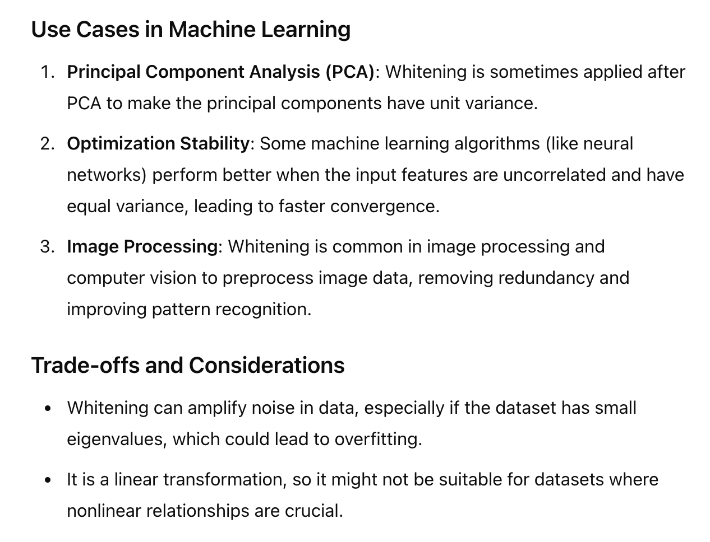

# Co-Variance

Is a matrix that shows co-relation of a features with itself and the rest of the other features

* Whitening is  a process to reduce Co-relation between features

# Whitetning
> Whitening is a transformation applied to data to make it easier for some machine learning algorithms to work with by removing correlations between features and scaling them to have unit variance. It is related to the covariance matrix and involves a process that centers, scales, and rotates the data.

 

 # Whitening Process
 
 

 # Uses
 