# Probability Models from Lectures

---

# Bernoulli
> The Bernoulli distribution is a **discrete** probability distribution for a random variable that has exactly **two possible outcomes**: typically labeled as 1 (success) and 0 (failure). It is one of the simplest and most fundamental distributions in probability and statistics.

## uses
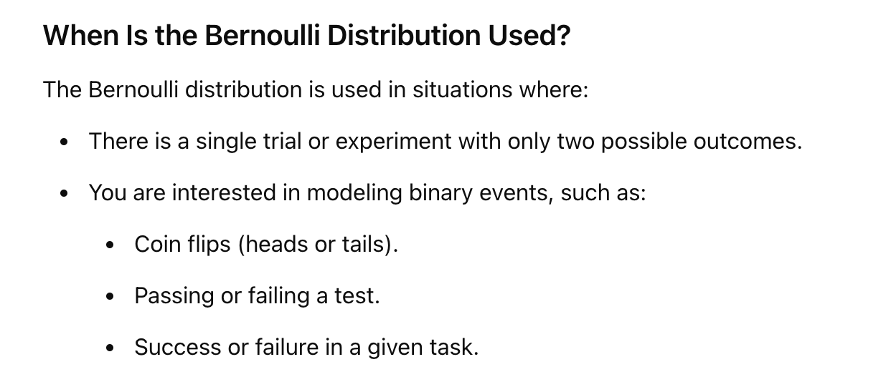

## Exanples
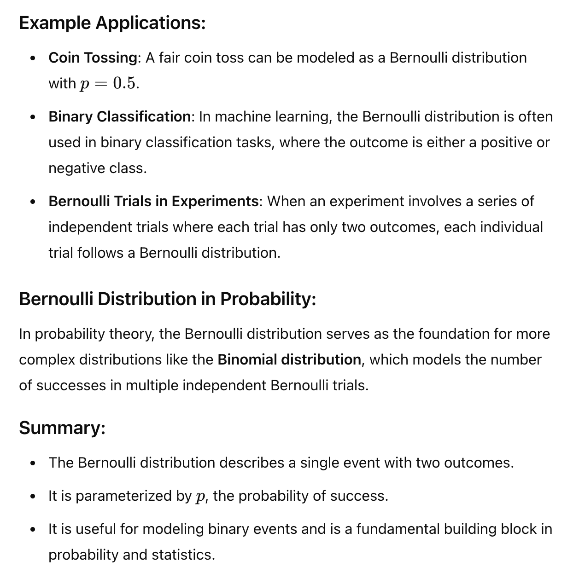

---

# Binomial Distribution

> models the number of successes in multiple independent Bernoulli trials.

> The binomial distribution is a **discrete** probability distribution that **models the number of successes** in a **fixed number of independent trials**, where **each trial has the same probability of success**
> It is an extension of the Bernoulli distribution to multiple trials.

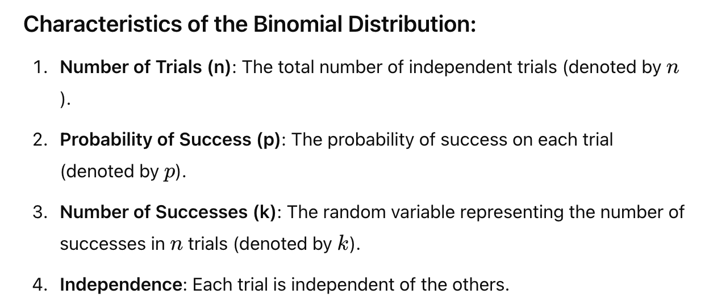
### PMF

###  Example
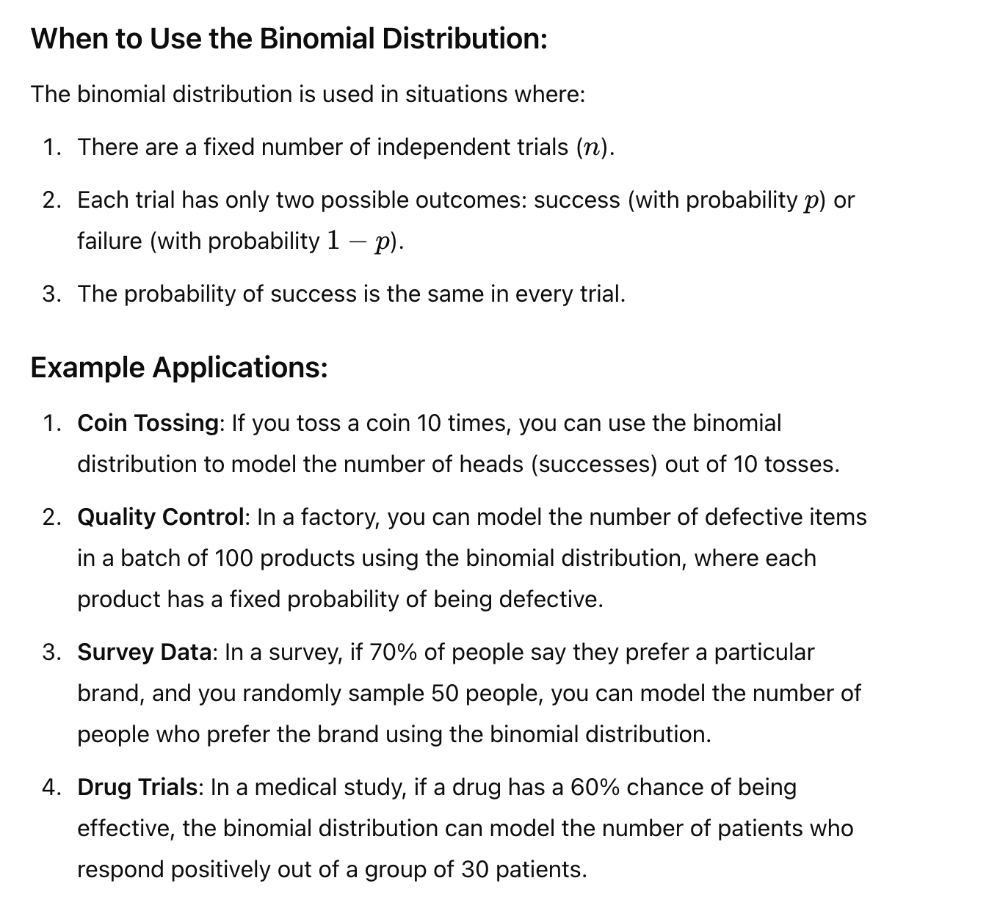
---

# Poisson

### PMF
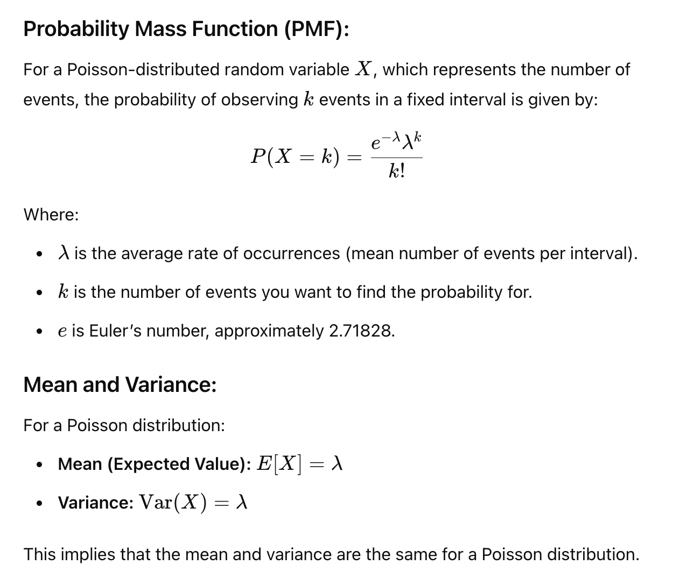
### use case
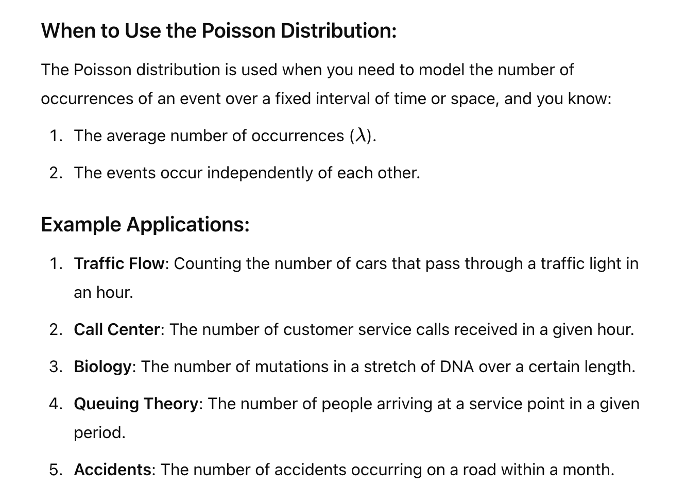

### Comparison
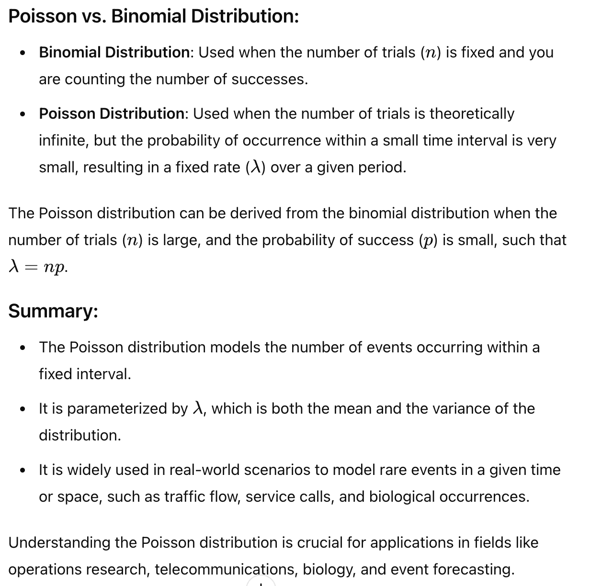
---
# Multinomial
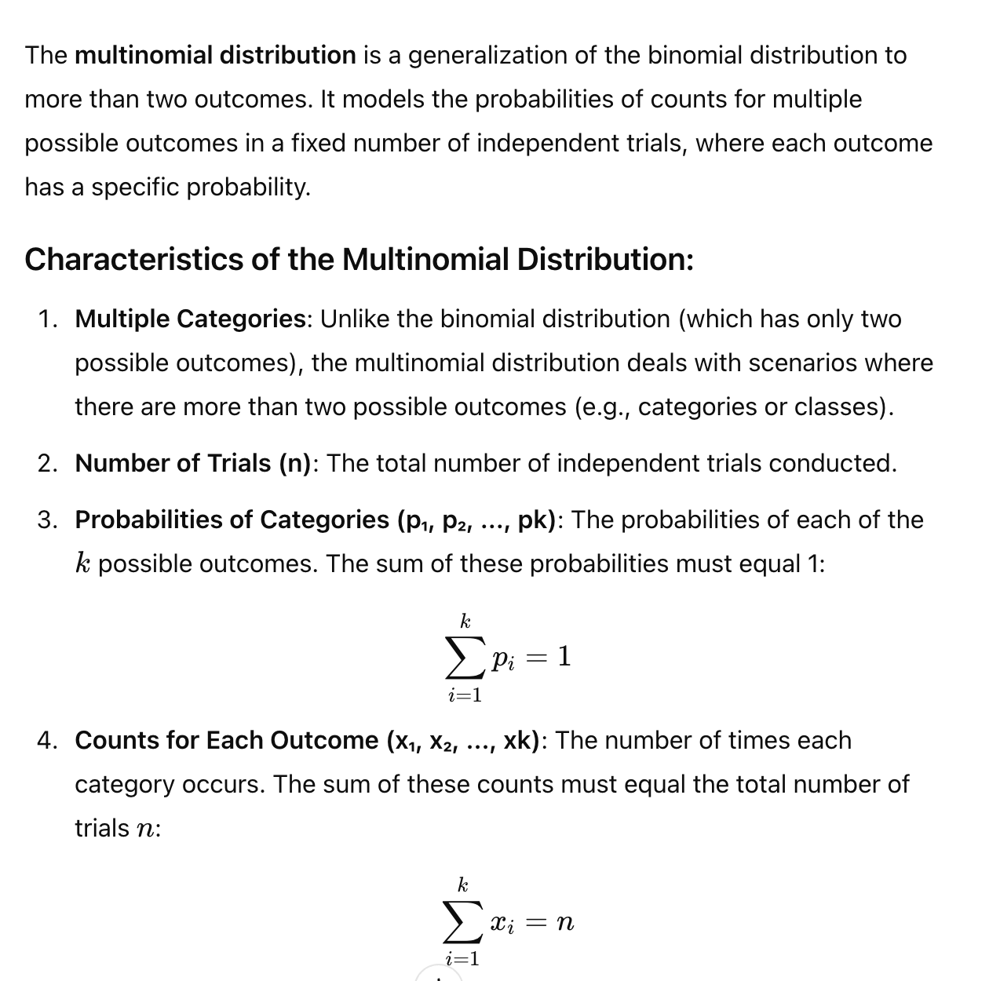
### PMF
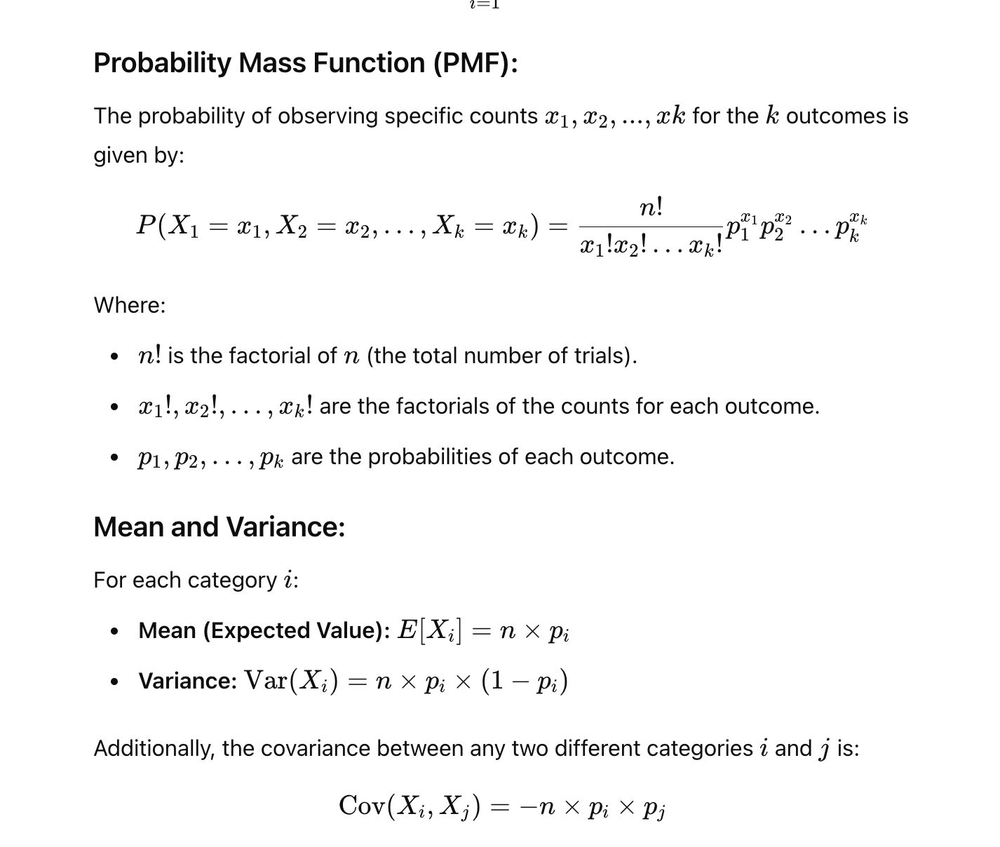
### Sample
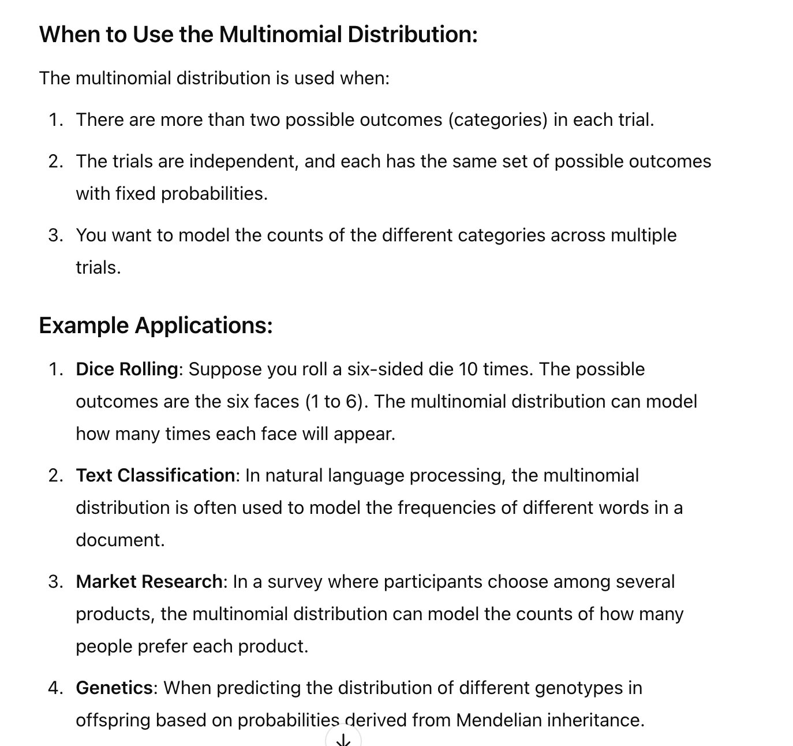

# Normal Distribution/Gaussian

# PMF vs. PDF
PMF deals with DISCRETE and PDF deals with continuous data and AUC represent probability

PMF : Probability Mass function
PDF: proability density function

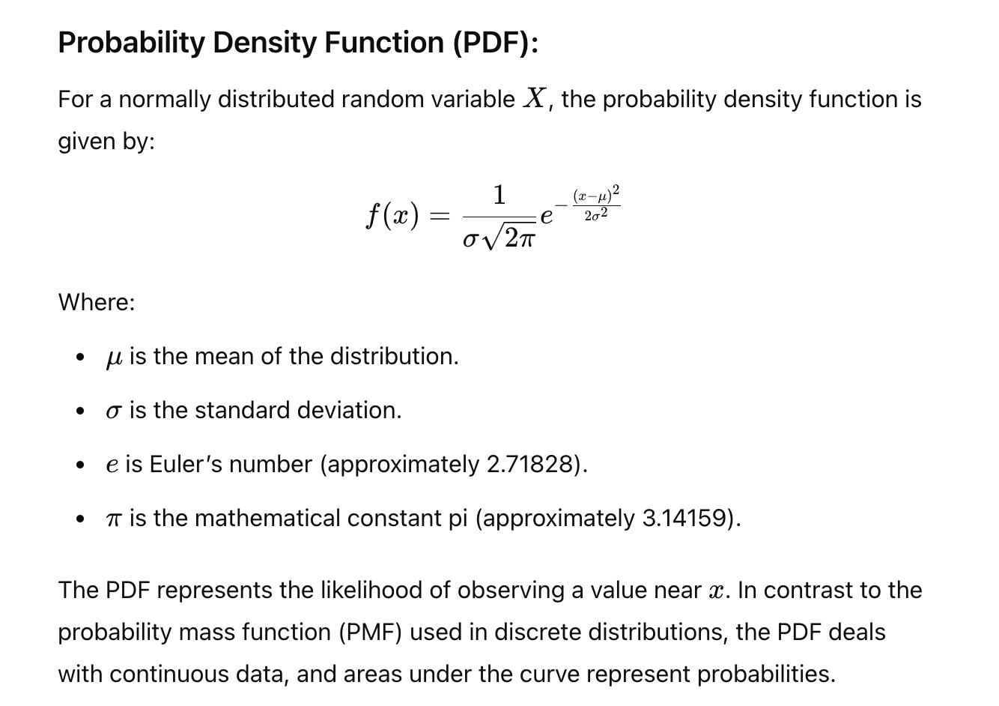

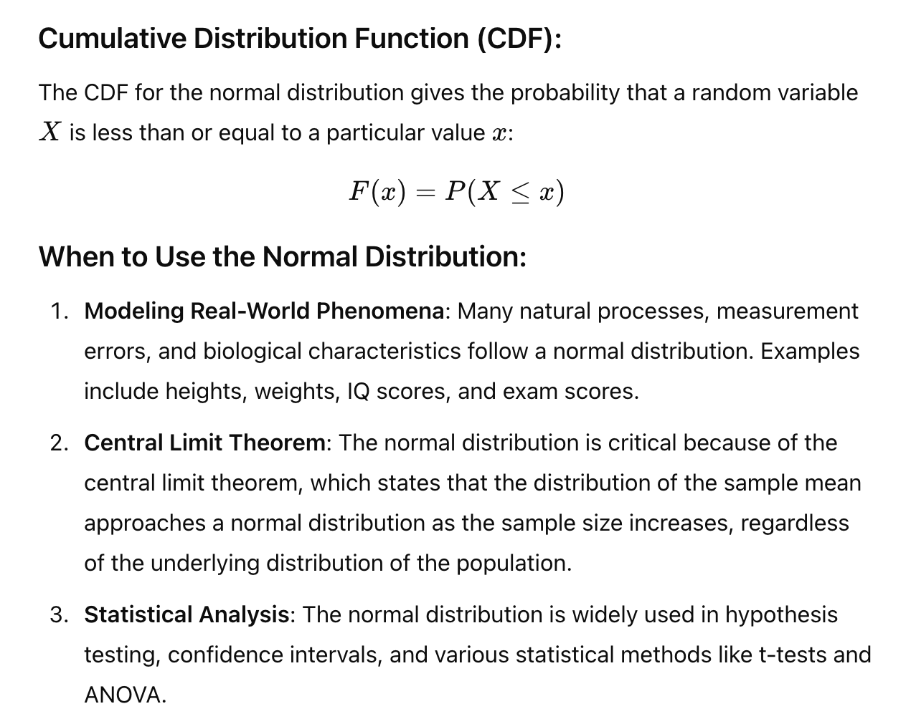

### Example

---
#### Fade Out...
