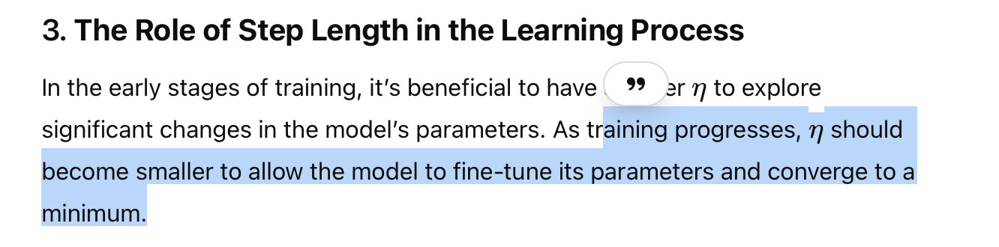
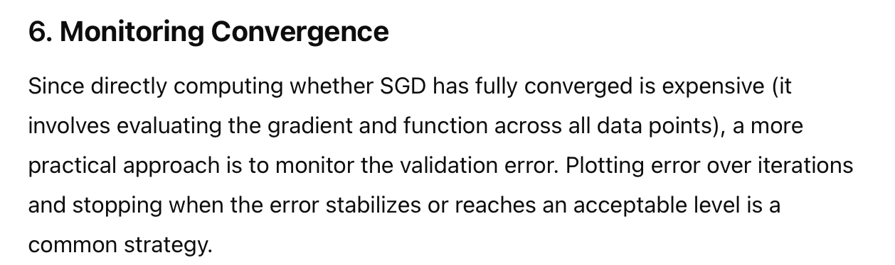
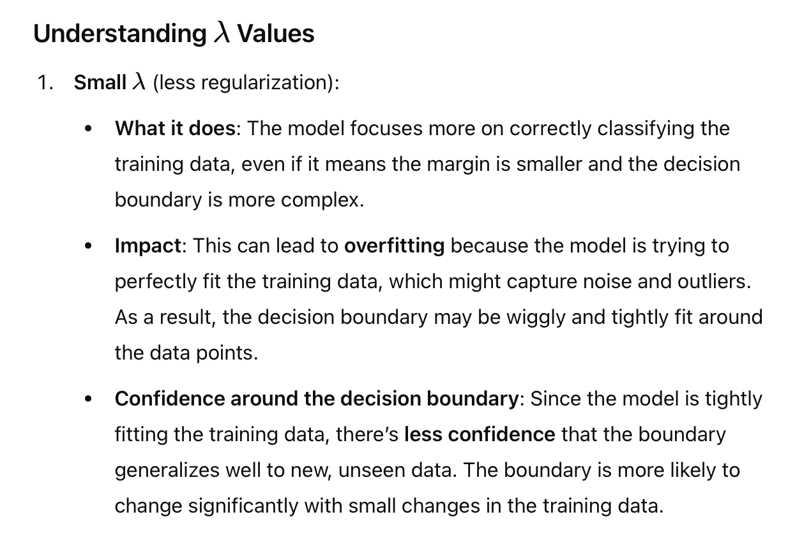
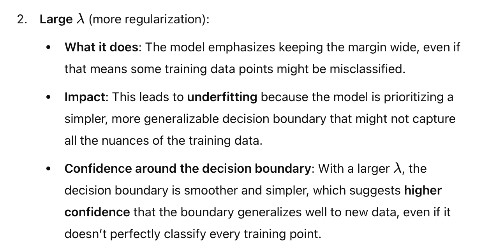
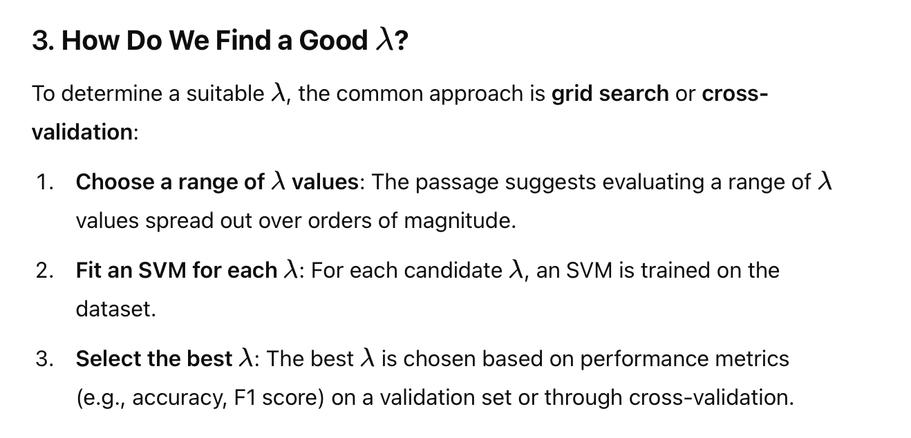
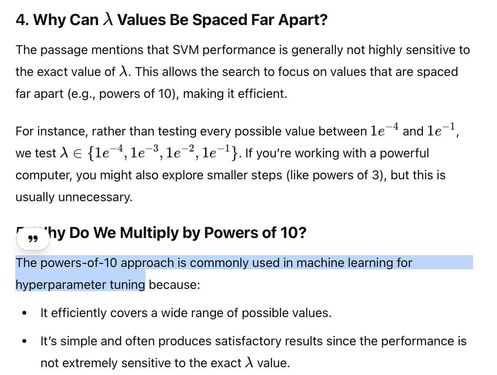
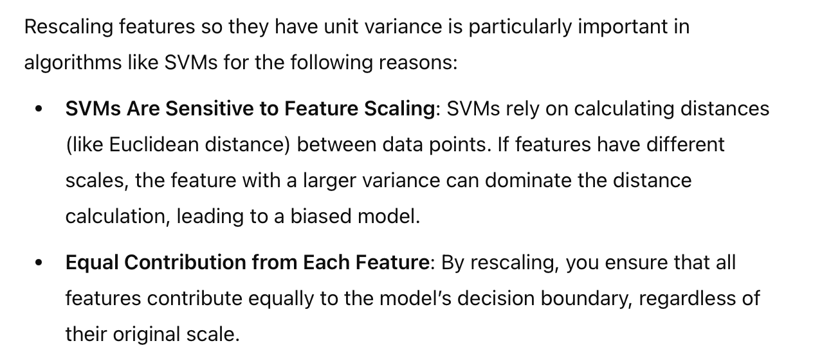
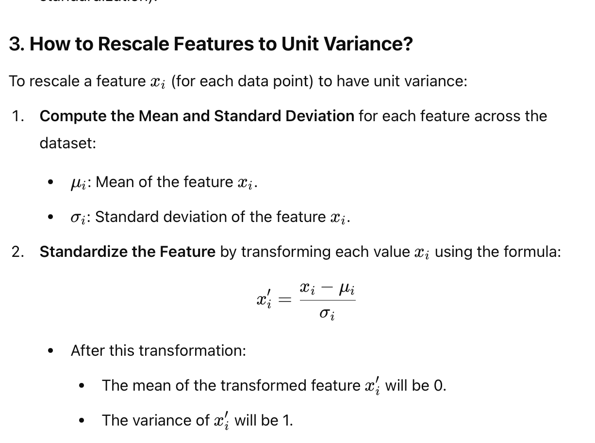

# Choosing Step length
Step Length/Learning rate

# Selection of Lambda
## Role of Lambda

## Small Lambda:

## Large Lambda:

## selecting Lambda

# Rescaling feature vector to unit variance mean

## Why importan?

## How ?

## Summary
- Each feature in the dataset will have a variance of 1.
- The mean of each feature is typically adjusted to be 0 (this process is called **standardization**).

---
# 2.1.6 Example
**Approach to optimizing a classifier using stochastic gradient descent (SGD) for a support vector machine**
> Specifically, it’s referring to how you can update the parameters a (the weights) and 
b (the bias) of the classifier during training. 