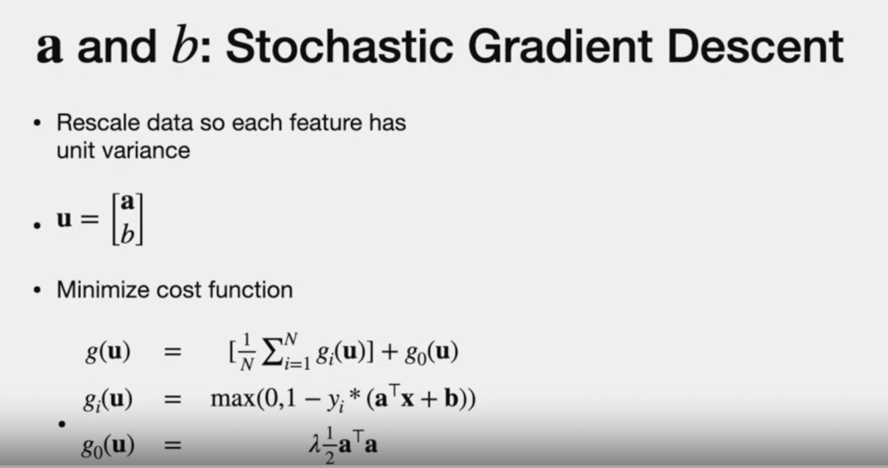
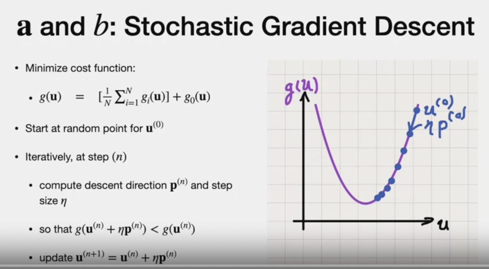
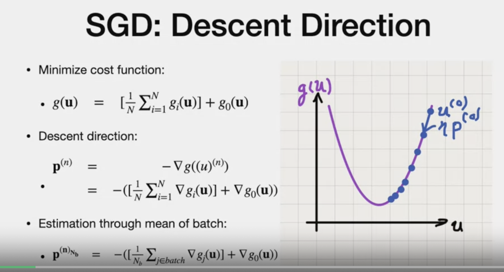
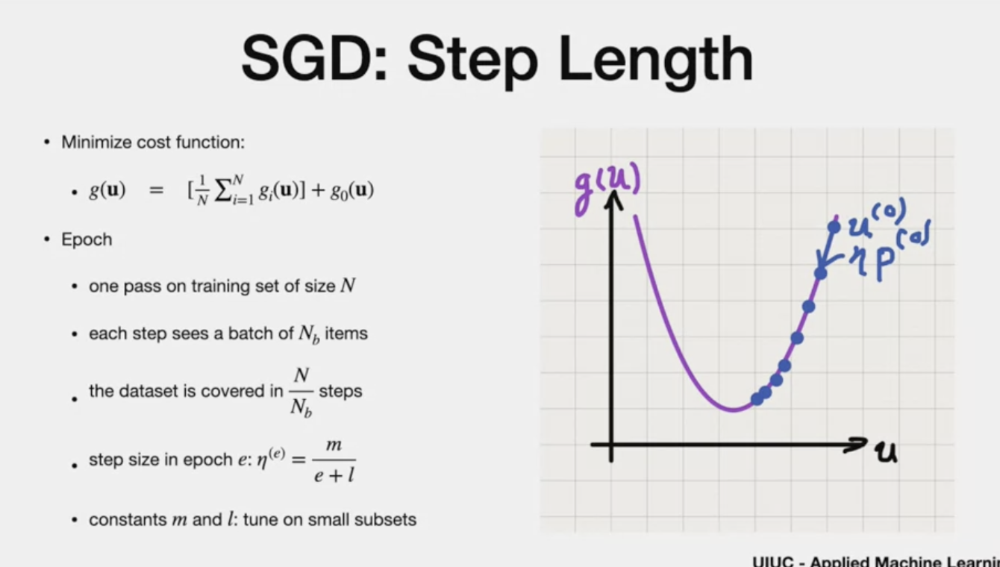
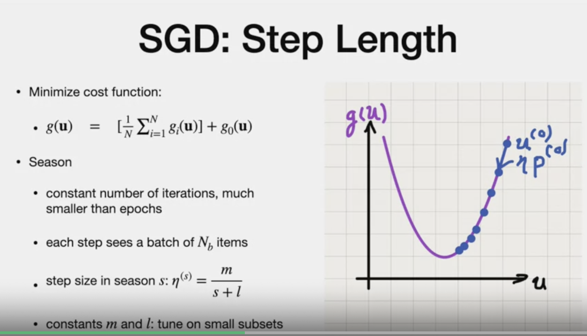
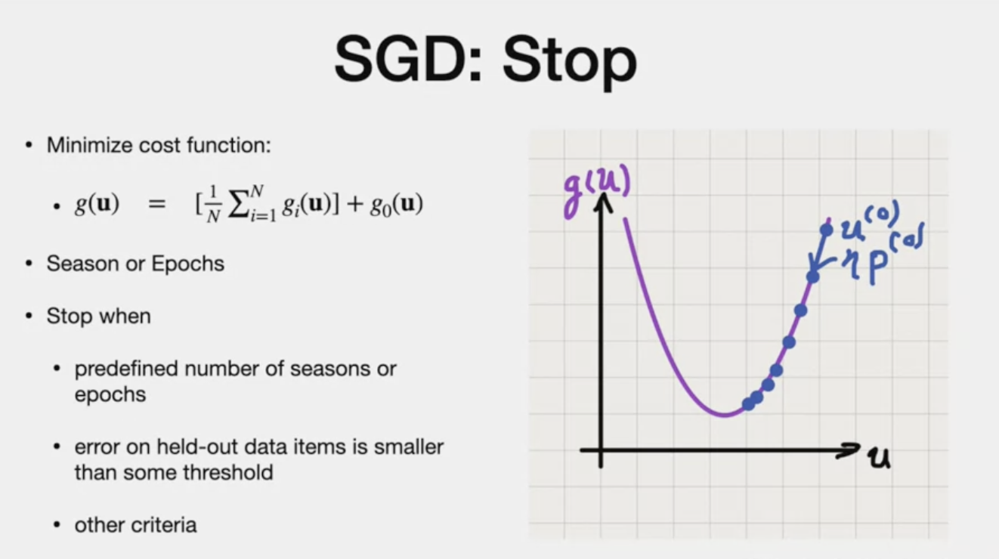
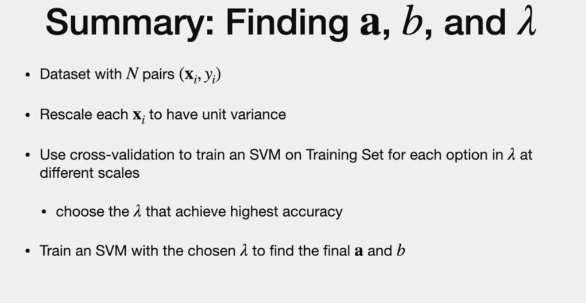
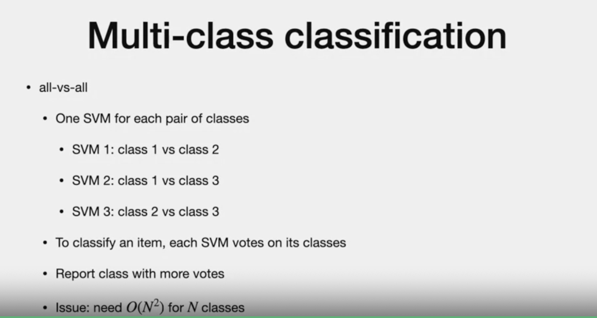

# Training Support vector machines

# Agenda

- parameter of decision boundary
- briefly - multi class with SVM

# Prev. lecture

- two components - training cost + regulariation error

> - Find A , b - stochastic gradient
> - lambda - using cross validation

# Stochastic gradient

- rescale for unit variance
- Gi - maximization term
- G0 - reguralixation term

-iterative provess
- each step si U(n).next step is U(n+1)
- small step size "aeta"
- if new step smaller than previous step, we update U(n+1)
- p => Direction
- aeta => step size
 ---
- **Objective** : minimize cost function
refer below

- Gradient descent uses "Negative" gradient
- "nabla' times g(u)
- If "n" is large, gradient descent is tough(many peaks in a mountain)
- So, use stochastic gradient descent, takes **apprxomization over precision.**
- instead of entire population, just use "sample"

- use "mean" gradient
- N(b) - estimation based on sample size
- Approx pop.mean = 1/N(b) * sum of gradient(for all G(i) in the batch)

- larger vs. small step length pros and cons noted in the fig.
- conveient way, initialize with large value and then reduce aeta/step length.

# Step Length
- how we can determine step length

- data is covered in N/Nb number of steps
- Epoch - full data coverage
- (m/e+l) - step length is large in the first and as "e" increases, step length decreases in later epochs.
- (m and l) - chosen by trial and error

# Alternate approach using seasons

- **Seasons** - smaller batches than epochs
- constant number of iterations

- step length is same as epoch
- (m and l) - chosen by trial and error

# Gradient
- gradient is on "u" (derivative of u)

# STOP!
- when to stop

# Regularization constant
- Throuh "Cross-validation"
- 10 power -4, 10 power -3,...
- common to use 2 powr -15,..2 power 3..
  

- it may be preferred to have Std. dev is different lambda achieves the same results.
  
  # Summary
  

  # Multi-class classification
  

  - issue is there may be more than one class predicted
- **Workaround** :  
# Approrach 1: "One vs ALL approach"

- though SVM not for comparing score, it works well.
- We only need "N " classifiers for "N" Classes

# Approach 2: All vs ALL

**cons :** Order of N squared.

# Conclusion

---
# The end