# Regression

> Classication predicts "CLASS"
> Regression predicts "VALUE"

**Examples**
- House in same neighbours, squarefoot, predict the selling proce.

**Note**
- Classification is a special case of regression that predicts +1 or -1 and just two values.

 # Regression base concept
  - When x (explanatory) plotted as scatterplot against "y"(output), the  "line" gives the prediction of the model  
- Most cases "y" is NOT function of x"
  - Mostly, samne value of "x" will give different "y"
  **Example**
  > Children with more feet size usually can read better, Its co-relkation.
  > In turn, children with bigger feet are old, so they can read. That is causation.
  Regression deals with co-relation

  - It can be "subjective" (same item, different store, different price)

**Example**
> height vs. length of the Perch fish
> freuqncy of crickets vs. temperature

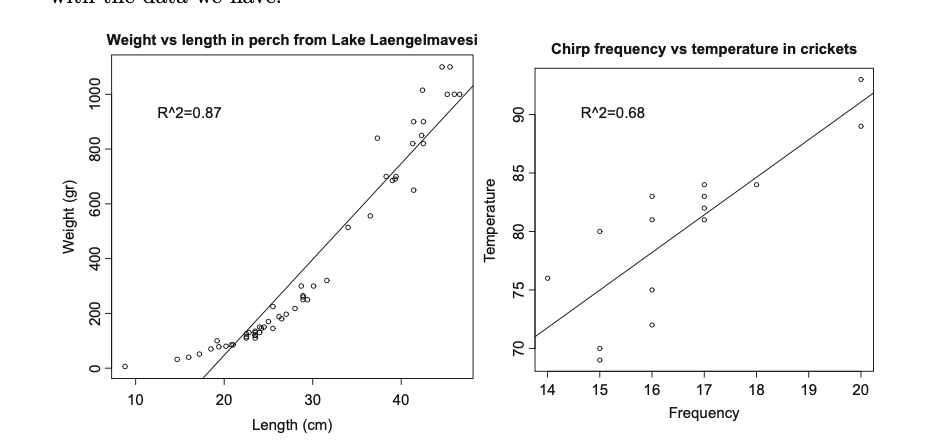

# Requirement for Regression
- training set should be i.i.d of test data
- R2 is better - measure of goodness of fit to regression (the more the better)

# Uses of Regression
- Not only predict "value", it can predict "TRENDS"

**Example**
- Hormones collected and saved in lot "A","B","C".
- *Question* : Are all lots the same?
- Amount of hormones changes over time
- 
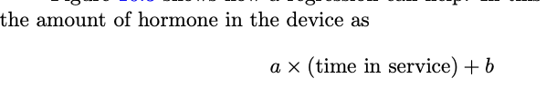
- a, b chosen to get the best fit 

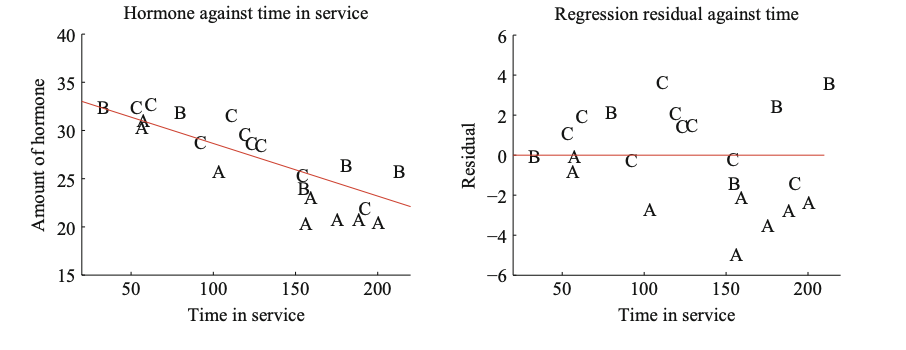

- Left plot : shows that "time in service" increases", amount of hormone decreases.
- Hard to see the difference of actual vs.predicted hormone
- So "Right plot" 

> Residual = Actual - prediction
> Right plot shows that Lot A contain less hormone than predicted (less than 0 reference line)
> Esp. Lot "A"is under the model fit line.

---
# Linear Regression & Least squares

- "y" is not function of "x". 
- Model needs to have probabilistic componentn and there is likely some error evaluating "y"
  > - there might be "Noise"
  > - "some randomness in "y"
  *(Example: two house, same feature can sell different rates)*

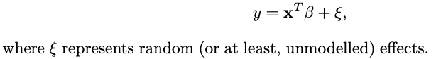

- Noise : This is sign "si"
- Beta: co-eff/vector of weights (we must estimate)

# Assumptions
> - The random noise always have "ZERO MEAN"

**Note**
- When x=0, the model predicts y=0
**Problem Example** 
salary(y) is correlated to years of experience (x). If years of experience = 0 , then salary also will be zero. That cannot be true.(workaround : choose right "x")

# Choosing beta

**Two ways**
### 1. Probabilistic Approach
Refer to My notes > Find Beta
- log likelihood of beta is negative likelihood of error (minimising error) = y-X(t) X beta
- Why we tske averga 1/N is it is better for scaling
- 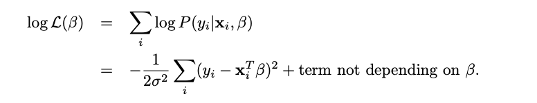
- 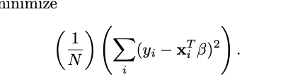
### 2. Direct Approach
- X- matrix. each row is vector of "p" features
- we use matric multiple to get the sum of squared error and then take derivative by beta and equate it to zero.
- 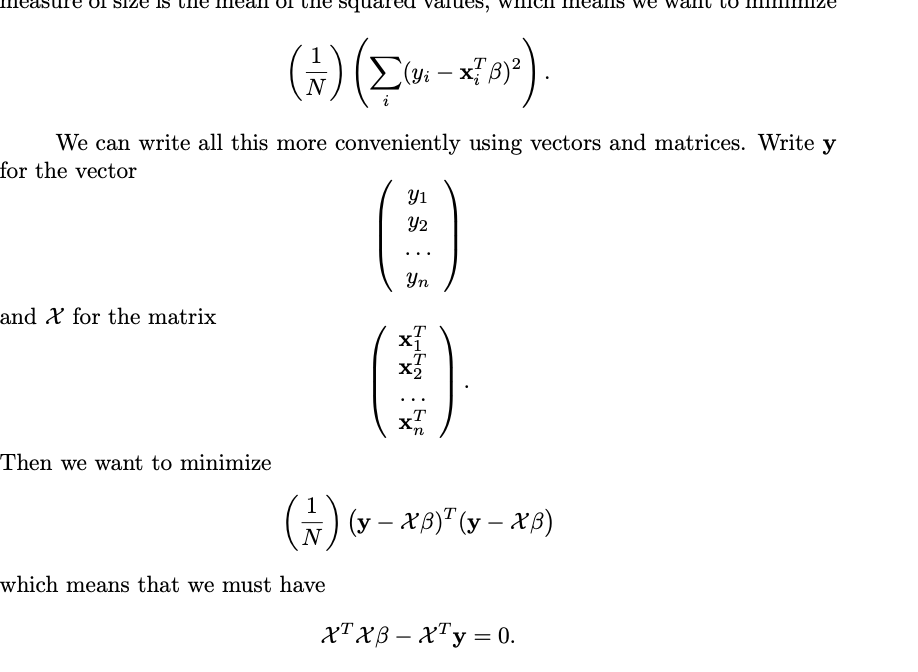
Beta is product of 
> 1. Inverse of X(T) times X 
>  2.  X(T) times Y

**Note**
For inverse to happen, it needs to be FULL RANK *( columns of X are linearly independant | non redudant features)* 

**Error/Residual**
> 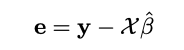

**Mean Square Error**
> 

> NOTE: MSE is not a great metrics as its units is SAME as the dependant variable.

 # R- Squared 
> This is unitless and within 0-1
> Variance of the residual should be smaller than variance of the dependant variable

- (where e is the vector of residual values) by choosing the value βˆ of β such that eT e is minimized. 
- y is a one-dimensional dataset a
**Properties of Regression**
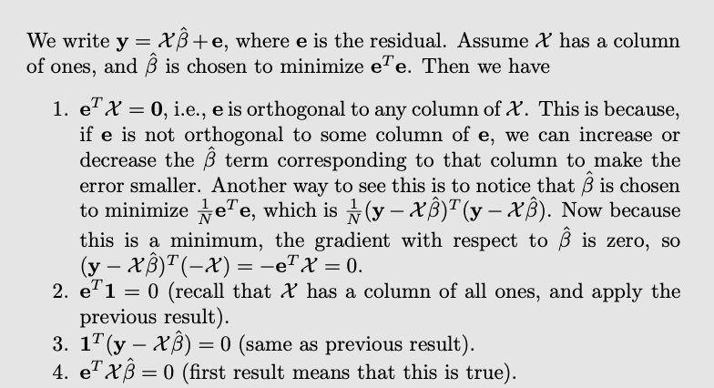

# derivation

**Variane of y:**

*The above is "averaga sum of square variance of actual and predicted*

Note:
> 

>> "Natural measure of the goodness of a regression is what percentage of the variance of y it explains."

# Transforming variables
 > Transforming explanatory variables, the dependent variable

 

 - without transformation vs. with transformation
 - in right, regression line is very close to the data
  

  # Box Cox Transformation
  > - method that can search for a transfor- mation of the dependent variable that improves the regression.
  > - use one-parameter family of transformations, with parameter λ, then searches for the best value of this parameter using maximum likelihood. 
  > 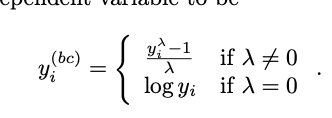
  > - One searches for a value of λ that makes **residuals look most like a normal distribution**

  # Can you trust regression?
  - Bad if regression predicts a constant
  -  If the variance of these **predictions is small compared to the variance of the independent variable,** the regression isn’t working well
- plot if the residual isn’t random. value of random error shouldnt depend on "y"
 **Good one**
 1. rsidual unrelated to predicted value
 2. variance of residue doesnt dependant on predicted one

# Summary
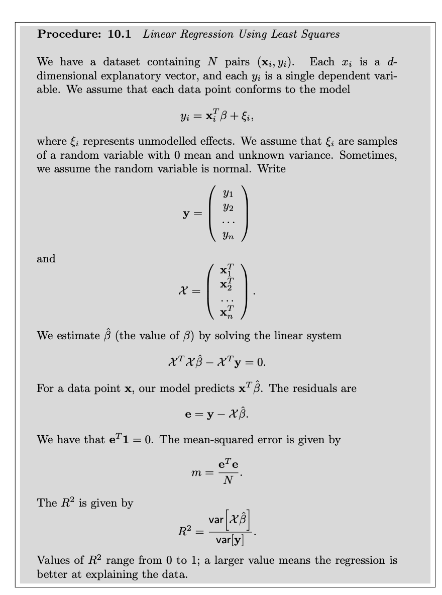

# Visualising regression to find problems
- if one explanatory variable, easy to plot and see the outliers
- Model fit with/without outliers
- right is with outliers

**Outliers**
- outliers impoact modeling beta as beta is designed to reduce modeling errors and since mean square errors is used, large value will make the model align to it more.
- if outliers is not noise/incorrect, it is hard to ignore it.
# Problems 
- more explanatory variables, hard to plot and identify outliers
- modelling problem - model that fits all the data. we can seek transformation if model is poor.

# Anamoly detection
### Two Options
1. Hat Matric and leverage
2. Cook' distance

# 1. Hat Matrix

**Note**
> The predictions of a linear regression at training points are a linear function of the y-values at the training points.

**Properties**
- Hat natrix is symmetry
- Eigen values are only 1 or zero
- row sums have important property
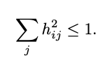

**Leverage**
> - leverage of the i’th training point is the i’th diagonal element, hii, of the hat matrix H.
> - **hii has large absolute value,** then all the other entries in that row of the hat matrix must have small absolute value. 
> - This means that, if a data point has high leverage, the model’s value at that point is predicted almost entirely by the observed value at that point. 
> - largest absolute value is Outlier

# 2. Cook' Distance
**Note**
- We could compute y(p) using the whole
dataset. 
- We then omit the i’th point from the dataset, and compute the regression coefficients from the remaining data (which I will write βˆ 

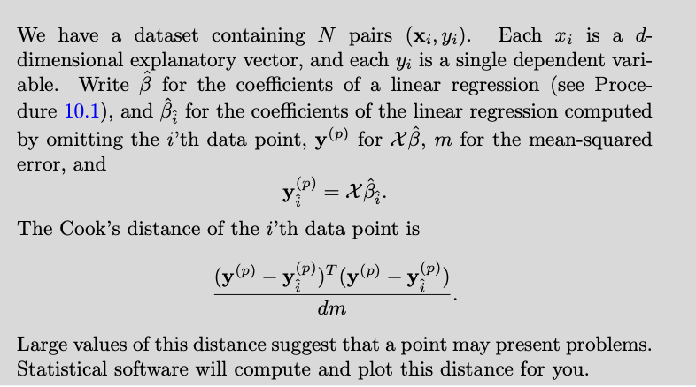 

# Standardized results
- Hat matrix tell how “large” a residual is.

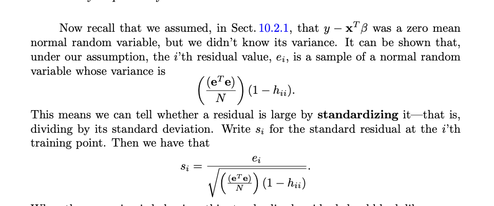

# Regularising Linear expressions

- Corelations betwween explanatory variables can cause small eigne values and beta can be large
- IMPORTANT:
  > - An important and useful way to suppress these errors is to try to find a βˆ that isn’t large, and also gives a low error. - We can do this by regularizing, using the same trick we saw in the case of classification. Instead of choosing the value of β that minimizes
  
> **Ridge Regression**
  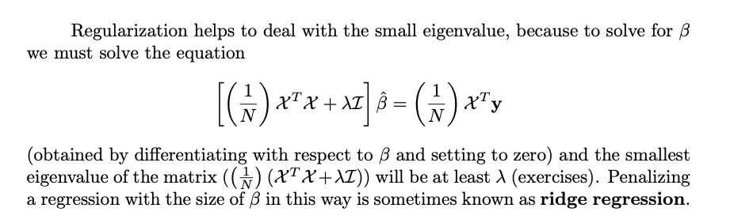

  #### GOAL:
  - A reasonable choice of λ lies between the one that yields the **smallest error encountered **(one vertical line in the plot) and the largest value whose mean error is **within one standard deviation of the minimum**

**Similarity to Classification penalty**
- We started with a cost function that evaluated the errors caused by a choice of β, then added a term that penalized β for being “large.” 
- This term is the* *squared length of β,** as a vector. It is sometimes known as the **L2 norm of the vector**

---
# The end

