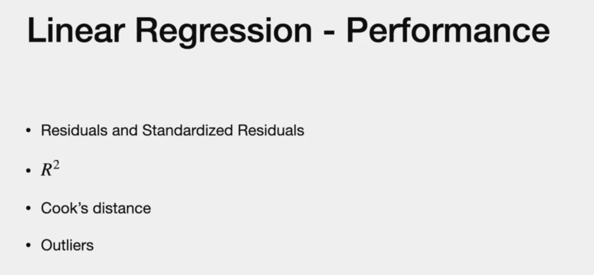
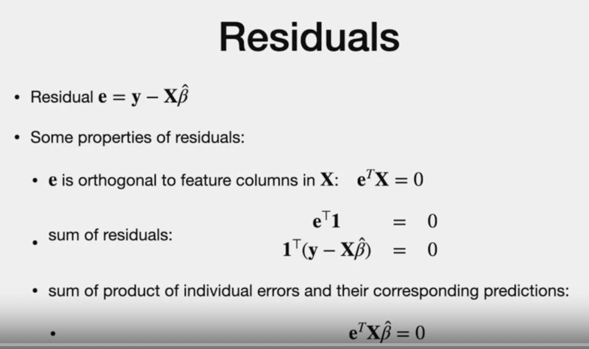
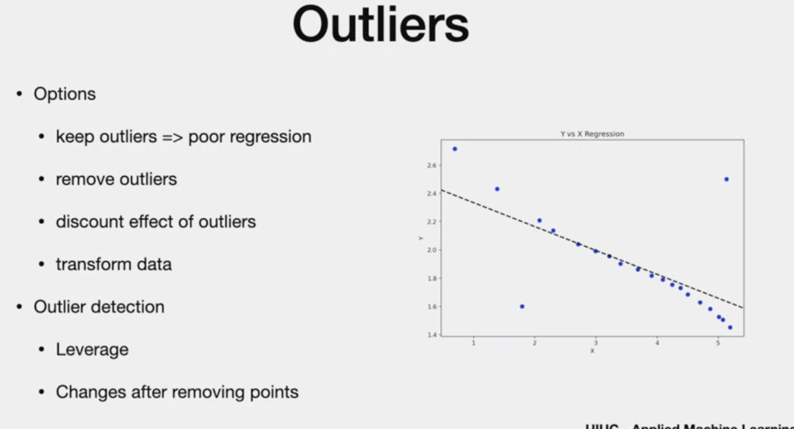
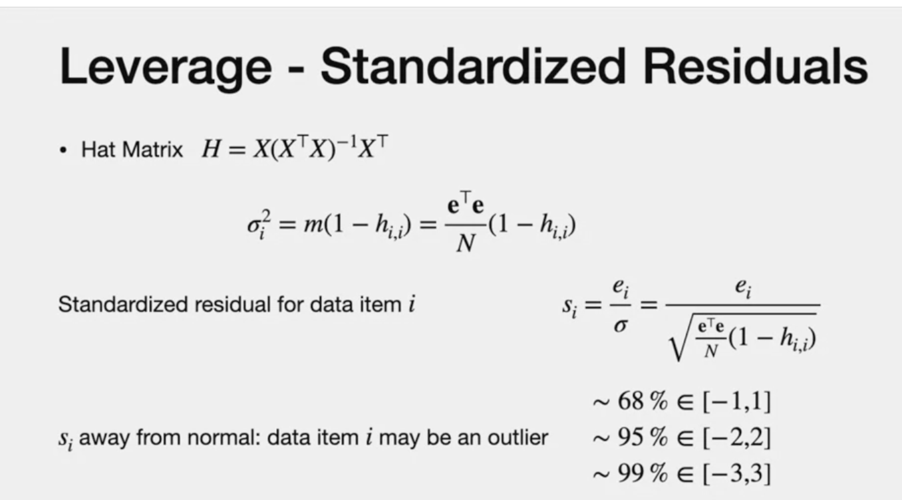
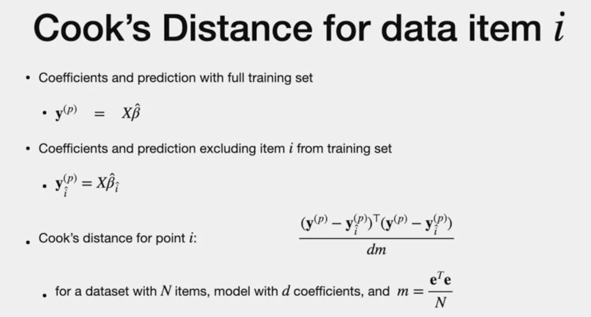

# Linear Regression Performance

# Agenda

# LR - previous lecture

- We need to quantify how good is our regression

# 1. Residuals
- measure errors in regression
- "e" - residual "vector"
- yHat - predicted outcome
- *hat - means estimate (not the true value)

> NOTE!!! Residual measured in same unit as "y"

- top is regressio line
- below chart if residual chart vs. "dependant variable" y in x-acis
- m => MSE of "e"

# Properties of Residuals

- we want MSE to be zero
- **Property 1:** "e" is orthogonal to any column of "X". If it is not, then it means there is a other way to reduce Betahat(as beta hat is deried by minimising the resisuals)
- **Property 2:**  since x has column of 1 for y-intercept . so same extension of property 1 is applicable for 1
- **Property 3:** replace  e= y - X times Betahat to get property 3.

# Standaradised
- sicne rsiduals and "dependant" have same units, we cannot use it as later the units of "dependant" changes, it will impact residual units 
(from km to m e.g)

- residual is random with mean as zero.
- we can  use the variance of dependant variable to normalize error to get meaning performane metrics
> y = true
> X times BHat is vector of predicted value

> R2
> - The performance is better when the variance of the prediction approach variance of the true label and the variance of the error is zero.

- when R2 =0, variance of the predicted is mainly due to the error. so not good.

---
# Holdups

### outlier 
- far from other points
- affect regression
- why? we take co-efficient B to minimise MSE.
- If large errors, they are exagerated and cause the regression line to change

### cause
- too less features
- system induced

### options 
- more features
- if one explanatoru, scatterplot of data with model line. check prediction. If **constant** , no relation between "x" and "y"" 
- residual is random , normal and zero mean. residual should not dependant on "y". that is what is required.

# Check Outlier

**No outlier example**

**Two Outlier**

- sometimes, removing outlier can unreveal other outliers(looks like outlier)
- exert strong pull from outlier on model line
- discount effect (other topic later)

# Leverage and Hat Matrix
- Hat "H" is Ypredicted without the "y" variable.
- "Pred" values is a linear transforation of the "Actual values" . This linear tranformation is "H"
- elements of hat = lower case "h(ij)"

**Properties**
1. symmetry
2. eigen value 0 or 1
3. sum of square element of each row  <=1
4. The diagonal h(ii) is the "Leverage"
5. because h(ii) is product of row (i) and y(i)
6. The second part of the formula (i not equal to j) is rest of the summation.
7. If "leverage" is big, then it indicates "Outlier" ashtr sum of the row is <=1. which means other values are small.
8. which means other values , other than (ii) have less contribution to the regression prediction

# Standardize Residuals
- same unit as dependant vairable "y"
- variance = normal random variable
= variance is function of MSE and leverage variable
- to get standard residual, we divide "e" by the standard deviation(square root of variance)

- throghu this, we can identify one, two or three standard deviationn assuming it as normal distribution.

- residuals that donot meet more than 3 standar deviation is 'outlier"

# Cook' distance
- measuring change in prediction with and without one data point
- how much prediction change by removing one data point
- cook distance is used
- y(i) = outcome by removing point "i"

> Cook distance significantly change for some point after remving it indicates that it an outlier

---
# The end