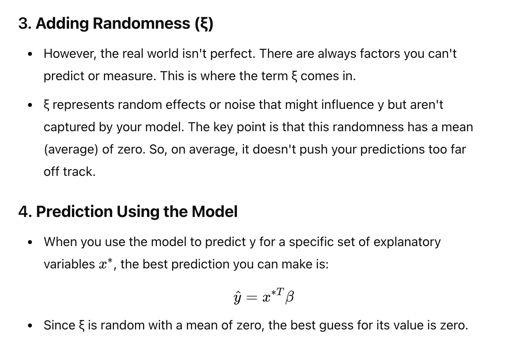
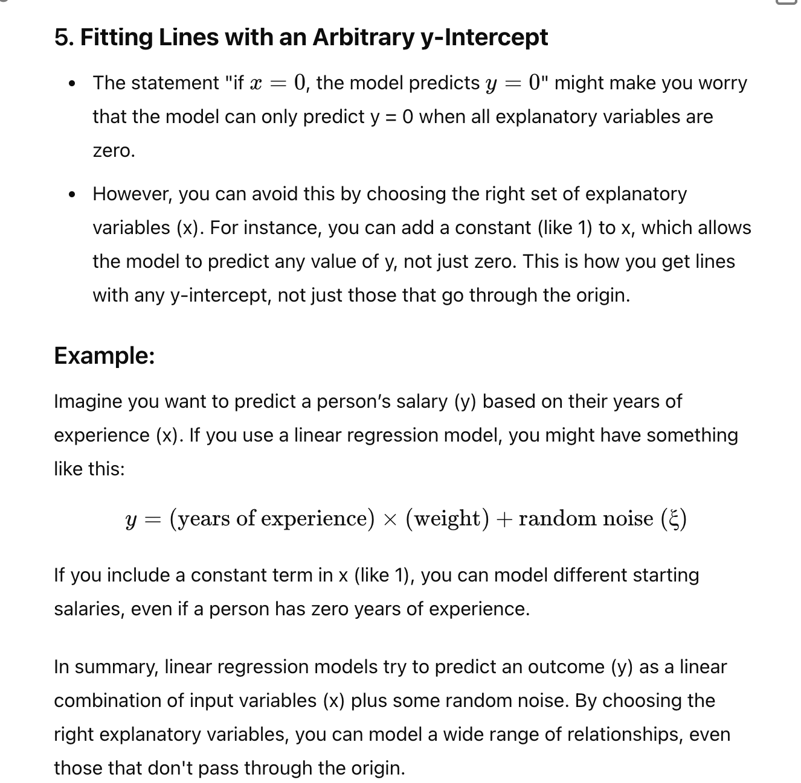

> Explaing below
> A good, simple model is to assume that the dependent variable (i.e., y) is obtained by evaluating a linear function of the explanatory variables (i.e., x), then adding a zero mean normal random variable. We can write this model as
y = xT β + ξ,
where ξ represents random (or at least, unmodelled) effects. We will always assume
that ξ has zero mean. In this expression, β is a vector of weights, which we must
estimate. When we use this model to predict a value of y for a particular set ∗
of explanatory variables x , we cannot predict the value that ξ will take. Our best available prediction is the mean value (which is zero). Notice that if x = 0, the model predicts y = 0. This may seem like a problem to you—you might be concerned that we can fit only lines through the origin—but remember that x contains explanatory variables, and we can choose what appears in x. The two examples show how a sensible choice of x allows us to fit a line with an arbitrary y-intercept.

# Answer

**- This is important**
