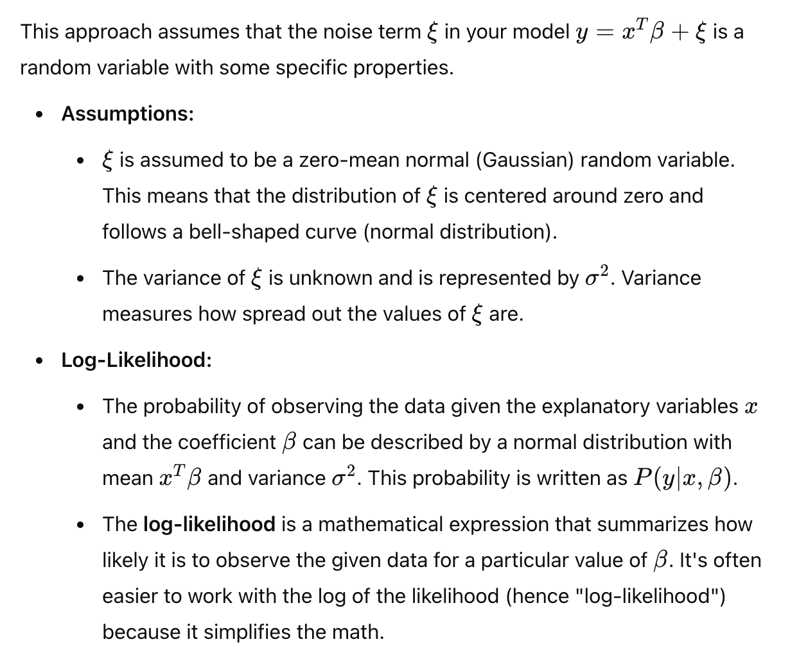
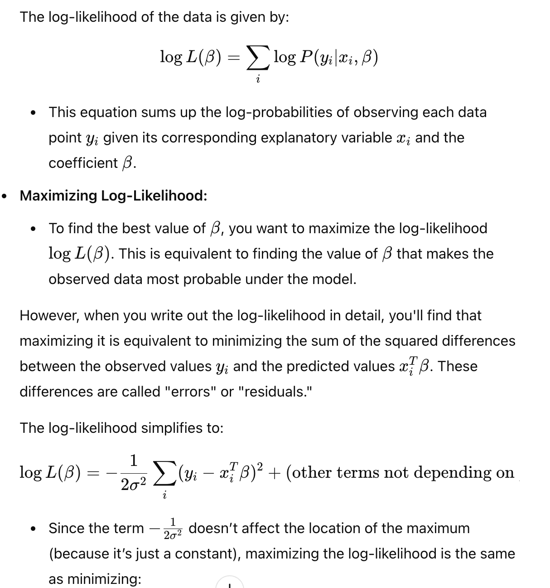
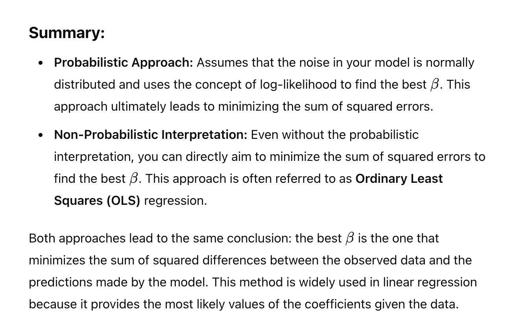

# Goal
>The key point here is that you're trying to determine the best value for the coefficient 𝛽
β in your model. 
>>Two approaches: a probabilistic approach and a non-probabilistic approach, both of which lead to the same result.

# Probabilistic model

# Summary

# Important
> **best β is the one that minimizes the sum of squared differences between the observed data and the predictions made by the model**