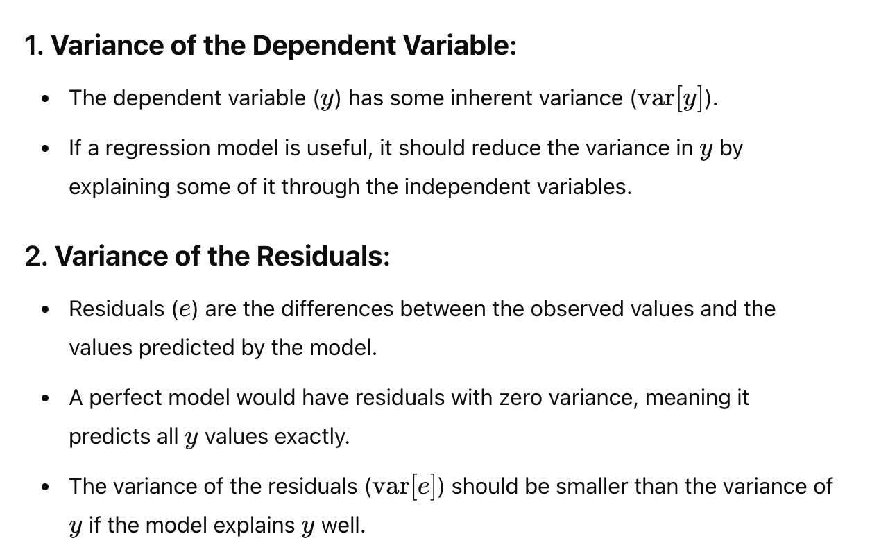
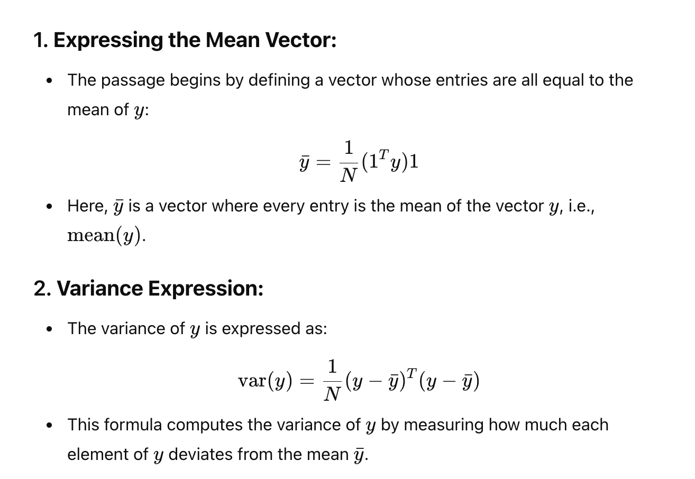
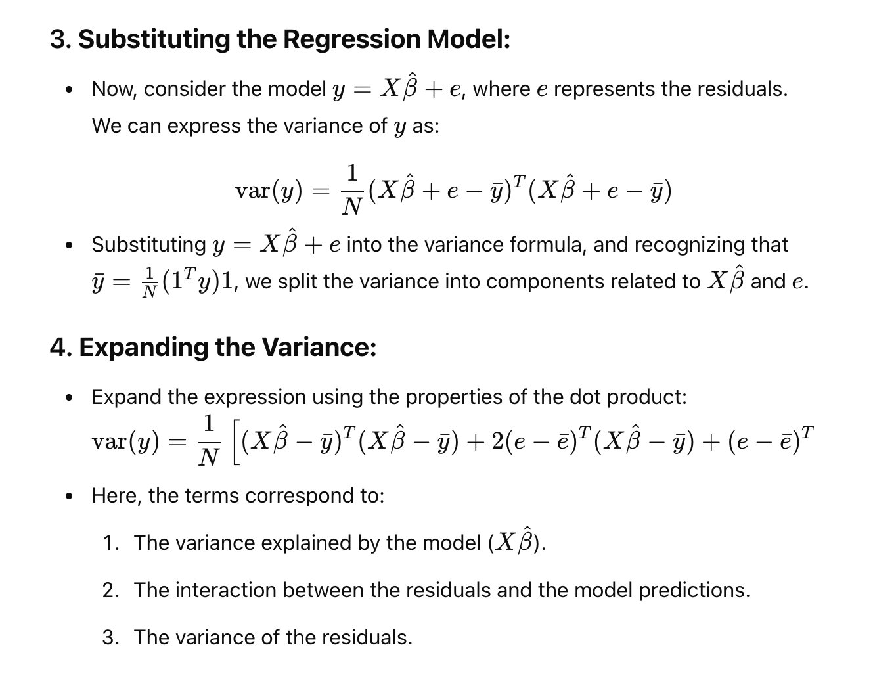

# R Squared
#### Refer R2-Orthogonal note..

> The R-squared value, often referred to as the **coefficient of determination**, is a crucial metric in regression analysis that quantifies how well the independent variables in a model explain the variability of the dependent variable. 

# What is variance

> NOTE: The variance of the residuals var[e]) should be smaller than the variance of 
y if the model explains y well.

# R2?
> NOTE: Unitless measure (Root Mean square is a unit metrics. depends on scale)

# More about R2:

# derivation

Note: variance = average variance (actual -mean)

