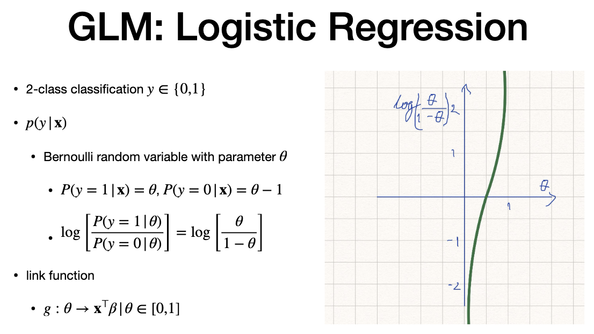
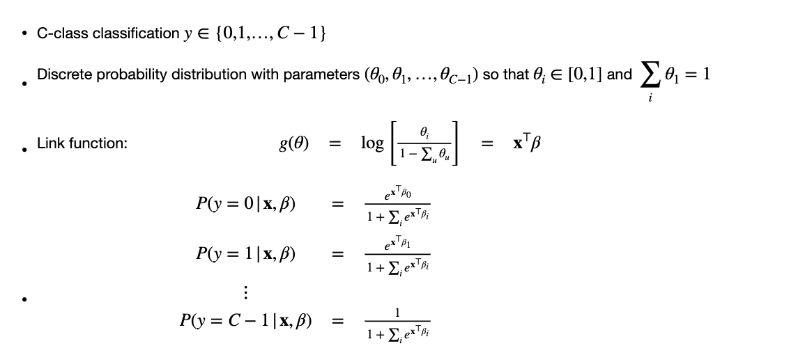
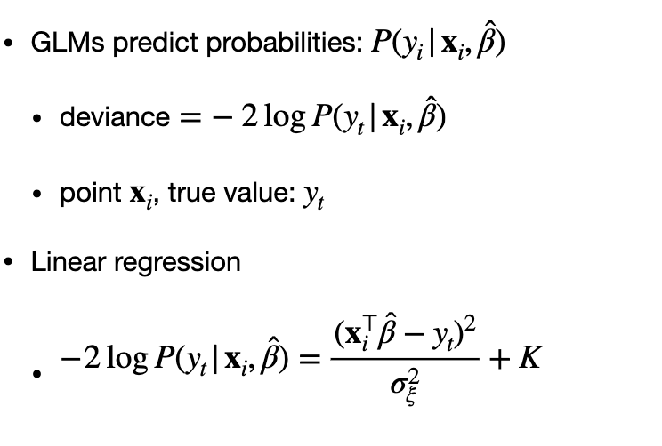

# General Linear Models

# Agenda

# Concept

> - predict parameter of probability dis=tribution
> - our range is between 0 and 1
> - error is zero mean and sigma  squared. mean is X times beta
> - so it can be written as distribution
> - "Link" Function that maps parameter of distribution to prediction (X transpose Beta)
> - performance is through "Deviance"

# Logistic regression

> - 2 class classification
> - values of "y" is 0 and 1
> - similar to SVM , but they use class probability posterior.
> - bernolli - use "LOGIT". logs theta to 0 and 1 range
> - LINK = "Logit Function"
> - Theta is between 0 and 1

# Math

- g(theta) = logit function to get y=1 and y-0
- it only depends on theta. we equate to X transpose beta.

# Indicator Function

> - minimise negative log likelihood
> - P(y=1 |X)
> "INDICATOR FUNCTION" 
> - solve "beta" using stochastic gradient descent (maximise likelihood or minimise negative log likeliehood)

# Logistic Regression and SVM

> - use yhat function = 2 times y -1
> - solve and find new indicator function
> - replace the indicator function for likelihood function 
> - use exponent and log to manipulate

> - behaves similar to hinge loss
> - y for class in -1, yhat =-1. first term is zero. second term is just sum of log (1 +expoenet X transpose times Beta)
> - negative and correct predictin => low loss
> postitive prediction when actual is negative => loss grows
> same as in hinge loss

# Multi-Class Rebgression

> - multiple classes (0,1, until C-1)
> - discrete probability distribution
> - sum of all parameters =1
> - calculate each class probability
> - can use gradient descent

# Counting/Poisson

> - count and discrete
> - model using poisson distribution
> - Intesity parameter = theta=0
> - Log of theta = Link Function
> - replace theta to possion distribution and minimize the negative log likelihood
> - gradient descent to find beta

# Performance using Deviance

> - we use square error for linear regression
> - For generalized linear modesl, we use probability performance metrics, which is deciance

---
# The end