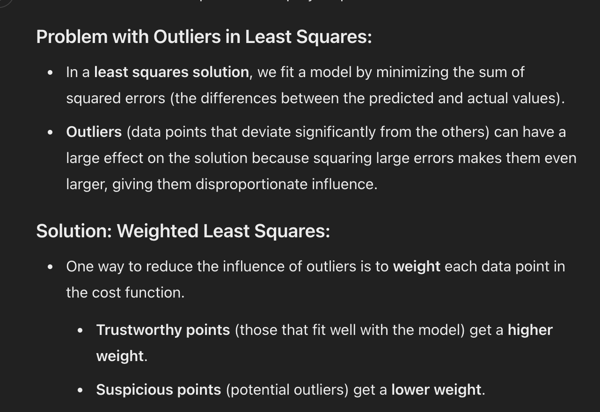
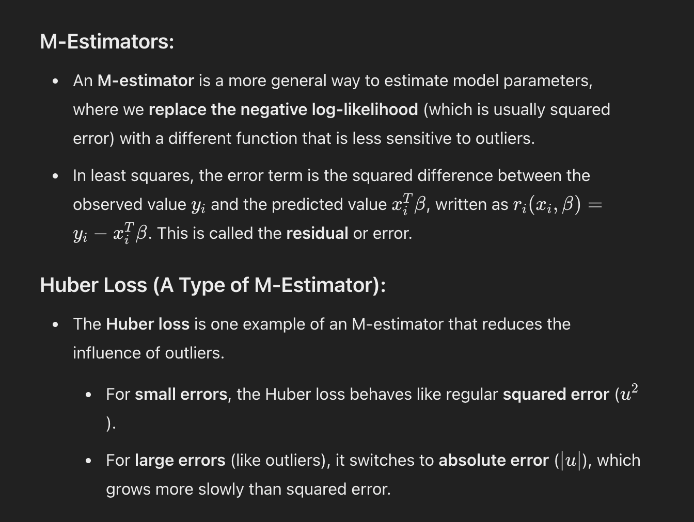
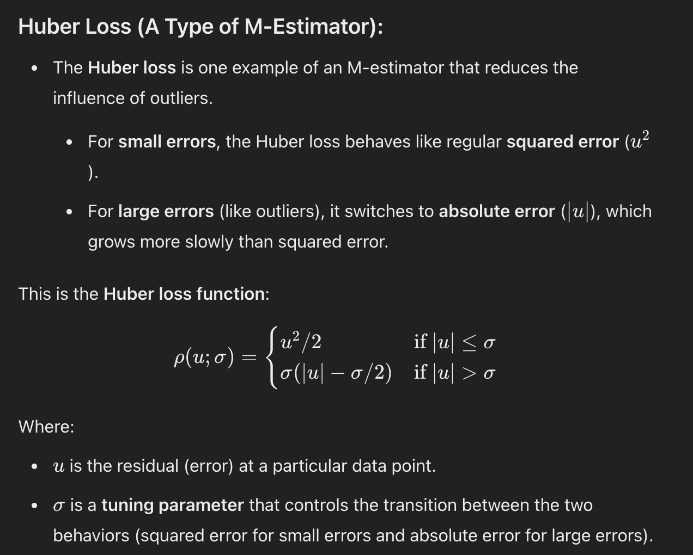
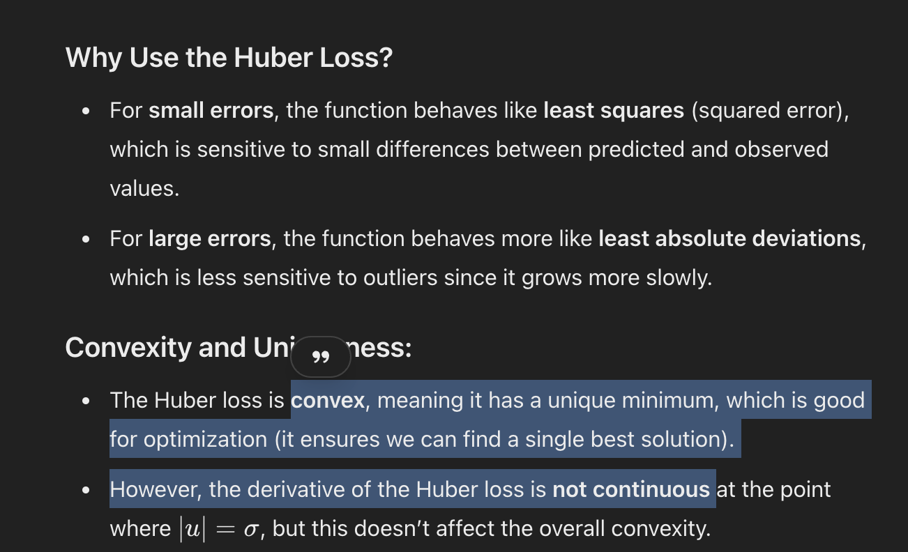

# Reference

# Explanation
# Problem and solution

# What is M-estimators

# How is it implemented?

- Tuning parameter is also called "SCALE"
  
# Properties of Huber Loss

# Influence Function intro

