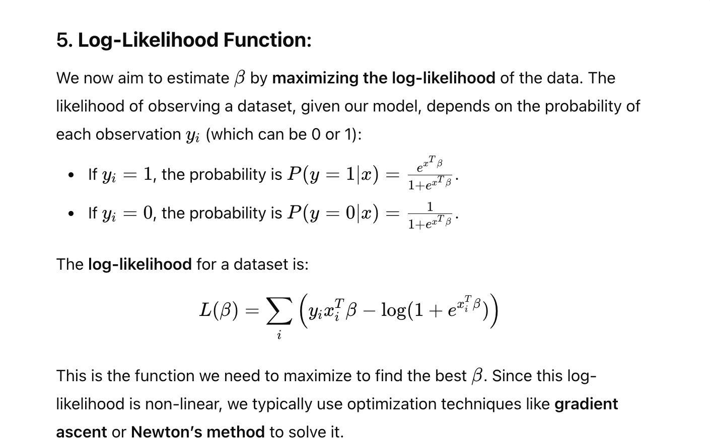
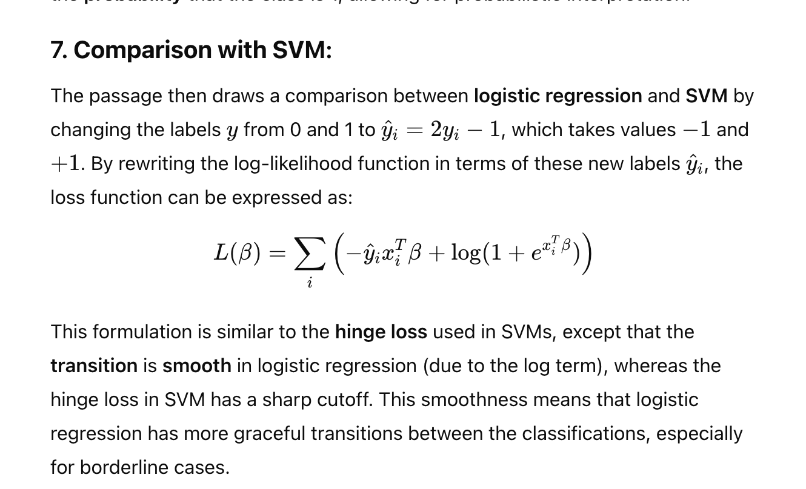
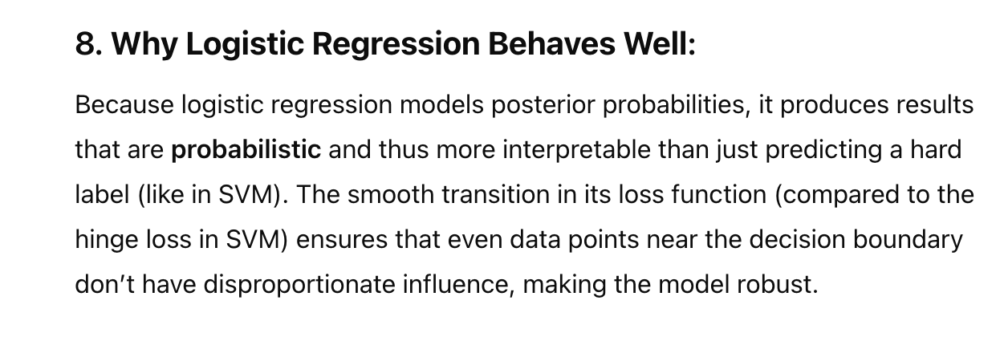
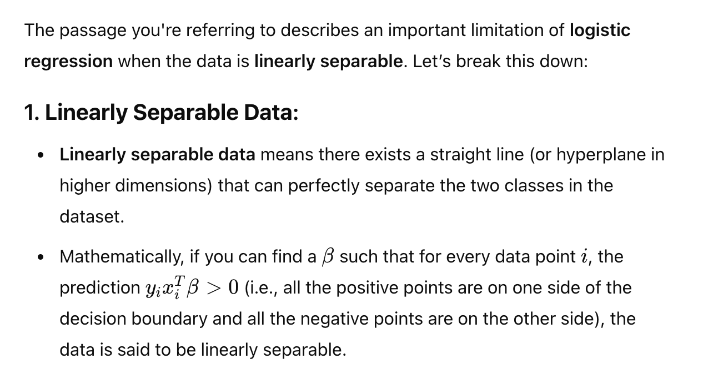
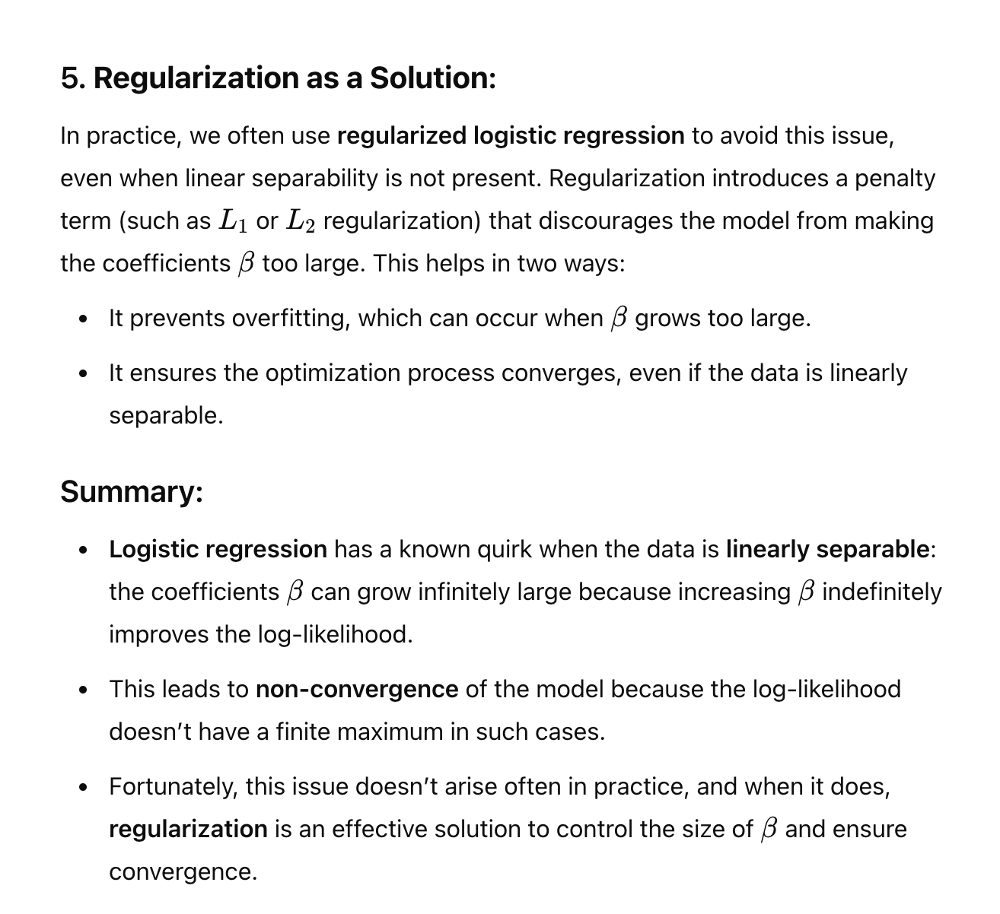
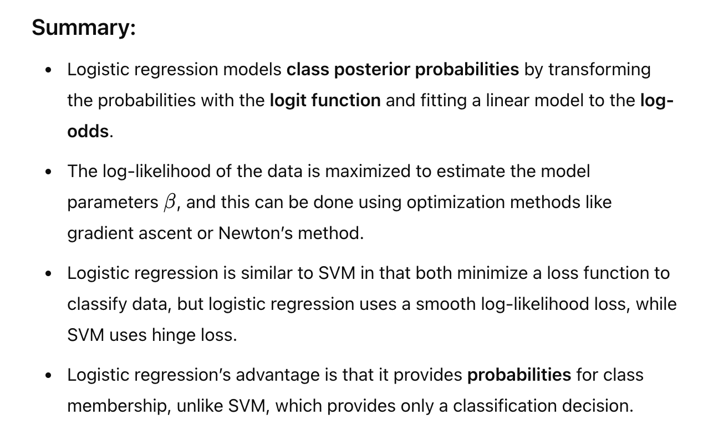

# Logistic Regression
Page 258, 259

# Explanation:

> Note: SVM is classigication model. However, Logistic has some advantages
> - it uses class posterior probabilitues
> - the transition is smooth unlike the hinge loss

# Link 

# Logit for link

# Likelihood

# compare with SVM

# Pros of Logistics (Important)

# Cons of Log Reg.

**Why this problem?**

## Workaround

# Summary
