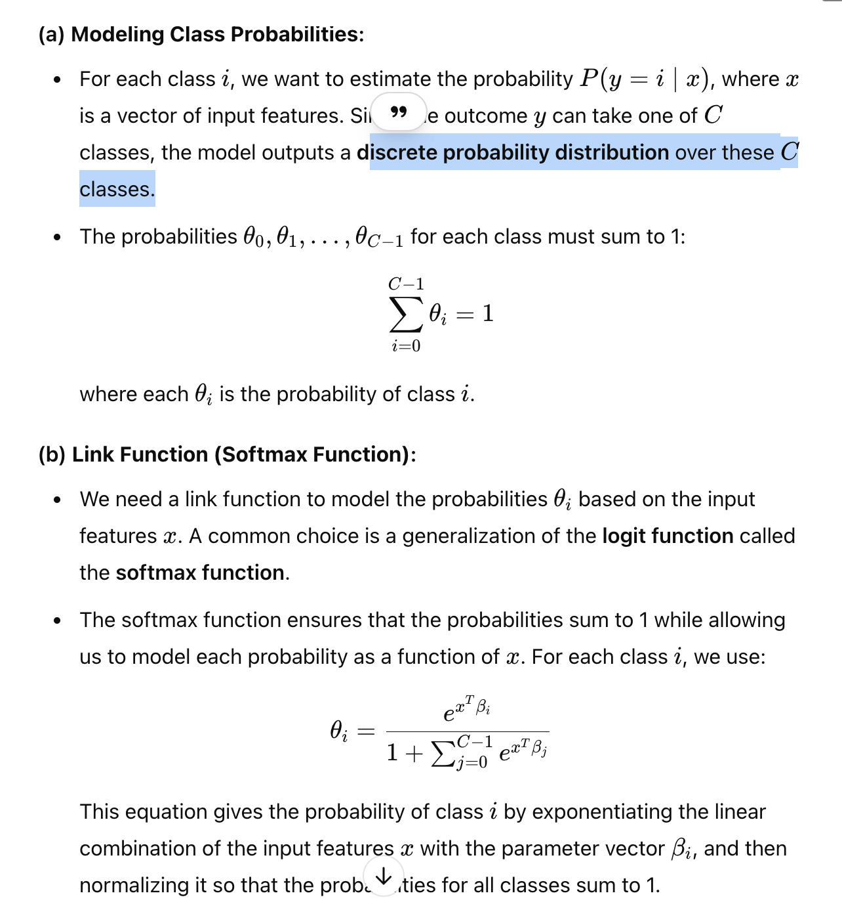
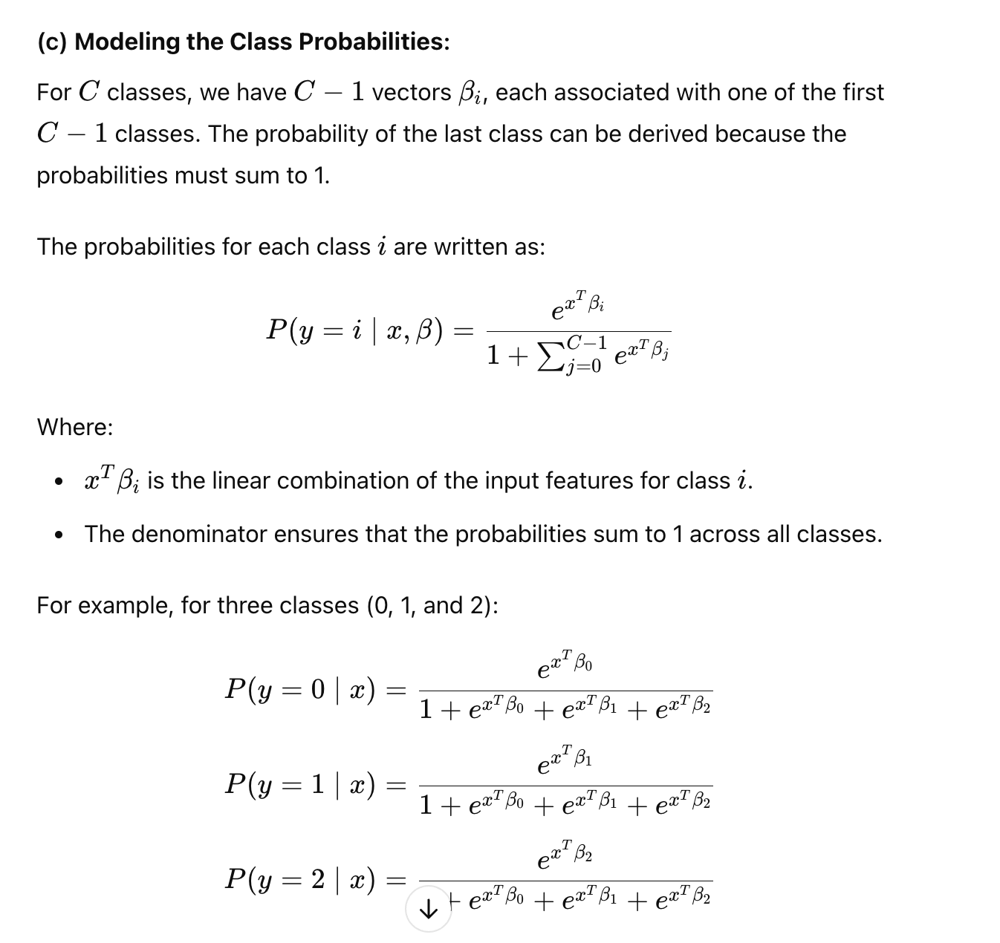
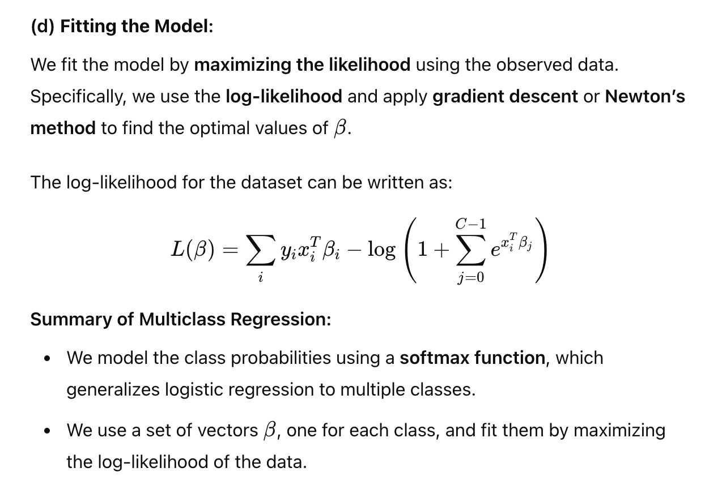
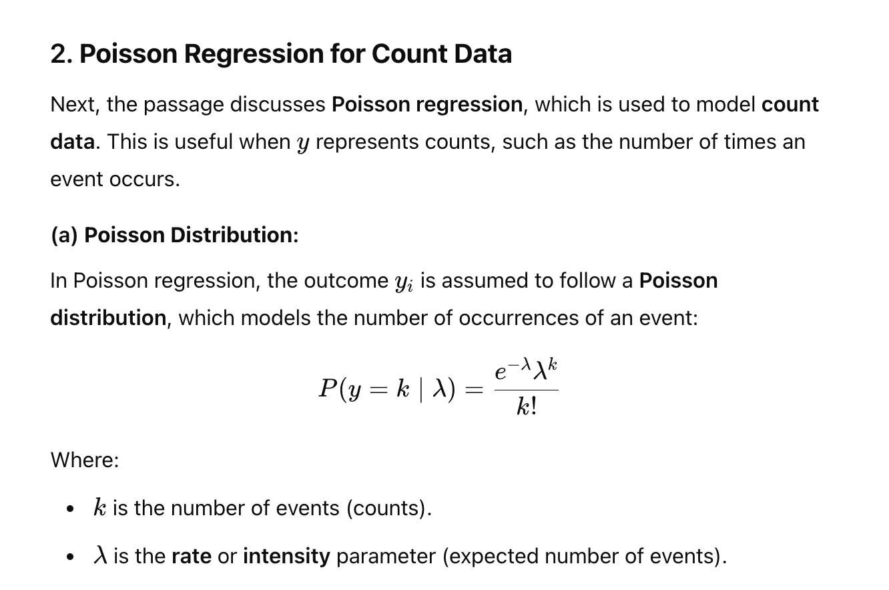
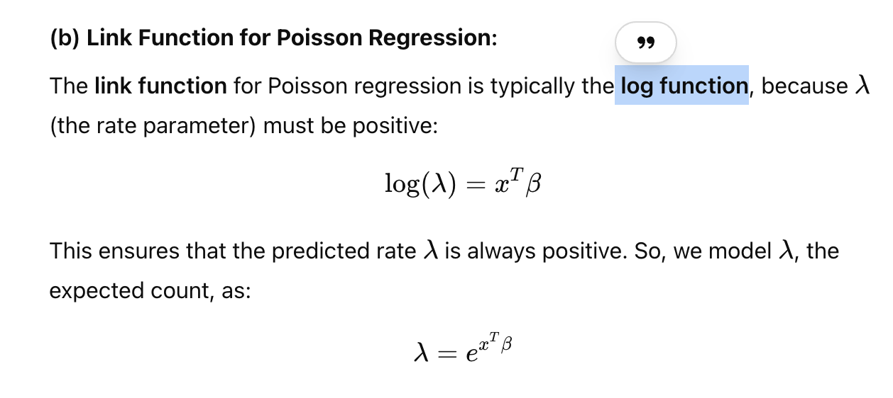

> Covers multiclass, count and deviance

# Multic lass GLM
- use multinomial distribtion (discrete distribiution)
Page 260 | 261 | 262

# Regressing count data (Poisson)

--- 
# Deviance
- evaluate a GLM with deviance

- lower deviance,better fit
- instead of predicted value, we use predicted probaility to compare to the true outcome

# Cross - validation and deviance

# comparisng to null model
