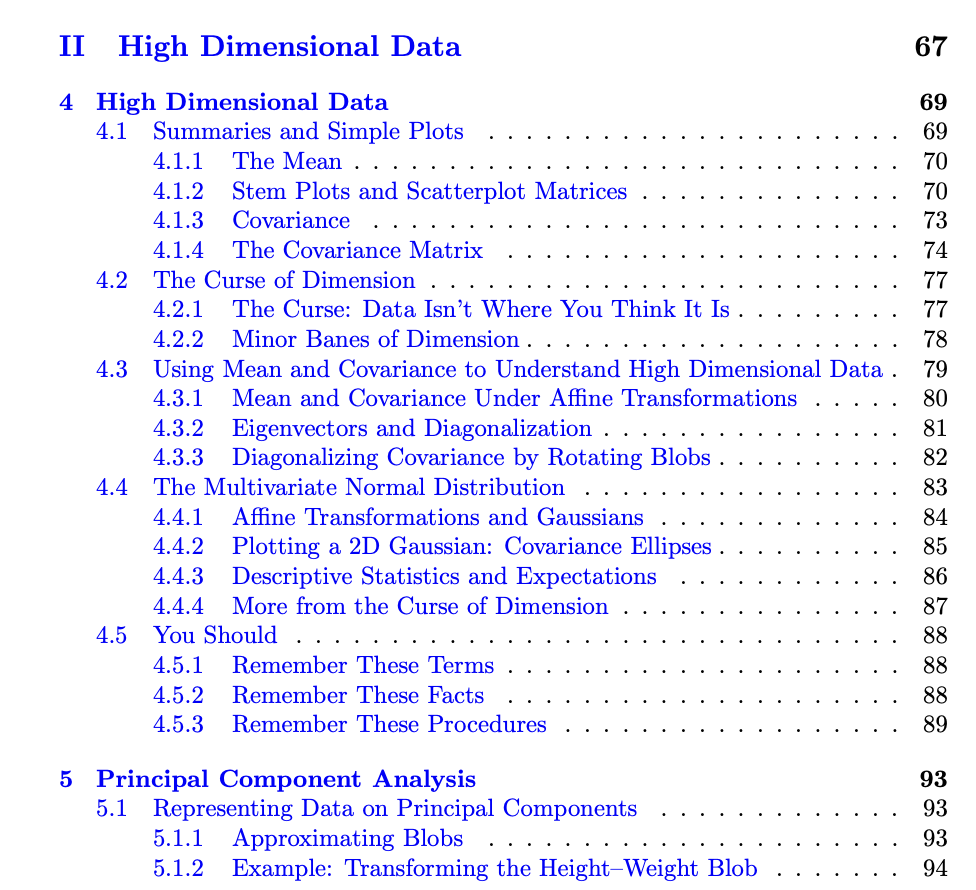

Textbook References

Generally, the AML textbook's Chapter 4 on High Dimensional Data and Chapter 5 on Principal Component Analysis (Pages 77-99) covers this week's topic.

Specifically, see the following section breakdown for each of the lecture videos:

**Lec 6.1 High-Dimensional Data** - **Section 4.2** The Curse of Dimension,**4.3** Using Mean and Covariance to Understand High Dimensional Data (Pages 77-80) 

**Lec 6.2 Data Transformations **- **Section 4.3.1 ** Mean and Covariance Under Affine Transformations, Section **4.3.2** Eigenvectors and Diagonalization, Section **4.3.3** Diagonalizing Covariance by Rotating Blobs (Pages 80-83)

**Lec 6.3 Principal Component Analysis** -** Section 5.1 **Representing Data on Principal Components (Pages 93-99)

# Book

