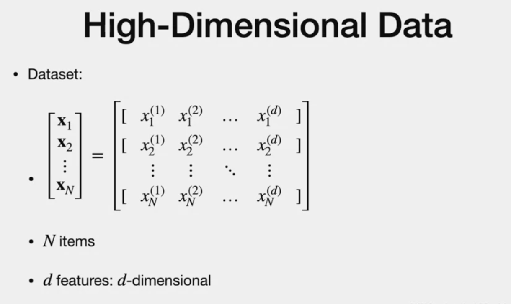
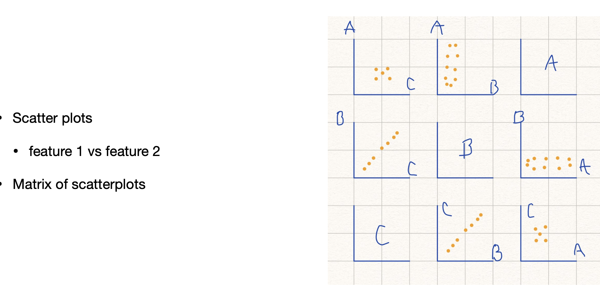
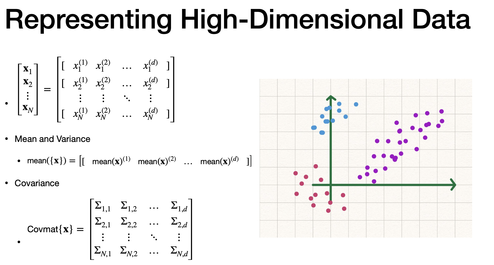
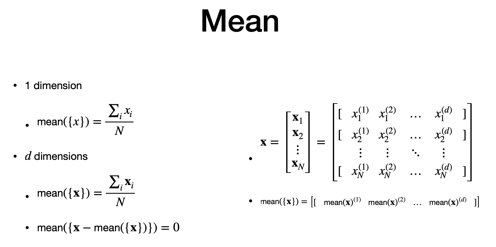
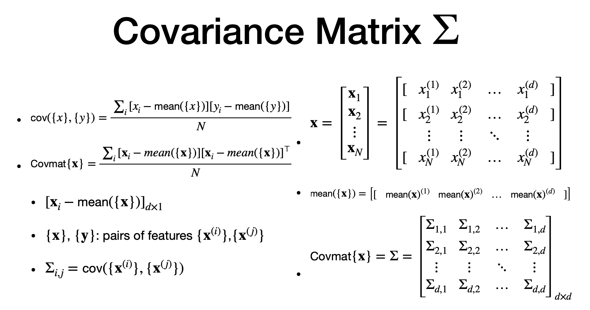
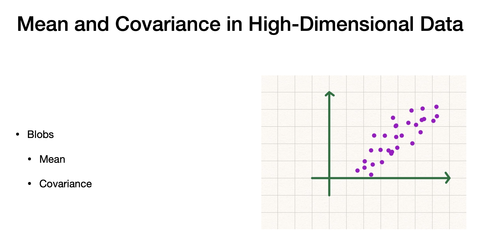

# High Dimensional data

# Agenda

- issues with hi-dim data
- mean and variance to characeristize blobs of data

# high dimensional data 

- higher the feature, higher the dimension
- "d" feature
- each row has "d" features
- power is "number of features"
- subscript correspond to data item
- dataset as matrix and vector
- example: MNIST with 28 by 28 array is an example of hi-dim data (fortunately, we can see this as images. But, not for most cases)

# 4.Curse of dimensionality

- as dimensionality "d" increaes, they get farther from each other and from origin
- data is sparse
- many hi-dim is suitable for low-dimensional representation
- size of data grows like square of dimension "d"

# representing high dimensional data - scatterplot

- hard to build histograms as data grows exponentially ,so many bars may be empty with sparse data
- scatterplot - clustter of data with mean and covariance is possible.
- we have 3 features. diagonal shows plot vs. itself.
- its symmetry matrix. top corner matches bottom corner
- useful. but tough to see for hi- dim data (as number of plots grow)

# representing high dimensional data - mean and covariance

> - using plots like this, we can identify "blobs of data"
> - blobs are far from other blobs
> - they can be modeled using distribution.like, normal distr.
> - shows row of mean
> - covariance as matrix

# Mean

- for 1-d, mean is simple
- for "d",instead of one scalar, we compute a row matrix, one element per feature 
- we subtract mean from every member of data set
- resulting dataset of new set is "Zero"

# Covariance

- tendency for pair of elements to be one side or other side
- two compoents , x and y (x is one column and y is othe column)
- each of them x,y are set.
- we take set of each feature and compare with other feature
- take overall mean of each feature and subtract individual elements. then take product of two features and then average
- "POSITIVE" - If elements of x and y larger than its individual mean
- "NEGATIVE" - If elements of one set larger than its individual mean and other set is smaller than its mean.
- magnitude shows its differene of members from thier respective mean

# Covariance matrix - I

> - covriance matrix - called sigma
> - its a d*d square matrix
> - sum of products of vector
- dimension (d by 1) multipleied by transpose ( i by d)
- to obtain sigma (ij) - covariance - corresponds to co-variance between xi and xj

# Covariance matrix - II

> **Property**
> Positive semidefinite  - **positive or zero**
> symmetric (cov of i,j = cov of j,i)
> eigen values are non negative
> Positive Sefinite  - **always positive**
> > May be "positive definite" unless vector (c transpose product of (x-mean)) =0 
> magnitude vector >0 , will mae v traspose, sigma vector = 0, it is positive definite
> Positive definite - all eigen values are positive and zero

# Covariance matrix - III

> - std dev.
> - variance - how much data varies from mean
> - std dev =  square root of variance.
> - variance = covariance of x,x (diagonal values of co-variance is "variance")
> - Correlation = normalized co-variance.
> - x and y => two features from same dataset

# Blobs

> - one blob
> - shape shows some pattern
> - need transformation to make sense
> - think this blob as lying in its own co-ordinate
> - subtract by mean, to make it move towards origin
> - this brings to hih co-orelation 
> - this also reduce co-variance between multiple features

---
# The end