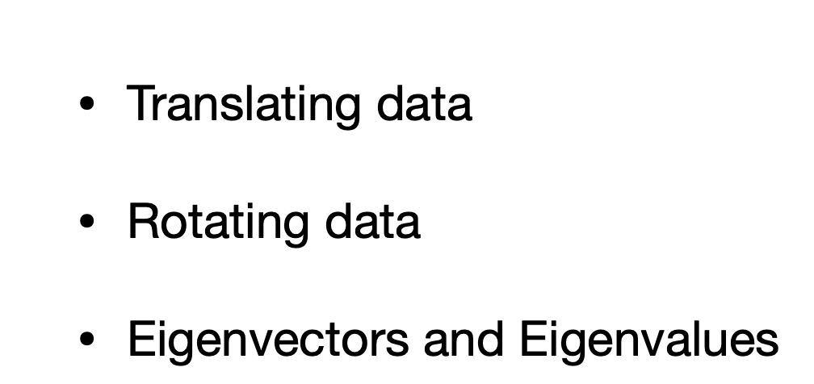
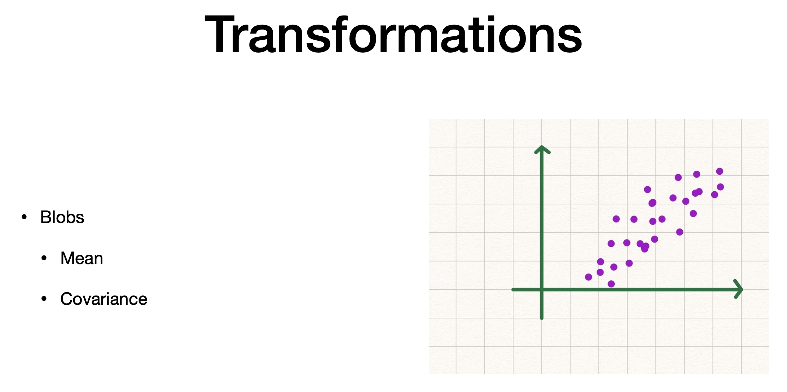
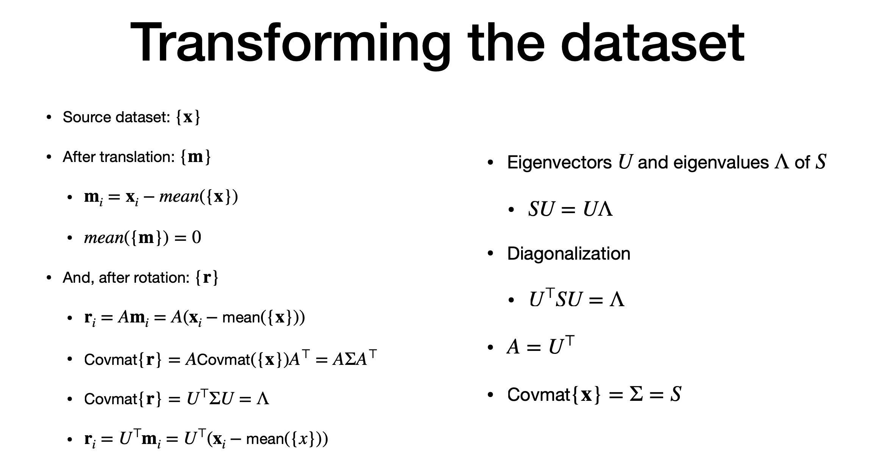

# Agenda

# transformations

> - blob translated and rotated
> - blob' co-ordinate dont have high corelation
> - translate by its mean
> - then rotate it

- translation +  rotation
> - affine transformation - maintain co-linearity and distance between data points
> - target dataest =m 
> - rotation matrix - A and translation vector d

# Eigen Values, Eigen Vectors

> - lets see how they are related to covariance
> - matrix ="S"
> - eigen value = lanbda | eigenvector = "u"
> - we consider matrix is symmetric (this is because the eigen vector/value is only applied to "co-variance" matrix)
> - "d" - number of features
> - eigen vectors are orthogonal
> - we can make a "Orthonormal" matrix with unique norm my by array of "eigen vectors" u1,u2...
> - "I" - identify matrix
> - "captital lambda" = diagonal matrix whos value is lambda (i)
> - arrange in descending
> - larger ones are the most important feature(larger eigen values) 
> - "diagonalize" - by multiplying both sides of "SU = 
> 'U.Capital_lambda" by U_transpose.
> - "Note with orthonormal property = U_transpose.U = I

# 6. Transforming data set

> - after translation, the matrix is centered
> - sigma = covariance of "x" matrix
> Note; Co_variance of 'r" has "zero covariance" and "zero" co-relation
> "r" has zero mean
> - new transofrmed dataset is basicsx for PCA

---
# The end