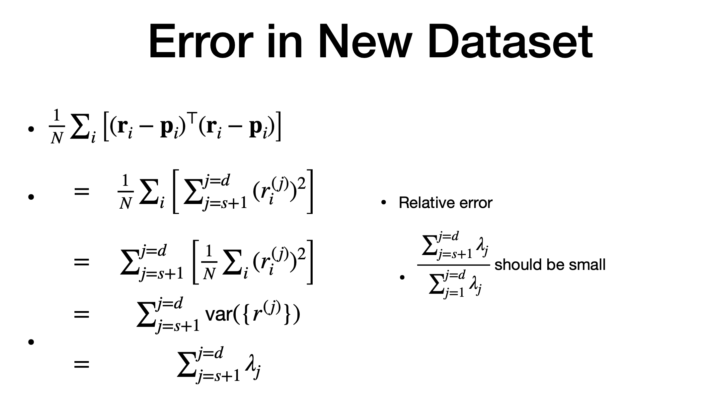
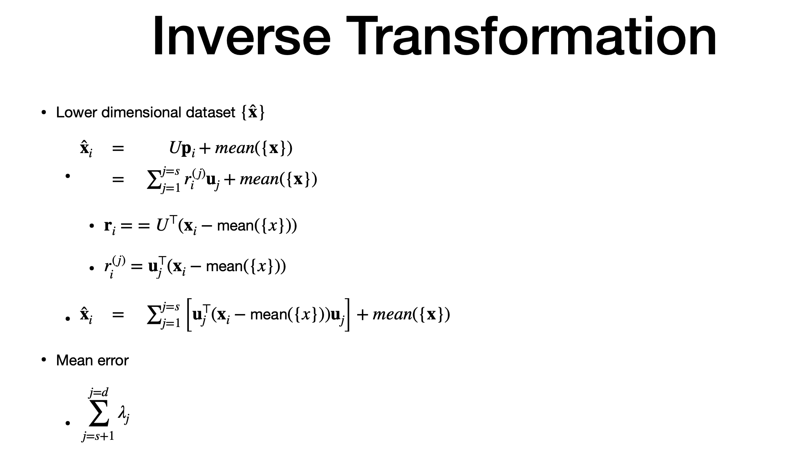
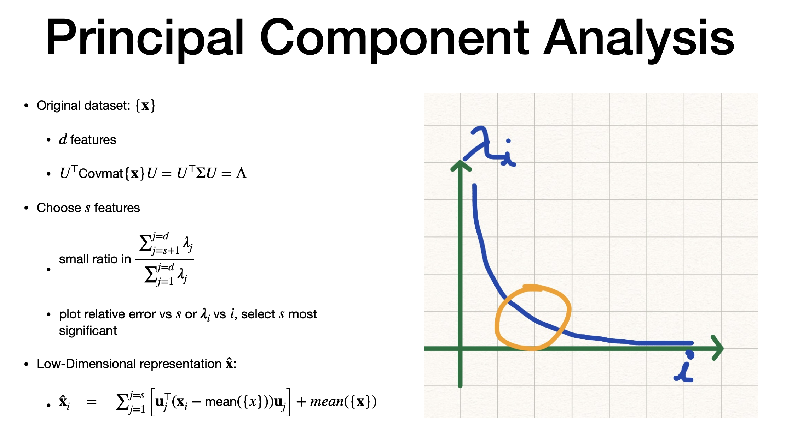

# PCA

# Agenda

- PCA - low dim representation of high dimension data
- prinicpal component are eigen value/vectors of the co-variance matrix of the dataset

# 3. Data transformation

> HOW
> - trnaslate by mean
> - rotate so covariance is diagonal
> - transformed dataset "r"
> - u - matrix of eigen vector
> - zero mean - as translated dataset is original - mean
> sort desc of co-variance matrix of eigen values/vector
> - largest eigen value adn correspondign eigen vector are first
> set features with small co-variane to zero
> - use inverse function to get the dataset to original dataset
> - Adv : removes noise (as lower weight features are removed)

# selection of features

> - diagonal value of eugen value
> - smaaller number of componnents has high variance
> - these features witth largest variance are impactful ones
> - "d" dimension
> - dataset "p" is formed by "s" components
> - "s" is smaller than d
> - replace (d-s) =0 (smaller impact features =0)
> 

# Error in new data set

> - (r-p) is representation of original dataset - newly formed dataset
> - error is zero for elements until "S"
> - from s+1 to d is where "p" is zero
> - so this is mean errr
> - "j" in superscript is the feature
> - error =  sum of variance of "r"
> - this variance is actually the eigen values of the diagonal matrix (lambda)
> - if eigen value of 1 to d is more (Denominator) than (s+1) to d (numerator) meaning the contributor of error by lower eigen value feature is less , then the relative error is less

# Inverse transformation

> - to take "p' to do inverse to get to the original data co-ordinate
> - we consider only "S" vectors as other features are zeor
> - mean(x) => original set
> - "Score" for featyre j, item "i" is noted above (xhat equation)
> avarage error = eigen value lambda from s+1 to d

# PCA

- above is summary
- "knee chart" is good point to place "s"

---
# The end